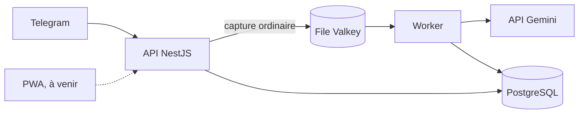

# Organizer

Outil de capture vocale auto-hébergé qui trie automatiquement notes et choses à faire.

La contrainte qui prime : aucune étape avant l'enregistrement. Le classement est différé et fait par la machine, jamais par l'utilisatrice.

## État du projet

Les lots 0 et 1 sont menés en parallèle (décision 21).

- Lot 0 : collecte et annotation d'une semaine de captures réelles, avec le banc d'essai terrain (`infra/terrain/`) et l'outil de relecture.
- Lot 1 : construction de l'application, par étapes. Le lot 1-A (socle et pipeline de capture) est en cours.

Livré sur la branche `lot1-a-socle-pipeline` :

- le monorepo pnpm et la base de dev (Postgres et Valkey sur la VM Docker, par tunnel SSH) ;
- les prompts versionnés et la validation Zod de la sortie de tri ;
- le schéma Prisma, avec le verrouillage du mode privé en SQL ;
- l'interface `ClassificationProvider` et le fournisseur Gemini, avec repli de modèle.

Pas encore livré : le traitement par le worker, l'ingestion Telegram, l'API NestJS, la PWA et le déploiement. L'application n'est pas en service.

## Principes

Les règles produit non négociables, résumées (texte complet dans [`CLAUDE.md`](CLAUDE.md)).

- **Deux flux séparés** : les actions (cochables, avec échéance) et les pensées (relues, jamais cochées) ne se mélangent dans aucune vue.
- **Aucune sollicitation** : le système ne relance jamais de lui-même. Une alarme ne sonne que si L l'a activée sur cet item précis.
- **Zéro culpabilisation** : ni compteur de retard, ni pourcentage, ni série, ni rouge.
- **Rien ne se perd** : une capture non classifiable va en « à revoir », sans relance. La transcription est conservée sans limite.
- **Mode privé décidé par le point d'entrée**, jamais par le contenu : une capture privée n'atteint jamais Gemini.
- **Palier payé Gemini obligatoire** : le worker vérifie la facturation du projet au démarrage et refuse de tourner sinon.

## Architecture



| Brique | Choix |
| --- | --- |
| API | NestJS 11 sur Node 22 LTS |
| ORM | Prisma 6 |
| Base | PostgreSQL 17 + pgvector |
| File de jobs | BullMQ sur Valkey 8 |
| IA | API Gemini, `gemini-3.1-flash-lite` (repli `gemini-3.8-flash`) |
| Embeddings | fastembed `bge-small`, en local |
| Agenda | API Google Calendar v3, portée `calendar.app.created` |
| Bot | grammY |
| Front | SvelteKit 2 (Svelte 5), mode statique, PWA Workbox |
| Proxy | Nginx Proxy Manager existant, hors dépôt |

## Arborescence

```
apps/worker       traitement asynchrone : fournisseur Gemini (apps/api, scheduler et web : à venir)
packages/shared   types, schémas Zod et configuration partagés
packages/db       schéma Prisma, migrations, garde-fous SQL du mode privé
prompts/          prompts Gemini versionnés et responseSchema
fixtures/         énoncés fabriqués pour les tests
infra/            stack de production (docker-compose.yml, Caddyfile)
infra/dev/        Postgres et Valkey de dev sur la VM Docker, tunnel SSH
infra/terrain/    banc d'essai du lot 0 : bot Telegram seul, retiré à la fin du lot 1
tools/relecture/  outil de relecture des captures du banc d'essai
design/           tokens et maquettes
docs/             cahier des charges, décisions, guide d'annotation, plans
```

## Prérequis

- Node 22 LTS minimum.
- pnpm, installé par Homebrew.
- Accès SSH à l'hôte Docker du homelab, pour la base de dev.
- Un bot Telegram de dev, distinct de celui de production.
- Une clé d'API Gemini sur un projet Google Cloud avec facturation activée.

## Démarrage en développement

1. Ouvrir le tunnel vers la base et la file de dev, et le laisser tourner :

   ```bash
   infra/dev/tunnel.sh
   ```

2. Installer les dépendances :

   ```bash
   pnpm install
   ```

3. Copier `.env.example` en `.env`, puis le remplir (le `.env` reste hors dépôt) :

   ```bash
   cp .env.example .env
   ```

4. Appliquer les migrations :

   ```bash
   pnpm prisma migrate dev
   ```

5. Créer un compte et un code de liaison. Ces commandes seront disponibles à la fin du lot 1-A :

   ```bash
   pnpm --filter @organizer/api cli creer-utilisateur <nom> --admin
   pnpm --filter @organizer/api cli code-liaison <nom>
   ```

6. Lancer l'application :

   ```bash
   pnpm dev
   ```

## Commandes

| Commande | Rôle |
| --- | --- |
| `pnpm test` | applique les migrations de test, puis lance les tests Vitest |
| `pnpm lint` | ESLint sur tout le dépôt |
| `pnpm typecheck` | vérification TypeScript de chaque paquet |
| `pnpm prisma …` | CLI Prisma du paquet `@organizer/db` (`migrate dev`, `migrate deploy`, `studio`…) |
| `pnpm dev` | lance en parallèle les applications de `apps/` |
| `python3 tools/relecture/relecture.py` | relecture des captures du banc d'essai (voir [`tools/relecture/README.md`](tools/relecture/README.md)) |

## Tests

- Les tests utilisent la base `organizer_test` sur la VM, jointe par le tunnel.
- `pnpm test` applique les migrations (`migrate deploy`) et chaque test vide ses tables. La base n'est jamais réinitialisée.
- Aucune donnée réelle : uniquement des énoncés fabriqués.

## Confidentialité et dépôt public

Le dépôt GitHub est public et l'historique Git garde tout. N'entrent jamais dans le dépôt :

- les secrets : `.env`, clé d'API Gemini, jeton du bot, clés VAPID, identifiants OAuth Google ;
- le corpus de L : captures réelles, transcriptions, exemples de corrections (les tests utilisent `fixtures/`) ;
- les données nominatives : prénoms réels dans les prompts, les fixtures, les captures d'écran.

Avant tout commit, vérifier qu'aucun de ces éléments n'est indexé.

## Documentation

- [Cahier des charges](docs/cahier-des-charges.md) : la spécification complète.
- [Décisions](docs/decisions.md) : les 21 décisions fermées.
- [Guide d'annotation](docs/guide-annotation.md) : format du corpus du lot 0.
- [Prompts](prompts/README.md) : versions, variables, schéma de sortie.
- [Outil de relecture](tools/relecture/README.md) : relire les captures du banc d'essai.
- [Plans de réalisation](docs/superpowers/plans/) : un plan par lot.

## Journal des modifications

Voir [`CHANGELOG.md`](CHANGELOG.md).

## Licence

Aucune licence n'est accordée pour l'instant : tous droits réservés.
