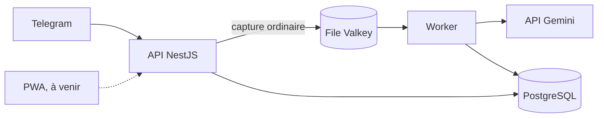

# Organizer

Outil de capture vocale auto-hébergé qui trie automatiquement notes et choses à faire.

La contrainte qui prime : aucune étape avant l'enregistrement. Le classement est différé et fait par la machine, jamais par l'utilisatrice.

## État du projet

Les lots 0 et 1 sont menés en parallèle (décision 21).

- Lot 0 : collecte et annotation d'une semaine de captures réelles, avec le banc d'essai terrain (`infra/terrain/`) et l'outil de relecture.
- Lot 1 : construction de l'application, par étapes. Le lot 1-A (socle et pipeline de capture) est en cours.

Livré sur la branche `lot1-a-socle-pipeline` :

- le monorepo pnpm et la base de dev (Postgres et Valkey sur la VM Docker, par tunnel SSH) ;
- les prompts versionnés et la validation Zod de la sortie de tri ;
- le schéma Prisma, avec le verrouillage du mode privé en SQL ;
- l'interface `ClassificationProvider` et le fournisseur Gemini, avec repli de modèle ;
- le worker BullMQ : classement des captures, pause sur crédit épuisé avec alerte à l'admin, reprise des captures perdues en route, contrôle du palier payé au démarrage ;
- l'ingestion Telegram : bot grammY, liaison des comptes par code, accusé de réception, audio rangé, job enfilé ;
- l'API NestJS (webhook ou polling, `GET /health`) et sa ligne de commande d'administration.

Pas encore livré : la PWA, le mode privé côté PWA (plan 1-B) et le déploiement (plan 1-C). L'application n'est pas en service.

## Principes

Les règles produit non négociables, résumées (texte complet dans [`CLAUDE.md`](CLAUDE.md)).

- **Deux flux séparés** : les actions (cochables, avec échéance) et les pensées (relues, jamais cochées) ne se mélangent dans aucune vue.
- **Aucune sollicitation** : le système ne relance jamais de lui-même. Une alarme ne sonne que si L l'a activée sur cet item précis.
- **Zéro culpabilisation** : ni compteur de retard, ni pourcentage, ni série, ni rouge.
- **Rien ne se perd** : une capture non classifiable va en « à revoir », sans relance. La transcription est conservée sans limite.
- **Mode privé décidé par le point d'entrée**, jamais par le contenu : une capture privée n'atteint jamais Gemini.
- **Palier payé Gemini obligatoire** : le worker vérifie la facturation du projet au démarrage et refuse de tourner sinon.

## Architecture



| Brique | Choix |
| --- | --- |
| API | NestJS 11 sur Node 22 LTS |
| ORM | Prisma 6 |
| Base | PostgreSQL 17 + pgvector |
| File de jobs | BullMQ sur Valkey 8 |
| IA | API Gemini, `gemini-3.1-flash-lite` (repli `gemini-3.8-flash`) |
| Embeddings | fastembed `bge-small`, en local |
| Agenda | API Google Calendar v3, portée `calendar.app.created` |
| Bot | grammY |
| Front | SvelteKit 2 (Svelte 5), mode statique, PWA Workbox |
| Proxy | Nginx Proxy Manager existant, hors dépôt |

## Arborescence

```
apps/api          NestJS : bot Telegram, ingestion, alertes admin, CLI d'administration
apps/worker       traitement asynchrone : classement Gemini, reprise (scheduler et web : à venir)
packages/shared   types, schémas Zod et configuration partagés
packages/db       schéma Prisma, migrations, garde-fous SQL du mode privé
prompts/          prompts Gemini versionnés et responseSchema
fixtures/         énoncés fabriqués pour les tests
infra/            stack de production (docker-compose.yml, Caddyfile)
infra/dev/        Postgres et Valkey de dev sur la VM Docker, tunnel SSH
infra/terrain/    banc d'essai du lot 0 : bot Telegram seul, retiré à la fin du lot 1
tools/relecture/  outil de relecture des captures du banc d'essai
design/           tokens et maquettes
docs/             cahier des charges, décisions, guide d'annotation, plans
```

## Prérequis

- Node 22 LTS minimum.
- pnpm, installé par Homebrew.
- ffmpeg avec libopus, nécessaire aux tests et à l'API (réencodage des captures privées) :
  `brew install ffmpeg`, puis `ffmpeg -hide_banner -encoders | grep libopus` doit répondre.
- Le dossier `prompts/` : l'API le lit au démarrage (types d'échéance), comme le worker.
- Accès SSH à l'hôte Docker du homelab, pour la base de dev.
- Le jeton du bot `@organizer_lud_bot` (décision R10 : pas de bot de dev distinct).
- Une clé d'API Gemini sur un projet Google Cloud avec facturation activée.

> **Attention.** Ne jamais lancer l'API en mode polling avec le jeton de `@organizer_lud_bot`
> tant que le banc d'essai (`infra/terrain/`) tourne : les deux processus se disputeraient
> les messages de L, et des captures du corpus du lot 0 seraient perdues pour le banc.
> L'essai de bout en bout se fera au déploiement (plan 1-C), en remplaçant le banc d'essai.

## Démarrage en développement

1. Ouvrir le tunnel vers la base et la file de dev, et le laisser tourner :

   ```bash
   infra/dev/tunnel.sh
   ```

2. Installer les dépendances :

   ```bash
   pnpm install
   ```

3. Copier `.env.example` en `.env`, puis le remplir (le `.env` reste hors dépôt). `DATABASE_URL`
   et `REDIS_URL` pointent sur le tunnel (`127.0.0.1:55432` et `127.0.0.1:56379`). Les chemins
   relatifs (`AUDIO_STORAGE_PATH`, `PROMPTS_DIR`) se lisent depuis la racine du dépôt.

   ```bash
   cp .env.example .env
   ```

4. Appliquer les migrations. `pnpm db` lance la CLI Prisma en chargeant le `.env` racine
   (une variable déjà exportée dans le shell l'emporte sur le fichier) :

   ```bash
   pnpm db migrate dev
   pnpm db migrate status   # vérifier sans rien modifier
   ```

5. Créer un compte et un code de liaison (voir « Administration » plus bas) :

   ```bash
   pnpm --filter @organizer/api cli creer-utilisateur <nom> --admin
   pnpm --filter @organizer/api cli code-liaison <nom>
   ```

6. Lancer l'application (lire d'abord l'avertissement sur le polling ci-dessus) :

   ```bash
   pnpm dev
   ```

## Configuration de l'API et du worker

| Variable | Rôle |
| --- | --- |
| `TELEGRAM_MODE` | `webhook` (défaut, production) ou `polling` (l'API interroge Telegram elle-même) |
| `TELEGRAM_WEBHOOK_SECRET` | obligatoire en mode `webhook` : jeton vérifié dans l'en-tête de chaque appel de Telegram |
| `TELEGRAM_BOT_TOKEN` | jeton de `@organizer_lud_bot` |
| `AUDIO_STORAGE_PATH` | dossier de l'audio, commun à l'API et au worker |
| `PROMPTS_DIR`, `PROMPT_VERSION` | dossier des prompts (défaut `prompts`) et version (défaut `tri/v1`) |
| `GEMINI_TIERS_PAYES` | valeurs de `serviceTier` acceptées comme palier payé |
| `TRUSTED_PROXY` | adresse du proxy dont l'API croit `X-Forwarded-For` (défaut `loopback`) ; sert à la limitation de débit par IP |

Chaque variable peut aussi être lue depuis un fichier, par `<NOM>_FILE` (secrets Docker).

L'API expose :

- `GET /health` : répond `{ "ok": true }`, pour la sonde de santé ;
- `POST /telegram/webhook` : le webhook Telegram, en mode `webhook` seulement (404 en mode `polling`).
  Une erreur de traitement répond 500 : Telegram relivre, et l'ingestion est idempotente.

Routes de la PWA, sous `/api`, toutes protégées par la session, sauf la connexion et la déconnexion :

- `POST /api/session` : connexion (mot de passe), cookie de 90 jours ; `DELETE /api/session` : déconnexion ;
  `GET /api/session/moi` : le compte connecté ;
- `GET /api/vues/aujourdhui`, `/semaine`, `/horizons`, `/a-revoir` : les vues, communes aux deux comptes ;
- `POST /api/items/:id/fait` : cocher ; `DELETE /api/items/:id/fait` : décocher ;
  `PATCH /api/items/:id` : corriger la nature ou l'échéance ;
- `GET /api/captures/:id/audio` : réécouter l'audio d'origine ;
- `POST /api/captures/privees` : déposer une capture privée ; `GET /api/captures/privees?mois=AAAA-MM` : les lister par jour (mois courant par défaut) ;
  `PATCH /api/captures/privees/:id` : poser ou retirer l'étiquette.

En mode `polling`, si le polling s'arrête sur une erreur (jeton refusé, autre processus sur le
même bot), l'API s'arrête volontairement.

### Contrôle du palier payé au démarrage du worker

Règle n° 8 : avant de traiter quoi que ce soit, le worker vérifie que le projet Gemini est au
palier payé.

- Palier non payé : le worker refuse de démarrer et s'arrête.
- Contrôle impossible (crédit épuisé, HTTP 402, réseau, erreur serveur) : il attend et réessaie,
  de 30 s jusqu'à 15 min entre deux essais, sans jamais démarrer sans contrôle.

Au démarrage puis chaque heure, le worker remet en file les captures perdues en route.

## Mode privé

Une capture faite par le bouton privé de la PWA, ou juste après le bouton « Prochaine capture privée » de Telegram, reste sur le serveur.
Elle n'est jamais transcrite, jamais classée, jamais envoyée à Gemini.
On la retrouve par date et heure, avec une étiquette facultative.

Dans Telegram, le bouton arme la capture suivante, vocal ou texte, une seule fois.
Le bot répond « Reçu. Elle reste sur le serveur. »

## Administration

Aucune inscription libre : les comptes se créent en ligne de commande. La CLI lit le `.env` racine.

| Commande | Rôle |
| --- | --- |
| `pnpm --filter @organizer/api cli creer-utilisateur <nom> [--admin]` | crée un compte ; `--admin` reçoit les alertes techniques |
| `pnpm --filter @organizer/api cli code-liaison <nom>` | affiche un code à usage unique, valable 10 minutes, à envoyer au bot par `/start <code>` |
| `pnpm --filter @organizer/api cli mot-de-passe <nom>` | pose ou change le mot de passe (Argon2id, 12 caractères minimum, saisie masquée et confirmée) ; révoque les sessions du compte |
| `pnpm --filter @organizer/api cli delier <nom>` | retire le lien entre un compte et son chat Telegram (une liaison ne remplace jamais un lien existant) |

## Commandes

| Commande | Rôle |
| --- | --- |
| `pnpm test` | applique les migrations de test, puis lance les tests Vitest |
| `pnpm lint` | ESLint sur tout le dépôt |
| `pnpm typecheck` | vérification TypeScript de chaque paquet |
| `pnpm db …` | CLI Prisma du paquet `@organizer/db`, avec le `.env` racine chargé (`migrate dev`, `migrate status`, `studio`…) |
| `pnpm prisma …` | CLI Prisma sans charger le `.env` : exporter `DATABASE_URL` avant |
| `pnpm dev` | lance en parallèle les applications de `apps/` |
| `python3 tools/relecture/relecture.py` | relecture des captures du banc d'essai (voir [`tools/relecture/README.md`](tools/relecture/README.md)) |

## Tests

- Les tests utilisent la base `organizer_test` sur la VM, jointe par le tunnel.
- `pnpm test` applique les migrations (`migrate deploy`) et chaque test vide ses tables. La base n'est jamais réinitialisée.
- Aucune donnée réelle : uniquement des énoncés fabriqués.

## Confidentialité et dépôt public

Le dépôt GitHub est public et l'historique Git garde tout. N'entrent jamais dans le dépôt :

- les secrets : `.env`, clé d'API Gemini, jeton du bot, clés VAPID, identifiants OAuth Google ;
- le corpus de L : captures réelles, transcriptions, exemples de corrections (les tests utilisent `fixtures/`) ;
- les données nominatives : prénoms réels dans les prompts, les fixtures, les captures d'écran.

Avant tout commit, vérifier qu'aucun de ces éléments n'est indexé.

## Documentation

- [Cahier des charges](docs/cahier-des-charges.md) : la spécification complète.
- [Décisions](docs/decisions.md) : les 21 décisions fermées.
- [Guide d'annotation](docs/guide-annotation.md) : format du corpus du lot 0.
- [Prompts](prompts/README.md) : versions, variables, schéma de sortie.
- [Outil de relecture](tools/relecture/README.md) : relire les captures du banc d'essai.
- [Plans de réalisation](docs/superpowers/plans/) : un plan par lot.
- [Dossier de revue du lot 1-A](docs/revue/2026-10-03-lot1-a.md) : synthèse autonome pour un relecteur externe.

## Journal des modifications

Voir [`CHANGELOG.md`](CHANGELOG.md).

## Licence

Aucune licence n'est accordée pour l'instant : tous droits réservés.
