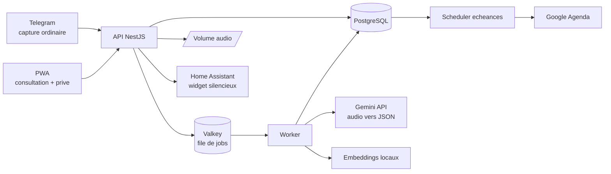
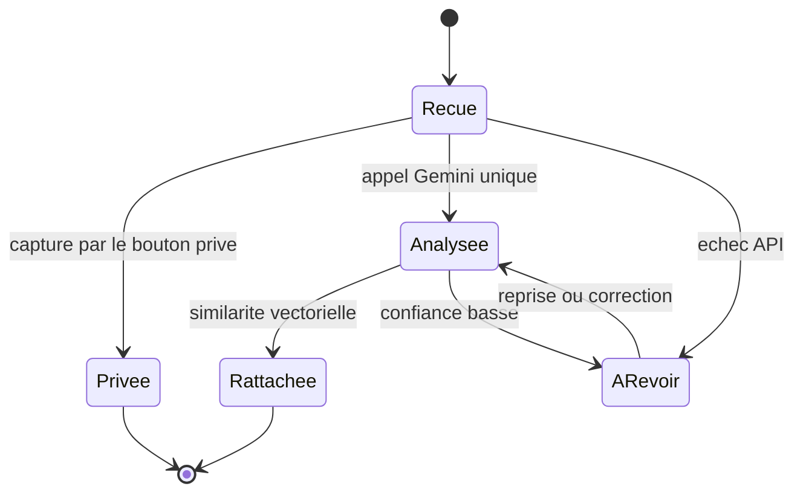
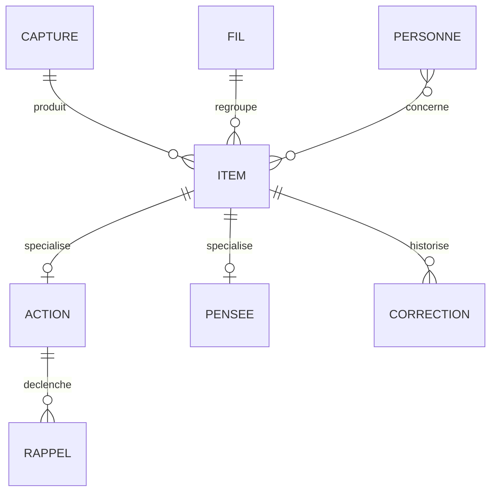
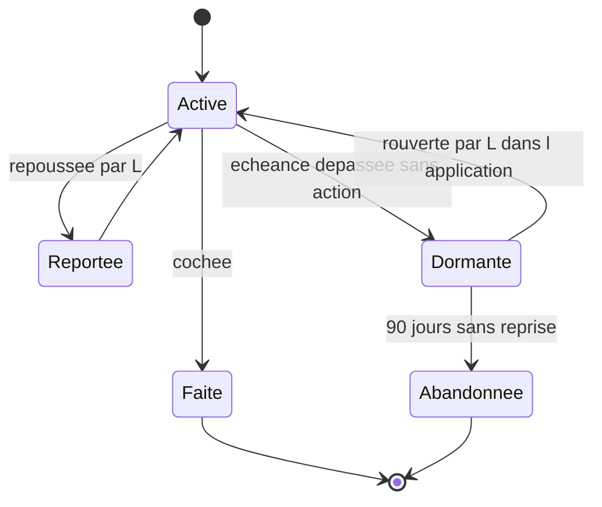
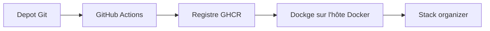

# Cahier des charges — Bloc-notes vocal à tri automatique (self-hosted)

Sep 21, 2026 · @Franck

> **Source de vérité.** Ce fichier fait foi pour tout le projet.
> Le document de cadrage initial (Claude Docs) est archivé au 1er octobre 2026
> et n'est plus tenu à jour. Toute correction se fait ici, dans le dépôt.

## Contexte et objectifs

L'outil doit encaisser une pensée en moins de cinq secondes, puis la ranger sans que son auteure ait à décider quoi que ce soit. Tout le reste du système découle de cette contrainte.

Le besoin vient de L : ses idées arrivent plus vite qu'elle ne peut les écrire, et le temps de choisir où les noter, elles sont perdues. Les outils de notes classiques échouent parce qu'ils demandent de classer au moment de la saisie. Ici, le classement est différé et automatique.

L'hébergement est entièrement auto-hébergé sur le homelab Proxmox existant (nœud pve), derrière le Nginx Proxy Manager déjà en place, avec une consultation mobile quotidienne.

### Objectifs et critères de succès

| Objectif | Critère mesurable |
| --- | --- |
| Capture sans friction | Moins de 5 s entre l'intention et le début de l'enregistrement, écran verrouillé compris |
| Aucun classement manuel | Plus de 85 % des entrées classées sans question posée à l'utilisatrice |
| Rien ne se perd | 100 % des captures conservées, même hors ligne et même non classifiables |
| Restitution lisible | Jamais plus de 5 lignes sur l'écran d'accueil, phrases de moins de 12 mots |
| Confidentialité | Les captures faites avec le bouton privé ne quittent jamais le serveur |
| Exploitation légère | Mise à jour et sauvegarde sans intervention manuelle mensuelle |

### Principes directeurs

1. **La capture prime sur tout.** Aucune fonctionnalité ne peut ajouter une étape avant l'enregistrement.
2. **Le tri est différé.** La machine range après coup ; l'utilisatrice ne classe jamais au moment de parler.
3. **Deux flux séparés.** Les choses à faire et les pensées personnelles ne se mélangent jamais dans une même vue.
4. **Zéro culpabilisation.** Pas de compteur de retard, pas de relance répétée, pas de liste rouge.
5. **Le silence est un état valide.** Une semaine sans interaction ne déclenche rien.
6. **Dégradation gracieuse.** Si l'IA, le réseau ou le serveur tombent, la capture continue et rien n'est perdu.
7. **Réversibilité.** Export complet des données brutes (audio et texte) à tout moment, sans l'application.

### Décisions arrêtées

Le projet s'appelle **Organizer**, application et bot Telegram confondus.

| # | Sujet | Décision |
| --- | --- | --- |
| 1 | Pensées via Gemini | Oui, en **palier payé dès le premier appel**. La facturation est activée avant le premier test |
| 2 | Mode privé | **Bouton d'enregistrement dédié**, séparé de la capture ordinaire. Pas de mot-clé |
| 3 | Retrouver une pensée privée | Par date et heure. Pas de transcription, pas de recherche texte |
| 4 | Garde-fou de longueur | Seuils par défaut retenus : 30 s, 60 s, 180 s |
| 5 | Sollicitations | Aucune par défaut, alarme comprise |
| 6 | Activation d'une alarme | Item par item, à la voix ou par un bouton, au choix de L sur le moment |
| 7 | Ressortir une pensée | Autorisé, mais seulement dans l'application, jamais en notification |
| 8 | Visibilité des pensées | Visibles aussi par Franck |
| 9 | Compte de l'API Gemini | Compte Google personnel de Franck, avec facturation Cloud activée |
| 10 | Agenda | Compte Google de L, OAuth porté par elle |
| 11 | Sauvegarde | Aucune au démarrage, pour rester simple. Sauvegarde vers le NAS Synology au lot 2 |
| 12 | Disque et audio | 50 Go maximum pour toute la stack, en volumes Docker simples. Rotation de l'audio ordinaire déjà transcrit au-delà de 40 Go, du plus ancien au plus récent. Audio privé jamais purgé |
| 13 | Hébergement | Hôte Docker existant du homelab, stack pilotée par Dockge |
| 14 | Publication | `organizer.djkix.ovh` |
| 15 | Dépôt | GitHub personnel djkix, **public** |
| 16 | Comptes | Deux : L et Franck |
| 17 | Widget d'accueil | Home Assistant, silencieux, surface principale de rappel, livré au lot 2 |
| 18 | Modèle | `gemini-3.1-flash-lite` par défaut |
| 19 | Nom | Organizer |
| 20 | Bot Telegram | `@organizer_lud_bot` |
| 21 | Lots 0 et 1 | **Menés en parallèle**, décidé par Franck le 3 octobre 2026. Thèmes, types d'échéance et prompt sont des données et de la configuration, branchées en fin de lot 1 |

## Périmètre fonctionnel

Deux utilisatrices, deux flux de contenu, un périmètre volontairement étroit à la v1 : capturer, trier, restituer, rappeler.

### Utilisateurs

| Rôle | Qui | Usage |
| --- | --- | --- |
| Utilisatrice principale | L | Capture vocale quotidienne, consultation mobile, cochage |
| Administrateur | Franck | Déploiement, mises à jour, sauvegardes, réglage des prompts de tri |
| Comptes supplémentaires | — | Prévus techniquement (multi-utilisateur), non ouverts à la v1 |

### Les deux flux

|  | Flux A — Actions | Flux B — Pensées |
| --- | --- | --- |
| Contenu | Rendez-vous, commandes, retours, ménage, préparatifs (Halloween, Noël) | Introspection, analyses sur une relation, notes sur une personne |
| Attendu | Rappeler au bon moment, cocher | Conserver, relier, ressortir sur demande |
| Vue | Listes cochables, écran d'accueil | Journal filtrable par personne et par thème |
| Échec redouté | L'oubli d'une échéance | La noyade et la rumination |

### Cas d'usage couverts en v1

- [ ] Envoyer un vocal d'une phrase depuis le téléphone, écran verrouillé, sans ouvrir d'application
- [ ] Obtenir la transcription et le classement automatique en moins de deux minutes
- [ ] Découper un vocal contenant plusieurs sujets en plusieurs entrées
- [ ] Consulter les listes Aujourd'hui, Cette semaine, Horizons, Rapide
- [ ] Cocher une action d'un geste, depuis la liste ou depuis une notification
- [ ] Recevoir une alarme uniquement sur les rendez-vous où elle l'a demandée
- [ ] Voir les urgences sur l'écran d'accueil du téléphone sans ouvrir l'application
- [ ] Relire les pensées, filtrées par personne ou par thème
- [ ] Activer une alarme sur un rendez-vous précis, à la voix ou par bouton
- [ ] Corriger un classement erroné en un geste

### Hors périmètre

- Partage entre plusieurs personnes, listes collaboratives, attribution de tâches
- Lecture de l'agenda existant de L : l'application écrit dans un agenda dédié mais ne lit pas ses créneaux avant le lot 3
- Gestion de projet : dépendances complexes, diagrammes, estimation de charge
- Pièces jointes photo ou fichier (hors audio de capture)
- Analyse psychologique automatisée ou conseil thérapeutique généré par l'IA

Le dernier point est une exclusion de principe, pas technique. Le système conserve et retrouve les pensées ; il ne les interprète pas et n'émet aucun avis sur les personnes citées.

## Architecture cible

La capture et la consultation sont deux surfaces distinctes : un canal de messagerie pour parler, une application web installée pour lire et cocher. Entre les deux, une file de jobs absorbe le traitement lourd.

Une capture privée s'arrête à l'API : elle est écrite sur le volume audio et en base, sans jamais entrer dans la file de traitement.

Une capture entre par Telegram, revient classée dans la PWA, et ressort en notification au moment utile.

### Rôle de chaque composant

| Composant | Rôle | Criticité |
| --- | --- | --- |
| Bot Telegram | Surface de capture ordinaire et dialogue asynchrone | Vitale |
| PWA | Consultation, cochage, et capture privée par bouton dédié | Vitale |
| API NestJS | Ingestion, aiguillage privé ou ordinaire, authentification | Vitale |
| PostgreSQL | Entrées, actions, pensées, fils, échéances | Vitale |
| Valkey | File de jobs, verrous, cache de sessions | Haute |
| Worker | Appel Gemini, écriture des items, rattachement des fils | Haute |
| Gemini API | Transcription, découpage et classification en un seul appel | Haute |
| Embeddings locaux | Vectorisation des items pour le rattachement des fils | Moyenne |
| Volume audio | Enregistrements ordinaires (en rotation) et privés (conservés) | Haute |
| Scheduler | Échéances et écriture dans Google Agenda | Haute |
| Home Assistant | Widget silencieux, et alarme quand un item la demande | Haute |

### Flux nominal d'une capture

1. L envoie un vocal dans la conversation Telegram dédiée. Le bot accuse réception immédiatement.
2. L'API télécharge l'audio, crée une entrée brute en base, empile un job et répond.
3. Le worker envoie l'audio à Gemini, qui renvoie en un appel la transcription, le découpage et le classement.
4. Les items produits sont écrits en base et rattachés à un fil existant si la similarité le justifie.
5. Si la confiance est basse, une question unique part dans Telegram. Sinon, rien n'est demandé.
6. Le contenu apparaît dans la PWA et, le cas échéant, dans les rappels programmés.

Le délai cible entre l'étape 1 et l'étape 6 est de deux minutes. Seule l'étape 1 a une exigence de temps réel.

## Choix du front mobile

Décision : **bot Telegram pour la capture, PWA installée pour la consultation**, avec un pont Home Assistant pour le widget d'écran d'accueil. Aucune application native n'est développée. La cible est **Android uniquement** : aucune contrainte iOS ne s'applique au projet.

Le raisonnement tient en une phrase : une PWA ne peut pas être ouverte assez vite depuis un écran verrouillé pour capter une pensée fugace, alors qu'une application de messagerie déjà installée le fait en un geste déjà acquis.

Android rend toutefois la PWA nettement plus capable que sur iOS : notifications fiables avec son et vibration, synchronisation en arrière-plan, stockage durable, partage entrant depuis n'importe quelle application. Elle devient une vraie seconde surface de capture, et non un simple pis-aller.

### Comparatif des options de capture

| Critère | PWA seule | App native Android | Canal de messagerie |
| --- | --- | --- | --- |
| Délai jusqu'à l'enregistrement | 4 à 6 s (déverrouiller, ouvrir, charger) | 2 à 4 s | 2 à 3 s, geste déjà automatique |
| Enregistrement vocal fiable | Bon, interrompu par les appels | Excellent | Excellent, natif |
| File d'attente hors ligne | Background Sync, fiable sur Chrome Android | À développer | Native, transparente |
| Notifications avec son | Oui, canaux de notification Android | Oui | Oui |
| Widget d'écran d'accueil | Impossible | Oui | Non |
| Effort de développement | Moyen | Élevé | Faible |
| Dépendance externe | Aucune | Play Store | API Telegram |

### Ce que chaque surface porte

| Surface | Fonctions |
| --- | --- |
| Bot Telegram | Capture vocale et texte, accusé de réception, question de désambiguïsation unique, bouton « avec alarme », cochage par bouton inline |
| PWA installée | Listes cochables, fils de pensées, recherche, correction d'un classement, réglages, capture vocale de secours, réception du partage Android |
| Home Assistant | Widget des urgences sur l'écran d'accueil, alarme sonore des rendez-vous |

### Le widget d'écran d'accueil

C'est la seule exigence de L qu'aucune technologie web ne couvre : Android n'expose pas de widget d'écran d'accueil à une PWA. Trois réponses possibles, par ordre de préférence :

1. **Home Assistant.** L'application compagnon Android fournit des widgets d'écran d'accueil et des notifications actionnables. Le serveur HA existe déjà sur le homelab (VM 100). Une liste `todo` HA est alimentée par l'API via webhook, et le widget natif l'affiche.
2. **KWGT ou Tasker** interrogeant une URL JSON signée exposée par l'API. Spécifique à Android, entièrement personnalisable, mais dépend d'une application tierce à configurer sur le téléphone.
3. **Notification persistante** à faible priorité, épinglée en haut du volet de notifications, plus le compteur sur l'icône de la PWA via la Badging API.

L'option 1 est retenue au lot 2, puisque le widget devient la seule surface de rappel ; les options 2 et 3 restent des replis.

### Contraintes PWA à respecter

- Installation en WebAPK depuis Chrome Android : donne l'icône, le plein écran, les canaux de notification et la Badging API.
- HTTPS avec certificat valide exigé pour le service worker et le push. Le Nginx Proxy Manager existant s'en charge.
- Stockage durable demandé explicitement (`navigator.storage.persist`) pour que la file hors ligne survive à la pression mémoire.
- Background Sync pour vider la file de captures dès le retour du réseau, sans ouvrir l'application.
- Web Share Target déclaré dans le manifeste : L peut partager un texte ou un audio depuis n'importe quelle application vers l'outil.
- Raccourcis d'application dans le manifeste : appui long sur l'icône pour « Capturer » ou « Aujourd'hui ».
- Cible de compatibilité : Chrome Android 120 et plus, Android 12 et plus. Aucun développement ni test iOS.
- La cible est un mobile en mode portrait, utilisable d'une seule main et en marchant.

### Alternative écartée

WhatsApp a été écarté malgré l'habitude de L. L'API Business impose un compte vérifié, une facturation à la conversation et interdit ce type d'usage personnel automatisé. Les passerelles non officielles exposent à un bannissement du numéro. Signal n'offre pas d'API bot stable. Telegram est le seul canal grand public avec une API bot gratuite, documentée et sans risque de blocage du compte.

## Capture

Toute capture est acceptée, sans exception, sans question préalable et sans champ à remplir. Un rejet de capture est considéré comme un défaut bloquant.

### Exigences fonctionnelles

| Réf. | Exigence | Priorité |
| --- | --- | --- |
| CAP-01 | Accepter un message vocal Telegram de 1 s à 10 min | Vitale |
| CAP-02 | Accepter un message texte, même d'un seul mot | Vitale |
| CAP-03 | Accuser réception en moins de 2 s, sans attendre le traitement | Vitale |
| CAP-04 | Conserver l'audio d'origine en plus de la transcription, jusqu'à sa rotation | Vitale |
| CAP-05 | Horodater la capture à l'émission, pas à la réception | Haute |
| CAP-06 | Offrir un bouton d'enregistrement privé distinct dans la PWA | Vitale |
| CAP-07 | Exposer ce bouton en raccourci Android sur l'écran d'accueil | Haute |
| CAP-08 | Signaler visuellement le mode privé avant, pendant et après l'enregistrement | Vitale |
| CAP-09 | Ne jamais envoyer une capture privée hors du serveur, quel que soit le chemin de code | Vitale |
| CAP-10 | Mettre en file locale une capture PWA faite hors ligne | Haute |
| CAP-11 | Ne jamais exiger de catégorie, de titre ou de date à la saisie | Vitale |
| CAP-12 | Appliquer le garde-fou de longueur paramétrable | Moyenne |
| CAP-13 | Accepter un transfert de message depuis une autre conversation | Basse |

### Garde-fou de longueur

L a explicitement demandé une limite pour ne plus se perdre dans les détails. Cette limite avertit mais ne détruit jamais.

| Seuil | Valeur par défaut | Comportement |
| --- | --- | --- |
| Confort | 30 s ou 60 mots | Aucun signal |
| Avertissement | 60 s ou 120 mots | Le bot propose de découper en plusieurs points |
| Long | 180 s ou 350 mots | Le bot signale et découpe automatiquement, sans rien supprimer |

Les trois seuils sont réglables par utilisateur et désactivables d'un seul réglage. Le garde-fou n'intervient jamais pendant l'enregistrement, uniquement après réception.

### Disponibilité et mode dégradé

| Panne | Comportement attendu |
| --- | --- |
| Serveur injoignable | Telegram conserve le message et le délivre au retour ; rien n'est perdu |
| PWA hors ligne | Capture stockée en IndexedDB, envoyée dès le retour du réseau |
| Transcription en échec | Entrée conservée en état `a_transcrire`, audio intact, reprise automatique |
| Classification en échec | Entrée versée dans la corbeille `à revoir`, sans relance |
| File saturée | Ingestion maintenue, traitement différé, ordre préservé |
| Crédit Gemini épuisé (HTTP 402) ou plafond atteint | Traitement suspendu, captures en file dans l'ordre, ni `à revoir` ni relance ; alerte à l'administrateur seul |

### Budget de latence

| Étape | Cible | Maximum acceptable |
| --- | --- | --- |
| Intention → début d'enregistrement | 3 s | 5 s |
| Réception → accusé de réception | 1 s | 2 s |
| Réception → transcription disponible | 20 s | 60 s |
| Réception → entrée classée et visible | 45 s | 120 s |

## Pipeline de traitement

Gemini accepte l'audio nativement : transcription, découpage et classification tiennent dans un seul appel, avec une sortie JSON contrainte par schéma. Le pipeline passe de cinq étapes à trois, et la machine n'a plus besoin de faire tourner de modèle.

### Étape 0 — Aiguillage

L'API regarde par quel point d'entrée la capture est arrivée. Privée : elle est écrite et le traitement s'arrête là. Ordinaire : un job est empilé. Aucune analyse de contenu n'intervient dans cette décision, et aucun modèle ne tourne sur le serveur pour la prendre.

### Étape 1 — Appel Gemini unique

- Modèle : `gemini-3.1-flash-lite` par défaut, `gemini-3.8-flash` en repli sur échec de schéma.
- Entrée : l'audio d'origine, sans réencodage préalable, plus un prompt système versionné.
- Sortie : JSON contraint par `responseSchema`, contenant la transcription intégrale et la liste des items classés.
- Contexte injecté : date du jour, fuseau `Europe/Paris`, thèmes connus, prénoms connus, dix exemples de corrections passées.
- `thinkingBudget` réduit au minimum : la tâche est une extraction, pas un raisonnement.
- Température à 0,2 pour stabiliser les libellés de thèmes d'une capture à l'autre.

La transcription reste stockée séparément des items, pour qu'une erreur de classement n'oblige jamais à retranscrire.

### Règle de découpage

Un vocal contient souvent plusieurs sujets. Le modèle découpe en items indépendants, en conservant la formulation d'origine de chaque morceau.

Règle : dans le doute, ne pas découper. Deux items fusionnés à tort sont moins graves qu'une pensée coupée en deux moitiés incompréhensibles.

### Étape 2 — Schéma de sortie

Chaque item reçoit une nature, puis les attributs de sa nature.

| Sortie | Valeurs possibles |
| --- | --- |
| Nature | `action`, `pensee`, `information`, `ambigu` |
| Échéance | date précise, fenêtre floue, délai relatif, aucune |
| Importance | `haute`, `normale`, `basse` |
| Effort | `moins_5min`, `moins_30min`, `plus_1h`, `multi_session` |
| Contexte | `appel`, `achat`, `maison`, `administratif`, `avec_quelquun`, `autre` |
| Alarme (actions `datee`) | `true` si L la demande en parlant, sinon `false` ; jamais déduite de l'importance |
| Personnes | liste de prénoms détectés |
| Thème | libellé court, réutilisé s'il existe déjà |
| Tonalité (pensées) | `constat`, `question`, `inquietude`, `elan` |
| Confiance | 0 à 1 par attribut |

Contraintes d'implémentation :

- Le schéma JSON est déclaré côté API (`responseMimeType: application/json` et `responseSchema`), puis revalidé côté worker avec Zod.
- Une sortie non conforme déclenche une reprise sur le modèle supérieur, puis un basculement en `à revoir`.
- Aucune invention : un attribut absent du texte reste nul, jamais deviné. Le prompt l'impose explicitement.
- Les thèmes et prénoms connus sont fournis en énumération ouverte, pour éviter qu'un même thème prenne trois libellés.
- Chaque item conserve la version du prompt et le nom du modèle qui l'a classé, pour pouvoir rejouer une classification après changement de version.

### Étape 3 — Rattachement

Chaque item est vectorisé **en local** par `bge-small` via fastembed, puis comparé aux fils existants par similarité cosinus dans pgvector. Garder les embeddings en local coûte 130 Mo de RAM et évite un second envoi du texte des pensées vers Google.

Au-delà de 0,80 de similarité, l'item rejoint le fil ; entre 0,65 et 0,80, le rattachement est proposé sans être appliqué ; en dessous, un nouveau fil est créé si trois items proches apparaissent.

### Désambiguïsation

Une question, et une seule, peut être posée dans Telegram, sous forme de boutons.

- Déclenchement : nature `ambigu`, ou confiance d'échéance sous 0,5 sur un item important.
- Plafond : trois questions par jour maximum, jamais deux d'affilée.
- Sans réponse sous 24 h, la question disparaît et l'item part en `à revoir`. Aucune relance.

### Apprentissage des corrections

Chaque correction manuelle est enregistrée comme un couple (texte, classement attendu). Ces couples alimentent les exemples injectés dans le prompt, par ordre de similarité avec l'item courant, plafonnés à dix. Aucun réentraînement de modèle n'est prévu.

## Modèle de données

Une capture brute est immuable et conservée à vie ; les items qui en découlent sont modifiables. Cette séparation garantit qu'aucune erreur de tri ne détruit la parole d'origine.

### Tables principales

| Table | Champs clés |
| --- | --- |
| `capture` | id, utilisateur, canal, audio\_path, audio\_purge\_le, duree\_s, texte\_brut, confiance\_stt, emis\_le, recu\_le, etat |
| `item` | id, capture\_id, texte, nature, confiance, theme, fil\_id, version\_prompt, cree\_le, archive\_le |
| `action` | item\_id, echeance\_type, echeance\_date, fenetre\_debut, fenetre\_fin, importance, effort, contexte, alarme, fait\_le, reporte\_n |
| `pensee` | item\_id, tonalite, visibilite, vecteur |
| `fil` | id, libelle, type, dernier\_item\_le, epingle |
| `personne` | id, prenom, alias, note |
| `rappel` | id, action\_id, type, declenche\_le, canal, etat, accuse\_le |
| `correction` | id, item\_id, champ, ancienne\_valeur, nouvelle\_valeur, corrige\_le |
| `utilisateur` | id, nom, telegram\_chat\_id, fuseau, plages\_silence, seuils\_garde\_fou |

### Typologie des échéances

| Type | Exemple d'énoncé | Stockage | Restitution |
| --- | --- | --- | --- |
| `datee` | « dermato le 14 octobre à 10h » | date + heure | Événement d'agenda silencieux ; alarme si activée sur l'item |
| `jour` | « jeudi, appeler le garage » | date, sans heure | Vue Aujourd'hui le jour dit, et widget |
| `fenetre` | « avant Noël », « avant mars » | borne début + borne fin | Vue Horizons, et widget quand la borne approche |
| `relative` | « sous quinze jours » | date calculée à la capture | Comme `jour` |
| `aucune` | « penser aux cadeaux » | nul | Vue Rapide ou Un jour, jamais poussée |

### Cycle de vie d'une action

Une action dormante disparaît des listes mais reste consultable et recherchable. Aucune relance n'est envoyée : seule L peut la rouvrir, depuis l'application. Rien n'est jamais supprimé automatiquement.

### Règles de conservation

| Donnée | Durée | Justification |
| --- | --- | --- |
| Audio d'origine ordinaire | Jusqu'à la rotation, 30 jours au minimum | Plafond disque ; la transcription reste |
| Audio d'origine privé | Illimitée, jamais purgé | Seule trace de la capture : rien d'autre n'est stocké |
| Transcription et items | Illimitée | Mémoire longue, recherche |
| Vecteurs | Illimitée, recalculables | Rattachement des fils |
| Corrections | Illimitée | Amélioration du tri |
| Journaux techniques | 30 jours | Diagnostic |

### Rotation de l'audio

Décision 12 : la stack ne dépasse pas 50 Go, avec des volumes Docker ordinaires et aucune préparation de l'hôte. L'audio est le seul volume qui grossit vraiment : la rotation le tient sous 40 Go. La base (moins de 5 Go à un an) et les petits volumes (moins de 2 Go) laissent la marge. Seul l'audio ordinaire tourne ; tout le reste est conservé.

| Règle | Valeur |
| --- | --- |
| Exécution | Job quotidien du scheduler à 4h. Idempotent |
| Déclenchement | Taille du dossier audio au-delà de 40 Go |
| Cible | Purger jusqu'à repasser sous 35 Go |
| Ordre | Du plus ancien au plus récent, selon `emis_le` |
| Éligible | Capture ordinaire dont la transcription est stockée, émise il y a plus de 30 jours |
| Jamais éligible | Capture privée ; capture en `a_transcrire`, en file ou en échec |
| Effet | Fichier supprimé, `audio_path` mis à nul, `audio_purge_le` renseigné. Transcription et items intacts |
| Côté L | Rien. Aucun message ; le bouton de réécoute disparaît simplement |
| Côté admin | Alerte si l'audio reste au-dessus de 40 Go faute d'éligible, ou si la base dépasse 8 Go |

Aux volumes estimés (20 à 45 Go d'audio par an), la rotation garde environ un à deux ans d'audio ordinaire.

## Restitution, rappels et notifications

La règle de restitution est de montrer peu. Une vue qui dépasse cinq lignes sur l'écran d'accueil ou vingt lignes en liste est considérée comme un défaut.

### Vues de l'application

| Vue | Contenu | Règle d'affichage |
| --- | --- | --- |
| Aujourd'hui | Actions datées du jour, plus 1 à 3 suggestions issues des fenêtres qui approchent | 7 lignes maximum |
| Cette semaine | Actions datées des 7 prochains jours | Groupées par jour |
| Horizons | Échéances floues, groupées par borne (avant mars, avant Noël) | Tri par borne croissante |
| Rapide | Actions estimées à moins de 5 minutes, toutes échéances confondues | 10 lignes maximum |
| Fils | Regroupements par thème ou projet (Noël, Halloween, maison) | Fils actifs d'abord |
| Pensées | Journal antichronologique, filtres par personne et par thème ; rapprochements proposés à la lecture, jamais en notification | Jamais de case à cocher |
| Privé | Captures privées, groupées par jour, heure et durée, lecteur audio | Aucune recherche texte, navigation par calendrier |
| À revoir | Items non classifiables | Aucune notification associée |
| Recherche | Texte intégral et similarité sémantique, hors captures privées | — |

### Interactions

- Cocher : un seul geste, avec annulation possible pendant 10 secondes.
- Reporter : trois boutons seulement (demain, la semaine prochaine, plus tard).
- Corriger le classement : changer la nature ou l'échéance depuis l'item, en deux gestes maximum.
- Réécouter l'audio d'origine depuis n'importe quel item issu d'un vocal, tant que la rotation ne l'a pas purgé.

### Types de rappels

| Type | Déclencheur | Canal | Par défaut |
| --- | --- | --- | --- |
| Widget silencieux | Permanent | Home Assistant, écran d'accueil | **Actif** |
| Alarme | Échéance `datee` dont l'alarme a été activée | Rappel Google Agenda, plus canal Android haute priorité | **Inactif**, activé item par item |
| Rappel du jour | — | — | Supprimé |
| Relance sur échéance floue | — | — | Supprimée |
| Point du matin et point hebdomadaire | — | — | Supprimés |

Décisions 5 et 6 : une alarme de rendez-vous est elle aussi une sollicitation. Le système ne sonne donc jamais de lui-même. Un événement est bien créé dans Google Agenda pour chaque rendez-vous daté, mais **sans rappel**, sauf si L a demandé l'alarme sur cet item précis.

Activer l'alarme se fait de trois façons, au choix de L sur le moment : en le disant à la capture (« avec alarme », « faut vraiment que je le rate pas », détecté par Gemini), en appuyant sur un bouton « avec alarme » proposé par le bot juste après la capture d'un rendez-vous daté, ou en basculant un interrupteur sur l'item dans l'application.

Le bouton du bot est la voie sûre : il ne dépend pas de la reconnaissance d'une formulation. Il n'apparaît que sur les captures où une date et une heure ont été comprises, donc jamais en dehors du moment où il sert.

Le sens de lecture est inversé par rapport à un agenda classique : le silence est la norme, le bruit est l'exception qu'elle choisit.

Conséquence à assumer : sans alarme et sans relance, c'est le widget qui porte tout. S'il n'est pas sur son écran d'accueil et lisible d'un coup d'œil, l'outil ne rappelle plus rien. Le widget passe donc du lot 3 au lot 2.

### Règles de non-harcèlement

1. Le système ne prend jamais l'initiative d'une notification, alarme comprise.
2. Seule une alarme explicitement demandée par L sur un item précis peut l'interrompre.
3. Aucun rituel, aucun résumé spontané, aucune relance sur une échéance floue.
4. Aucun compteur de retard, aucun pourcentage d'accomplissement, aucune couleur d'alerte sur une liste.
5. Une période sans usage n'est jamais signalée, ni à L ni dans l'interface.
6. Le widget informe sans interrompre : c'est la seule surface où l'information vient à elle.

### Notifications push : contraintes techniques

- Protocole Web Push avec clés VAPID générées au déploiement et stockées en secret Docker.
- Deux canaux de notification Android distincts : `alarme` (haute priorité, son, vibration) et `rappel` (par défaut, silencieux). L règle le son et l'insistance de chacun dans les paramètres Android, sans passer par l'application. Aucun canal de rituel : le système n'en émet pas.
- Notifications actionnables : boutons « Fait » et « Demain » directement dans le volet, traités par le service worker sans ouvrir la PWA.
- Badging API pour afficher le nombre d'urgences sur l'icône de l'application.
- Le push Android transite par les serveurs FCM de Google : le contenu utile est chiffré par le protocole, mais le libellé reste volontairement générique pour les pensées.
- Un abonnement push peut expirer sans prévenir ; l'application vérifie et renouvelle l'abonnement à chaque ouverture.
- Repli systématique : si le push échoue, le rappel est envoyé dans Telegram.
- L'optimisation de batterie d'Android peut retarder une notification de plusieurs minutes. Les alarmes de rendez-vous ne reposent donc jamais sur le push seul.

### Pont Google Agenda

L utilise Google Agenda : l'application y écrit directement, via l'API Google Calendar, plutôt que d'exposer un flux iCalendar. La différence est déterminante : un événement créé par l'API apparaît sur le téléphone en quelques secondes et déclenche l'alarme native, alors qu'un abonnement iCalendar n'est rafraîchi par Google que toutes les quelques heures.

| Élément | Choix |
| --- | --- |
| Agenda cible | Un agenda dédié, créé par l'application, séparé de l'agenda personnel de L |
| Autorisation | OAuth 2.0, portée `calendar.app.created` uniquement : l'application ne voit que les événements qu'elle a créés |
| Contenu écrit | Uniquement les échéances `datee` du flux Actions, titre court, sans description |
| Pensées | Jamais écrites dans l'agenda, sous aucune forme |
| Rappels | **Aucun par défaut** : l'événement est créé sans notification. 10 minutes avant si L a activé l'alarme sur l'item |
| Synchronisation | À la création, à la modification, à la suppression ; l'identifiant d'événement est stocké avec l'action |
| Sens de lecture | Écriture seule au lot 2. La lecture des créneaux occupés de L est envisagée au lot 3 |

Cocher une action dans l'application supprime l'événement correspondant. Supprimer l'événement dans Google Agenda ne coche rien : l'agenda est une sortie, pas une source. Le flux iCalendar reste documenté comme repli si l'autorisation OAuth pose problème.

## Stack technique

Le back-end reste en TypeScript/NestJS, par cohérence avec le projet d'inventaire alimentaire. L'intelligence est déportée sur l'API Gemini : plus aucun modèle ne tourne sur le serveur, hors embeddings.

| Brique | Choix | Version cible | Justification |
| --- | --- | --- | --- |
| API | NestJS sur Node | Node 22 LTS, NestJS 11 | Cohérence avec l'existant, validation et modules natifs |
| ORM | Prisma | 6.x | Migrations versionnées, typage de bout en bout |
| Base | PostgreSQL + pgvector | 17 | Relationnel et recherche vectorielle dans un seul moteur |
| File de jobs | BullMQ sur Valkey | Valkey 8 | Reprise, priorités, retards natifs ; évite la licence Redis |
| Worker | Process Node séparé | — | Isolation des traitements longs, mise à l'échelle indépendante |
| Transcription et tri | API Gemini en REST, sans SDK | `gemini-3.1-flash-lite` | Audio natif, sortie JSON sous schéma, un seul appel ; appel éprouvé par le banc d'essai, `serviceTier` lisible |
| Repli modèle | API Gemini | `gemini-3.8-flash` | Reprise en cas de sortie non conforme |
| Embeddings | fastembed, `bge-small` | — | Local, 130 Mo, seul modèle présent sur le serveur |
| Agenda | API Google Calendar | v3 | Écriture des rendez-vous dans un agenda dédié |
| Bot | grammY | 1.x | Bibliothèque Telegram TypeScript, webhooks et boutons inline |
| Front | SvelteKit en mode statique | Svelte 5 | Bundle léger, démarrage rapide sur mobile |
| Enregistrement privé | MediaRecorder, format Opus | — | Enregistreur natif du navigateur, envoi direct à l'API |
| PWA | Workbox | 7.x | Service worker, cache, file hors ligne, raccourcis Android |
| Serveur front | Caddy | 2.x | Image légère, en-têtes et compression par défaut |
| Reverse proxy | Nginx Proxy Manager existant | — | Déjà en place (conteneur 101), certificats Let's Encrypt automatiques |
| Supervision | Uptime Kuma + Loki | — | Déjà pertinent à l'échelle du homelab |

### Avertissement : l'abonnement Gemini ne donne pas l'API

Un abonnement Google AI Pro ou Ultra ne couvre que l'interface web d'AI Studio et l'application Gemini. L'usage direct de l'API, par clé, est [facturé et géré séparément](https://ai.google.dev/gemini-api/docs/google-ai-plans). Il faut donc créer un projet Google Cloud avec facturation activée, distinct de l'abonnement.

Deux conséquences directes :

1. **Le palier gratuit est à proscrire.** Sur le palier gratuit, le contenu envoyé sert à [améliorer les produits Google](https://ai.google.dev/gemini-api/docs/pricing) ; sur le palier payé, il ne l'est pas. Pour un journal intime, c'est une ligne rouge.
2. **Le coût réel est négligeable**, ce qui rend le palier payé indolore à ce volume.

### Coût estimé de l'API

Hypothèses : audio facturé 0,50 $ par million de tokens en entrée, texte 0,25 $, sortie 1,50 $, environ 32 tokens par seconde d'audio, 1 500 tokens de prompt système et 300 tokens de sortie par item.

| Scénario | Captures par jour | Coût mensuel estimé |
| --- | --- | --- |
| Nominal | 15 | 0,70 $ |
| Pointe soutenue | 50 | 2,30 $ |
| Rattrapage exceptionnel | 200 sur une journée | 0,30 $ pour la journée |

Deux plafonds se superposent, tous deux bloquants :

1. **Prépaiement, sans recharge automatique.** Le projet est au palier payé en mode Prépaiement : le crédit est versé à l'avance et la consommation y est déduite en temps quasi réel. À zéro, toutes les clés des projets liés au compte de facturation répondent HTTP 402 jusqu'au prochain versement. Le crédit versé est donc un plafond strict. Il expire au bout de 12 mois : on verse peu, de l'ordre d'une année d'usage. Seul le projet Organizer est lié à ce compte de facturation, pour qu'un épuisement ne coupe rien d'autre.
2. **Budget Cloud avec plafond de dépenses appliqué**, à 9 € par mois (environ 10 $), sur le seul service Gemini API du projet, avec alertes à 50, 80 et 100 %. Il met l'API en pause une fois le montant atteint. La fonction est en Preview chez Google : si elle disparaît, le repli est un quota de requêtes par jour sur le palier du projet.

Un plafond atteint n'est pas une erreur de classement : le worker traite HTTP 402 et la pause du budget comme une indisponibilité temporaire. Les captures restent en file, dans l'ordre, sans passer en `à revoir` ni déclencher de relance, et repartent dès le crédit rétabli. L'administrateur est alerté ; L ne l'est jamais. Un dépassement signale une boucle de reprise, pas un usage réel.

### Ce que ce choix fait gagner et perdre

|  | Avec Gemini | Avec des modèles locaux |
| --- | --- | --- |
| RAM nécessaire | 4 Go | 16 Go |
| Latence de classement | 3 à 8 s | 30 à 60 s sur CPU |
| Qualité sur phrases courtes en français | Élevée | Moyenne |
| Coût mensuel | 1 à 3 $ | 0 $, hors électricité |
| Données sortant du réseau | Oui | Non |
| Dépendance externe | Forte | Nulle |

Le pipeline reste écrit derrière une interface `ClassificationProvider`. Basculer sur Ollama en local se fait par configuration, sans réécrire le worker. Cette abstraction est une exigence, pas une précaution de style.

### Environnements

| Environnement | Hébergement | Données |
| --- | --- | --- |
| Local | Docker Compose sur poste de dev | Jeu de données fictif |
| Production | Hôte Docker existant du homelab | Données réelles |

Pas d'environnement de recette intermédiaire : le volume ne le justifie pas. Les migrations sont testées en local sur une copie anonymisée.

## Déploiement Docker

Une seule stack Docker Compose, déployée via Dockge sur l'hôte Docker existant du homelab (VM 105, décision 13), publiée par le Nginx Proxy Manager existant (conteneur 101). Seul le conteneur `web` publie un port (8080, sur l'adresse de la VM), pour le reverse proxy ; rien n'est exposé à l'extérieur.

Le fichier `infra/docker-compose.yml` devient le `compose.yaml` de la stack Dockge `organizer` (`/opt/stacks/organizer/`), à côté de son `.env` et du dossier `secrets/` (le Caddyfile est dans l'image `web`).

### Services

| Service | Image | Ports internes | Volumes | Dépendances |
| --- | --- | --- | --- | --- |
| `api` | `ghcr.io/djkix/organizer-api` (Node 22, ffmpeg) | 3000 | `audio` | `db`, `queue`, API Telegram, FCM |
| `worker` | `ghcr.io/djkix/organizer-worker` (Node 22) | — | `audio` (lecture seule) | `db`, `queue`, API Gemini |
| `web` | `ghcr.io/djkix/organizer-web` (Caddy 2.11, coquille de la PWA incluse) | 8080 | — | `api` |
| `sortie` | `ghcr.io/djkix/organizer-sortie` (Squid) | 3128 | — | Internet, liste fermée |
| `db` | `pgvector/pgvector:0.8.0-pg17` | 5432 | `pgdata` | — |
| `queue` | `valkey/valkey:8.1-alpine` | 6379 | `valkeydata` | — |

Six services au lot 1 (api, worker, web, sortie, db, queue), plus le conteneur de migrations, contre neuf dans le plan initial : les conteneurs de transcription et de modèle local ont disparu, et avec eux 9 Go de modèles et les deux tiers de la RAM.

Le `scheduler` rejoint la stack au lot 2, avec Google Agenda et la rotation de l'audio.

### Réseaux

- `publication` : `web` seul, porte le seul port publié (8080, sur l'adresse de la VM), joint par le reverse proxy.
- `edge` : `web` et `api`, interne.
- `core` : `api`, `worker`, `db`, `queue`, migrations. Aucune sortie Internet.
- `sortie` : `api` et `worker` vers le proxy sortant `sortie`, interne.
- `egress` : le proxy sortant seul. Il n'ouvre à chaque conteneur que sa liste fermée de domaines, en HTTPS.

| Conteneur | Domaines autorisés | Usage |
| --- | --- | --- |
| `api` | `api.telegram.org`, `fcm.googleapis.com` | Accusé de réception, téléchargement de l'audio, messages du bot, repli Telegram ; envoi des notifications Web Push |
| `worker` | `generativelanguage.googleapis.com` | Appel Gemini |
| `scheduler` | `www.googleapis.com`, `oauth2.googleapis.com` | Écriture dans Google Agenda, rafraîchissement du jeton OAuth |

L'API est le seul point d'envoi de messages vers L : le scheduler déclenche une alarme en empilant un job, que l'API transforme en notification push ou en message Telegram. La base et la file n'ont aucune route vers Internet : une faille applicative ne peut pas joindre un domaine arbitraire, seulement ceux de cette liste.

### Volumes persistants

| Volume | Contenu | Taille | Sauvegarde |
| --- | --- | --- | --- |
| `pgdata` | Base complète | 2 à 5 Go à 1 an | Lot 2 |
| `audio` | Enregistrements d'origine | 40 Go maximum ; rotation reportée au lot 2, alerte administrateur à 30 Go d'ici là | Lot 2 |
| `valkeydata` | File de jobs | Moins de 1 Go | Aucune, reconstructible |

La coquille de la PWA est dans l'image `web` : une mise à jour d'image la remplace.

Des volumes Docker nommés, sans préparation sur l'hôte. Le plafond de 50 Go est tenu par la rotation de l'audio, pas par le système de fichiers.

### Publication et TLS

| Sous-domaine | Cible interne | Exposition |
| --- | --- | --- |
| `organizer.djkix.ovh` | `web:8080` (Caddy), qui relaie `/api` vers `api:3000` | Publique, HTTPS |
| `organizer-bot.djkix.ovh` | `web:8080`, qui ne relaie que `/telegram/webhook` | Publique, restreinte aux plages IP Telegram |

Bot Telegram : `@organizer_lud_bot`. API Gemini : projet Google Cloud sur le compte Google personnel de Franck, palier payé en Prépaiement sans recharge automatique, plus un plafond de dépenses appliqué à 9 € par mois sur la Gemini API, alertes à 50, 80 et 100 %. Les identifiants de compte restent hors du dépôt.

Certificats Let's Encrypt gérés par le Nginx Proxy Manager. HSTS activé, HTTP/2, redirection HTTP vers HTTPS, taille de requête plafonnée à 30 Mo pour les envois audio.

### Principes de configuration

1. Aucun secret dans le fichier Compose : un fichier `.env` hors dépôt, plus les secrets Docker pour les clés VAPID, le jeton du bot et la clé d'API Gemini.
2. Images épinglées par version majeure et mineure, jamais `latest`.
3. `restart: unless-stopped` sur tous les services applicatifs.
4. Sondes de santé sur `api`, `db` et `queue`, avec dépendance conditionnée à l'état sain.
5. Limites mémoire explicites par service, et plafond de concurrence sur le worker pour ne pas saturer le quota d'API en rattrapage.
6. Journalisation en JSON, rotation à 10 Mo et trois fichiers.
7. Conteneurs applicatifs en utilisateur non root, système de fichiers racine en lecture seule.
8. Migrations Prisma jouées par un conteneur d'initialisation avant le démarrage de l'API.

### Chaine de livraison

### Dépôt public : ce qui n'y entre jamais

Le dépôt GitHub personnel djkix est public. Trois catégories doivent rester dehors, et une seule fuite est définitive puisque l'historique Git garde tout :

1. **Secrets** : `.env`, clé d'API Gemini, jeton du bot, clés VAPID, identifiants OAuth Google. Un fichier `.env.example` sans valeurs les documente.
2. **Corpus de L** : les captures annotées du lot 0, les exemples de corrections, tout énoncé réel. Les tests du pipeline utilisent des énoncés fabriqués.
3. **Données nominatives** : les prénoms réels dans les prompts, les fixtures, les captures d'écran de la documentation.

Mesures : `.gitignore` strict dès le premier commit, analyse de secrets activée sur le dépôt, et relecture du premier `git push` avant publication.

Build multi-étages, images publiées sur GHCR en public (décidé par Franck le 4 octobre 2026 : le code est déjà public, les images ne contiennent ni secret ni donnée), déploiement déclenché manuellement depuis Dockge. Une fois publié par une étiquette `v*`, chaque paquet `organizer-*` est créé en privé par GHCR : il faut passer chaque paquet organizer-* en public (page du paquet, Package settings, Change visibility) après la première publication, faute de quoi la VM, sans authentification, ne peut pas le tirer. Pas de déploiement automatique : le volume de changements ne le justifie pas et une régression sur la capture serait invisible jusqu'à la prochaine pensée perdue.

## Sécurité et confidentialité

Le système contient des pensées intimes de L sur elle-même et sur des tiers nommés. Le niveau d'exigence est celui d'un journal personnel, pas celui d'une liste de courses.

### Authentification

| Mécanisme | Application |
| --- | --- |
| Comptes locaux | Identifiant et mot de passe, haché en Argon2id |
| Session PWA | Jeton en cookie `HttpOnly`, `Secure`, `SameSite=Lax`, durée 90 jours |
| Reconnexion | Empreinte digitale via WebAuthn et Credential Manager Android, au lot 3 |
| Bot Telegram | Liaison du `chat_id` à un compte par code à usage unique, expirant en 10 minutes |
| Webhook Telegram | Jeton secret dans l'en-tête, vérifié à chaque appel |
| Flux iCalendar | URL signée, révocable, sans données du flux Pensées |

Aucune inscription libre : les comptes sont créés en ligne de commande par l'administrateur.

### Cloisonnement des données sensibles

Le recours à Gemini change la nature de cette section : les pensées de L transitent désormais par un service tiers. C'est le seul arbitrage du projet qui ne relève pas de la technique, et il appartient à L.

1. **Palier payé obligatoire, dès le premier appel.** Le palier gratuit utilise le contenu pour améliorer les produits Google et autorise la relecture humaine. La facturation Cloud est activée avant le premier test, y compris avec des énoncés fabriqués. Un contrôle au démarrage du worker vérifie que le projet est bien facturé et refuse de tourner sinon.
2. **Trois conteneurs sortent, chacun vers une liste fermée.** Le `worker` vers l'API Gemini, le `scheduler` vers l'API Google Agenda et son serveur OAuth, l'`api` vers Telegram et FCM. La base et la file sont isolées.
3. **Rien d'autre ne part.** Les embeddings sont calculés en local. Aucune donnée n'est envoyée à un service d'analyse, de télémétrie ou de journalisation externe.
4. **Pas de rétention côté modèle.** Aucun fichier n'est laissé sur l'API Files : l'audio est envoyé en ligne dans la requête et existe ensuite uniquement sur le volume local.
5. **Mode privé par point d'entrée.** Une capture faite par le bouton privé est marquée privée avant même d'exister en base. Le code ne connaît pas de chemin qui envoie une capture privée vers Gemini.
6. **Aucun contenu en clair dans les journaux**, même en mode debug, y compris les requêtes sortantes.
7. **Les pensées n'apparaissent** ni dans l'agenda, ni dans les widgets, ni dans les notifications, dont le libellé reste générique.
8. **Les deux comptes se voient.** L et Franck partagent la visibilité des pensées, par décision de L. Le mode privé concerne la sortie vers Gemini, pas la visibilité entre eux.

### Les trois positions possibles

| Position | Ce qui sort du réseau | Coût | Condition |
| --- | --- | --- | --- |
| Tout Gemini | Actions et pensées | 1 à 3 $ par mois | Accord explicite de L, palier payé |
| Hybride | Actions seulement, pensées en local | Moins de 1 $ par mois | Mode privé activé par L à la capture |
| Tout local | Rien | 0 $ | 16 Go de RAM, classement plus lent et moins bon |

La position retenue est **Gemini pour tout, en palier payé, avec un bouton d'enregistrement privé séparé**.

### Le bouton privé

Séparer les deux captures par le point d'entrée, et non par le contenu, supprime le problème : il n'y a rien à analyser pour décider si une capture est privée. Aucun modèle local n'est nécessaire.

| Élément | Choix |
| --- | --- |
| Capture ordinaire | Vocal envoyé au bot `@organizer_lud_bot` dans Telegram |
| Capture privée | Bouton dédié dans la PWA, doublé d'un raccourci Android sur l'écran d'accueil qui ouvre directement l'enregistreur privé |
| Distinction visuelle | Écran d'enregistrement privé de couleur distincte, cadenas permanent, mention « reste sur le serveur » avant et pendant l'enregistrement |
| Traitement | Stockée telle quelle, jamais envoyée, jamais transcrite, jamais classée |
| Restitution | Vue Privé : liste antichronologique groupée par jour, avec heure et durée, lecteur audio intégré, navigation par calendrier |
| Étiquette facultative | L peut ajouter après coup quelques mots tapés pour se repérer, sans obligation |
| Repli Telegram | Un bouton « prochaine capture privée » dans le clavier du bot, pour les moments où la PWA n'est pas à portée |
| Correction | Un item ordinaire peut être basculé en privé après coup, mais l'envoi déjà fait ne peut pas être annulé ; l'interface le dit |

Décision 3 : se repérer par la date et l'heure suffit. C'est ce qui permet de se passer entièrement de transcription locale, donc de tout modèle lourd sur le serveur.

### Exposition et surface d'attaque

| Mesure | Détail |
| --- | --- |
| Ports publics | Aucun ; seuls 80 et 443 du reverse proxy |
| Limitation de débit | 60 requêtes par minute et par IP sur l'API, 10 sur l'authentification |
| Webhook | Restreint aux plages d'adresses Telegram au niveau du proxy |
| En-têtes | CSP stricte, `X-Content-Type-Options`, `Referrer-Policy: no-referrer` |
| Envois | Type MIME et taille vérifiés, audio réencodé par ffmpeg avant stockage |
| Dépendances | Analyse automatisée des vulnérabilités à chaque build |
| Accès administrateur | Uniquement par le réseau local ou le VPN du homelab |

### Chiffrement

- En transit : TLS 1.2 minimum, 1.3 privilégié, sur toutes les surfaces publiques.
- Au repos : chiffrement du disque qui porte les volumes de la stack sur l'hôte Docker.
- Sauvegardes, au lot 2 : chiffrement GPG avant dépôt sur le NAS, clé conservée hors du serveur.
- Chiffrement applicatif colonne par colonne écarté : il empêcherait la recherche vectorielle, pour un gain faible face au chiffrement disque.

### Données concernant des tiers

Les pensées citent des personnes qui n'ont pas consenti à ce traitement. Trois règles en découlent :

1. Aucun partage, aucune fonction d'export public, aucun lien partageable.
2. Les fiches `personne` ne contiennent qu'un prénom et des alias, jamais de coordonnées.
3. La suppression d'une personne efface son rattachement dans tous les items, sans toucher aux textes.

## Sauvegarde, supervision, exploitation

L'exploitation doit être nulle en régime normal : aucune action mensuelle, aucune vérification manuelle. Le système alerte l'administrateur, jamais l'utilisatrice.

### Sauvegarde

Décision 11 : aucune sauvegarde dédiée au démarrage, pour garder une stack simple. Seule protection : le snapshot Proxmox de la VM 105, s'il est en place. Une panne de disque avant le lot 2 peut donc perdre des données ; c'est un risque accepté pour démarrer.

Prévu au lot 2 : dump PostgreSQL quotidien chiffré GPG vers le NAS Synology (VM 103), copie de l'audio, test de restauration complète. Les fichiers de configuration et les secrets sont conservés dans le gestionnaire de mots de passe dès maintenant.

Objectifs de reprise, à partir du lot 2 : RPO de 24 heures, RTO de 4 heures. Un test de restauration complète est réalisé au lot 2, puis une fois par an.

### Supervision

| Sonde | Seuil d'alerte | Canal |
| --- | --- | --- |
| Disponibilité de `organizer.djkix.ovh` | 2 échecs consécutifs | Uptime Kuma vers Telegram admin |
| Profondeur de la file | Plus de 50 jobs en attente | Telegram admin |
| Jobs en échec | Plus de 3 par heure | Telegram admin |
| Taille de la stack | Audio au-dessus de 30 Go tant que la rotation n'est pas livrée (40 Go ensuite), ou base au-dessus de 8 Go | Telegram admin |
| Latence de classification | Moyenne supérieure à 120 s sur 1 heure | Telegram admin |
| Crédit Gemini épuisé | Première réponse HTTP 402 | Telegram admin |
| Aucune capture reçue | 10 jours | Information, sans alerte |

La dernière ligne est volontairement passive : l'absence d'usage n'est pas un incident et ne doit jamais être signalée à L.

### Indicateurs de qualité du tri

| Indicateur | Cible | Mesure |
| --- | --- | --- |
| Taux de classement sans question | Plus de 85 % | Items classés sur items reçus |
| Taux de correction manuelle | Moins de 15 % | Corrections sur items classés |
| Taux d'items en `à revoir` | Moins de 8 % | Items bloqués sur items reçus |
| Erreur de transcription perçue | Moins de 5 % | Corrections de texte sur items vocaux |

Ces indicateurs sont consultés par l'administrateur uniquement. Aucune statistique d'usage n'est montrée à L : un compteur de productivité contredirait le principe de non-culpabilisation.

### Exploitation courante

- Mises à jour applicatives : manuelles depuis Dockge, après lecture des notes de version.
- Mises à jour de sécurité du système hôte : automatiques, redémarrage planifié la nuit.
- Modèle Gemini : épinglé par version explicite, jamais un alias glissant ; un changement est un acte volontaire, suivi d'un test sur un échantillon de 30 items déjà classés.
- Une seule purge automatique : la rotation de l'audio ordinaire. Items, transcriptions et audio privé sont conservés sans limite de durée.

## Exigences non fonctionnelles et dimensionnement

Le système est dimensionné pour deux utilisateurs et une cinquantaine de captures par jour en pointe. Ni la charge ni la mémoire ne sont contraignantes depuis que l'intelligence est déportée sur Gemini : le seul modèle local pèse 130 Mo. Le facteur dimensionnant était le volume d'audio ; il est désormais tenu sous 50 Go par la rotation.

### Hypothèses de charge

| Paramètre | Valeur nominale | Pointe |
| --- | --- | --- |
| Captures par jour | 15 | 50 |
| Durée moyenne d'un vocal | 25 s | 3 min |
| Items produits par capture | 1,4 | 5 |
| Consultations de l'app par jour | 6 | 20 |
| Notifications par jour (alarmes demandées uniquement) | 3 | 6 |
| Volume audio par an | 20 Go | 45 Go |

### Ressources à réserver sur l'hôte Docker

| Ressource | Minimum | Recommandé |
| --- | --- | --- |
| CPU disponibles | 2 | 4 |
| RAM libre | 2 Go | 3 Go |
| Espace pour les volumes | 50 Go | 50 Go |

Limites mémoire par service : 1 Go pour PostgreSQL, 512 Mo pour l'API, 768 Mo pour le worker et son modèle d'embeddings, 256 Mo pour le scheduler, 128 Mo pour la file, 64 Mo pour le front, 64 Mo pour le proxy sortant, soit environ 2,7 Go au total. À ce volume, deux utilisatrices et une cinquantaine de captures par jour, c'est suffisant. Déporter l'intelligence sur Gemini évite les 16 Go qu'exigeraient des modèles locaux. La stack tourne sur l'hôte Docker existant (décision 13), sans VM dédiée : les limites mémoire par service et les réseaux Docker l'isolent des autres services de l'hôte.

### Performance

| Exigence | Cible |
| --- | --- |
| Ouverture de la PWA, cache chaud | Moins de 1,5 s |
| Ouverture de la PWA, première visite en 4G | Moins de 3 s |
| Réponse de l'API sur une liste | Moins de 200 ms au 95e centile |
| Cochage d'une action | Retour visuel immédiat, écriture optimiste |
| Recherche sémantique sur 10 000 items | Moins de 800 ms |
| Poids du bundle front initial | Moins de 150 Ko compressé |

### Disponibilité et robustesse

- Disponibilité visée : 99 % sur un mois, coupures de maintenance comprises.
- Une indisponibilité du serveur ne doit jamais provoquer la perte d'une capture : Telegram sert de tampon.
- Redémarrage complet de la stack en moins de 3 minutes, modèles déjà en cache.
- Toute tâche de traitement est idempotente et rejouable sans doublon.

### Accessibilité et ergonomie

| Exigence | Détail |
| --- | --- |
| Contraste | WCAG AA minimum sur tous les textes |
| Zones tactiles | 44 px minimum de côté |
| Usage à une main | Actions principales dans le tiers inférieur de l'écran |
| Mode sombre | Suivi du réglage système Android |
| Langue | Français uniquement, y compris les messages du bot |
| Lisibilité | Corps de texte à 16 px minimum, phrases courtes |

### Maintenabilité

- Code en TypeScript strict, sans `any` implicite.
- Tests automatisés sur le pipeline de classification. Le jeu de référence est le corpus annoté de L, conservé **hors du dépôt public** ; les tests versionnés n'utilisent que des énoncés fabriqués.
- Documentation d'exploitation dans le dépôt : démarrage, restauration, rotation des secrets.
- Aucune dépendance à un service payant pour le fonctionnement nominal.

## Trajectoire de livraison

Quatre lots. Le lot 0 collecte le corpus réel qui déterminera les catégories de tri. Le lot 1 démarre en parallèle (décision 21) : ses briques ne dépendent pas du corpus. Ce qui en dépend, la liste des thèmes, les types d'échéance et le prompt, reste en données et en configuration. Rien de tout cela n'est codé en dur ; tout est branché en fin de lot 1, une fois le corpus annoté.

### Lot 0 — Collecte et validation

- Validation de la note de synthèse par L.
- Création du canal Telegram dédié, sans automatisation.
- Sept jours de captures réelles, sans consigne de forme.
- Annotation manuelle de ces captures : nature, échéance, thème. Ce corpus devient le jeu de test du pipeline.
- Réponses de L aux questions de cadrage.

Critère de sortie : au moins 60 énoncés réels annotés et une typologie de thèmes stabilisée.

### Lot 1 — Capture et tri (MVP)

- Bot Telegram, ingestion, accusé de réception.
- Transcription, découpage et classement par l'API Gemini, stockage local de l'audio.
- Projet Google Cloud avec facturation, clé d'API et plafond de dépense.
- PWA en lecture : listes Aujourd'hui, Cette semaine, Horizons, cochage.
- Correction manuelle d'un classement.
- Supervision de base.

Mise en service : après la sortie du lot 0, avec la typologie et le prompt validés sur le corpus.

Critère de sortie : L utilise l'outil pendant deux semaines sans revenir à ses anciennes habitudes.

### Lot 2 — Rappels et fils

- Scheduler, écriture des rendez-vous dans Google Agenda sans rappel par défaut, et rotation de l'audio ordinaire au-delà de 40 Go.
- Alarme activable item par item, à la capture ou dans l'application.
- **Widget Home Assistant**, remonté du lot 3 : sans lui, plus rien ne rappelle quoi que ce soit.
- Fils de pensées, rattachement vectoriel, vue Pensées avec filtres.
- Question de désambiguïsation dans Telegram.
- Sauvegarde vers le NAS et test de restauration complète.

### Lot 3 — Confort

- Capture vocale ordinaire depuis la PWA, en plus du bouton privé.
- Recherche sémantique globale.
- WebAuthn pour la reconnexion par empreinte.
- Apprentissage par exemples issus des corrections.
- Lecture des créneaux occupés de l'agenda de L, pour proposer un moment.
- Transcription locale des captures privées, si L veut les retrouver par le texte.

### Jalons de décision

| Fin de lot | Décision à prendre | Résultat |
| --- | --- | --- |
| Lot 0 | Le besoin est-il confirmé par L, et accepte-t-elle que ses pensées transitent par Gemini ? | Oui aux deux, validé par L le 2 octobre 2026 |
| Lot 1 | Le classement par Gemini est-il assez bon et assez stable pour se passer de relecture ? | — |
| Lot 2 | Les rappels sont-ils utiles ou vécus comme une pression ? | — |
| Lot 3 | Les fonctions de confort ont-elles trouvé leur usage, ou faut-il en retirer ? | — |

## Risques et points ouverts

Le risque principal n'est pas technique : c'est l'abandon après deux semaines si la capture demande le moindre effort de plus que ne rien faire. Le second est le refus, légitime, de confier des pensées intimes à un service tiers.

### Risques

| Risque | Impact | Parade |
| --- | --- | --- |
| Abandon par manque de fluidité | Projet inutile | Lot 0 de collecte réelle, mesure du délai de capture dès le lot 1 |
| Tri jugé mauvais par L | Perte de confiance immédiate | Corriger en deux gestes, jeu de test issu de ses propres énoncés |
| Rappels vécus comme une pression | Rejet émotionnel de l'outil | Silence par défaut, alarme uniquement sur demande, aucun compteur |
| Refus de L d'envoyer ses pensées à Gemini | Retour au tout local, 16 Go de RAM | Question tranchée le 2 octobre 2026 : L accepte. Interface `ClassificationProvider` gardée interchangeable si elle change d'avis |
| Démarrage par erreur en palier gratuit | Contenu intime utilisé pour entraîner des modèles | Vérification de la facturation avant la première requête, test au déploiement |
| Changement de tarif ou d'API Gemini | Coût ou réécriture | Modèle épinglé, plafond de dépense, abstraction du fournisseur |
| Panne ou quota de l'API Gemini | Classement en retard | File conservée, reprise automatique, captures jamais perdues |
| Transcription fautive sur phrases courtes | Items incompréhensibles | Conservation de l'audio, réécoute d'un geste, seuil de confiance |
| Dépendance à Telegram | Capture indisponible si blocage | Capture PWA en secours dès le lot 3, format d'export ouvert |
| Panne du homelab | Service indisponible | Telegram tamponne les captures, RTO de 4 h |
| Surcharge d'exploitation pour Franck | Projet non maintenu | Aucune action mensuelle, alertes seulement en cas d'anomalie |

### Points ouverts

| Point | Qui tranche | Quand |
| --- | --- | --- |
| Formulations exactes qui déclenchent l'alarme à la voix | À collecter sur le corpus du lot 0 | Lot 2 |
| Sans alarme ni relance, le widget suffit-il vraiment à lui rappeler les choses ? | L, à l'usage | Lot 2, c'est le test central du lot |
| Basculer sur un compte Google dédié si les factures ou les quotas deviennent gênants | Franck | À l'usage |

Tous les autres arbitrages sont fermés. Le cahier des charges est complet pour attaquer les lots 0 et 1.

### Dépendances externes

| Dépendance | Nature | Conséquence d'une rupture |
| --- | --- | --- |
| API Gemini | Facturée à l'usage, projet Cloud dédié | Classement à l'arrêt ; captures conservées et rejouées |
| API Google Calendar | OAuth, portée limitée | Perte des alarmes natives ; repli sur le push et Telegram |
| API Bot Telegram | Gratuite, sans engagement | Perte du canal de capture principal |
| FCM | Transport du Web Push Android | Perte des notifications ; repli sur Telegram |
| Let's Encrypt | Certificats | Expiration du TLS sous 90 jours |
| GHCR | Registre d'images | Déploiement bloqué, service en place non affecté |

Quatre de ces six dépendances sont chez Google. C'est le prix du choix Gemini et de Google Agenda, et c'est assumé : la base, l'audio et les pensées restent chez Franck, et l'export complet permet de partir sans rien perdre.
