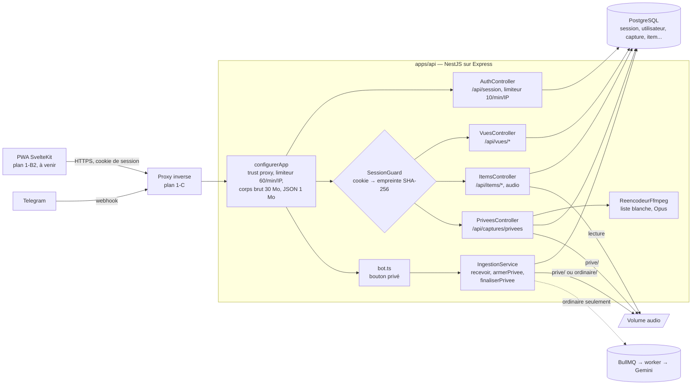
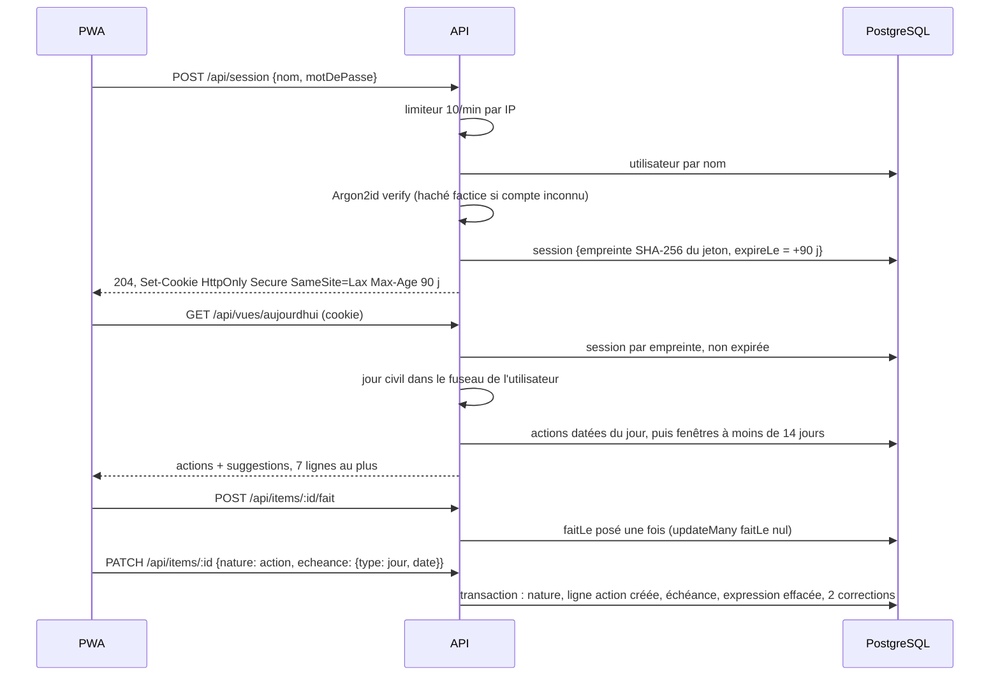
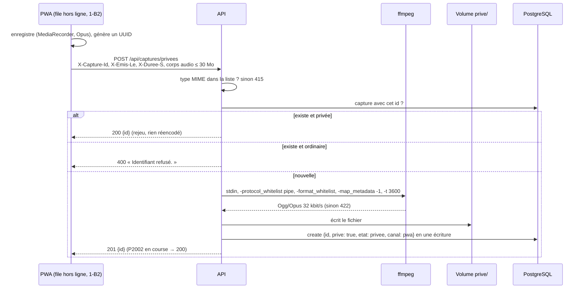
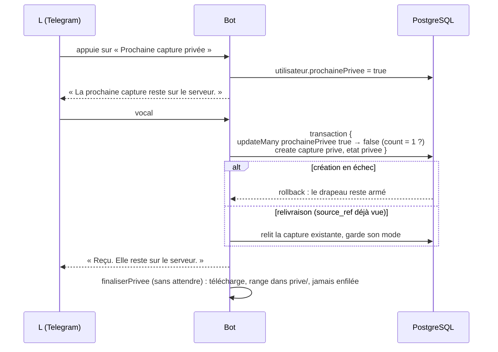

# Dossier de revue — Organizer, lot 1-B1 (API de la PWA et mode privé côté serveur)

Rédigé le 3 octobre 2026, à partir de l'état de la branche `lot1-b1-api-prive` (tête `2bae21b`,
correctifs finaux compris).
Auteur de la rédaction : un agent IA, à la demande de Franck, propriétaire du projet.
Ce dossier fait suite au [dossier du lot 1-A](2026-10-03-lot1-a.md). Il ne répète pas ce que
celui-ci dit déjà : produit, règles non négociables, pipeline de capture, méthode générale.

---

## 1. À l'attention du relecteur

Ce qu'on attend de toi est inchangé (voir [dossier 1-A, section 1](2026-10-03-lot1-a.md)) :
relire, challenger, proposer des alternatives chiffrées, séparer **défaut** et **préférence**.

**Lis d'abord le dossier 1-A**, sections 2 (le produit en une page) et 4 (méthode). Ce dossier-ci
suppose connus : les deux surfaces (bot Telegram, PWA), la règle n° 6 (le mode privé est décidé
par le point d'entrée), les garde-fous SQL du mode privé, l'ingestion Telegram en deux temps
(`recevoir`, puis `finaliser`), la décision 21 (types d'échéance et thèmes en données).

Ce que tu ne peux pas vérifier :

- Le code est sur GitHub, dépôt public `djkix/organizer`, branche `lot1-b1-api-prive`.
  Tous les commits du lot, correctifs finaux compris, y sont publiés (vérifié le 3 octobre 2026).
- Le dossier `.superpowers/` (registre, briefs, rapports, diffs de relecture) est ignoré par Git.
  Tout ce qui en vient est résumé ici.
- **Aucun appel réel à Telegram ni à Gemini** pendant ce lot. Aucune PWA n'existe encore : l'API
  n'a jamais été appelée par un vrai navigateur ni un vrai téléphone.
- Les nombres de tests viennent des rapports des implémenteurs. Ils n'ont pas été relancés
  pour ce dossier.

Même convention que le dossier 1-A : un point non vérifié est signalé ; les remarques marquées
« lecture du rédacteur » viennent de la lecture du code pour ce dossier et ne figurent pas au registre.

---

## 2. Ce que le lot 1-B1 ajoute

**But** (extrait du plan) : l'API expose tout ce dont la PWA a besoin (connexion, vues
Aujourd'hui, Cette semaine, Horizons, À revoir, cochage, correction, réécoute) et reçoit les
captures privées, par la PWA comme par le repli Telegram, sans qu'aucune ne puisse atteindre Gemini.

**Hors de 1-B1** : la PWA SvelteKit elle-même (plan 1-B2 : écrans, annulation du cochage en 10 s,
enregistreur privé, raccourci Android, file hors ligne IndexedDB et Background Sync, vue Privé par
calendrier) ; déploiement, image Docker, en-têtes de sécurité, webhook réel (plan 1-C) ; vues
Rapide, Fils, Pensées, Recherche (lots suivants).

**Volume** : 13 commits sur `main..HEAD` au moment de la lecture, six tâches, une ronde de
correction sur les tâches 2, 4 et 5. `apps/api/src` et `packages/shared/src` font ensemble
environ 1 500 lignes. 180 tests verts après la ronde de la tâche 5 (rapport de l'implémenteur).
L'application n'est pas en service.

### 2.1 Schéma de l'API



Aucune flèche ne relie le chemin privé (PWA ou Telegram) à la file. C'est ce que vérifient les
tests de la section 3.

### 2.2 Routes

Toutes sous `/api`, toutes protégées par la session sauf l'ouverture et la fermeture de session.

| Méthode et route | Rôle | Réponses notables |
| --- | --- | --- |
| `POST /api/session` | Connexion par nom et mot de passe | 204 + cookie ; 401 « Identifiants invalides. » ; 429 |
| `DELETE /api/session` | Déconnexion | 204, cookie effacé |
| `GET /api/session/moi` | Compte connecté | `{ nom }` ; 401 « Connecte-toi pour continuer. » |
| `GET /api/vues/aujourdhui` | Actions du jour civil + 1 à 3 suggestions, 7 lignes au plus | `VueAujourdhui` |
| `GET /api/vues/semaine` | Actions datées des 7 jours, groupées par jour | `VueSemaine` |
| `GET /api/vues/horizons` | Fenêtres groupées par borne | `VueHorizons` |
| `GET /api/vues/a-revoir` | Items ambigus et captures `a_revoir`, jamais privés | `VueARevoir` |
| `POST /api/items/:id/fait` | Cocher | 204 ; 404 si inconnu ou pas une action |
| `DELETE /api/items/:id/fait` | Décocher | 204 |
| `PATCH /api/items/:id` | Corriger nature et/ou échéance | 204 ; 400 |
| `GET /api/captures/:id/audio` | Réécouter l'audio d'origine | fichier ; 404 si purgé |
| `POST /api/captures/privees` | Déposer une capture privée (corps = audio brut) | 201 nouvelle ; 200 déjà reçue ; 400 ; 415 ; 422 |
| `GET /api/captures/privees?mois=AAAA-MM` | Lister les privées par jour local | `JourPrive[]` |
| `PATCH /api/captures/privees/:id` | Poser ou retirer l'étiquette (80 caractères) | 204 ; 404 |

Les types de réponse sont dans `packages/shared/src/api.ts`. Le correctif F3 y ajoute les corps
de requête (section 7).

### 2.3 Flux 1 : connexion, vues, cocher et corriger



Points de conception :

- **Jour civil.** `jourLocal`, `ajouterJours`, `debutJour` dans `packages/shared/src/dates.ts`.
  `debutJour` lit le décalage du fuseau à 00:00 UTC du jour voulu : vrai pour l'Europe, où les
  changements d'heure ont lieu la nuit, après minuit local (limite connue pour les fuseaux à
  l'est d'UTC, section 6).
- **Aujourd'hui** : types `datee`, `jour`, `relative` dont la date tombe dans le jour civil, puis
  fenêtres dont la fin tombe dans les 14 jours. Une action faite, archivée ou à échéance passée
  n'apparaît pas. Aucun compteur, aucune mention de retard.
- **Horizons** : groupées par `fenetreFin` ; le libellé est la première `echeanceExpr` non nulle
  du groupe (« avant Noël »).
- **Visibilité « tout mélangé »** (décision 8, choix confirmé par Franck le 3 octobre 2026) :
  aucune requête de vue ne filtre par compte. L et Franck voient, cochent et corrigent tous les items.
- **Correction** : les types d'échéance admis viennent de l'énumération `echeance_type` du
  `response-schema.json` de la version de prompt, lue au démarrage de l'API (décision 21). Chaque
  changement écrit une ligne `correction` (ancienne et nouvelle valeur en JSON). Corriger
  l'échéance efface `echeanceExpr`, sinon Horizons garderait l'ancien libellé.
- **Réécoute** : `sendFile` relatif à la racine audio, chemin contenu dans cette racine.

### 2.4 Flux 2 : capture privée par la PWA, avec rejeu hors ligne



- **Idempotence du rejeu** par l'identifiant fourni par le client. Sans `X-Capture-Id`, l'API tire
  un UUID : un rejeu crée alors un doublon (documenté par F3). Un `X-Capture-Id` présent mais
  invalide était remplacé en silence : F5 le refuse en 400.
- **`X-Emis-Le`** : l'heure de l'enregistrement, pas de l'envoi, car l'envoi peut être différé.
  Une date future de plus de 5 min est remplacée par l'heure de réception. Pas de borne basse.
- **`X-Duree-S`** : entier strict de 0 à 3600, sinon nul.
- **Liste** : par mois, groupée par jour local, plus récentes d'abord ; heure `HH:MM`, durée,
  étiquette. Pas de recherche texte (décision 3).

### 2.5 Flux 3 : bouton « Prochaine capture privée » dans Telegram



- **Drapeau et création dans la même transaction.** Le drapeau n'est consommé que si la capture
  est créée. Un échec le rend ; une relivraison Telegram retrouve la capture et son mode.
- La capture naît `prive = true, etat = 'privee'` : les garde-fous SQL du lot 1-A s'appliquent.
- `finaliserPrivee` refuse une capture ordinaire ; `finaliser` refuse toujours une privée.
- La reprise toutes les 5 min rattrape aussi les privées Telegram restées sans audio.
- Le clavier n'était envoyé qu'à la liaison : s'il disparaît, il ne revient plus. F4 le joint aux
  accusés et à `/start` sans code (section 7).

---

## 3. Garde-fous et ce qui les teste

| Garde-fou | Mécanisme | Tests (titres abrégés) |
| --- | --- | --- |
| **Mode privé, PWA** | Création en une écriture `prive: true, etat: privee` ; aucun appel à la file dans le service ; garde-fous SQL du 1-A | `privees.test` : création en une écriture, audio dans `prive/` ; rejeu sans réencodage ; identifiant d'une capture ordinaire refusé |
| **Mode privé, Telegram** | Drapeau consommé dans la transaction de création ; `finaliserPrivee` sans file ; reprise filtrée | `ingestion.test` : drapeau consommé une seule fois ; création en échec rend le drapeau, relivraison reste privée ; reprise des privées sans enfilage. `bot.test` : la suivante est accusée privée, jamais finalisée en ordinaire |
| **Privé hors des vues** | `prive: false` sur les captures et les items d'À revoir | `vues.test` : jamais les privées |
| **Sessions** | Jeton aléatoire 32 octets ; seule l'empreinte SHA-256 en base ; 90 jours fixes ; cookie `HttpOnly; Secure; SameSite=Lax` ; changement de mot de passe = toutes les sessions supprimées, dans une transaction | `auth.test` : empreinte seule ; expiration à 90 jours ; cookie forgé → 401 ; déconnexion ; révocation |
| **Énumération de comptes** | Haché Argon2id factice pour un compte inconnu ; même 401 | `auth.test` : même réponse pour mauvais mot de passe et compte inconnu |
| **Limitation de débit** | Fenêtre glissante en mémoire : 60/min/IP sur `/api`, 10/min/IP sur la connexion ; `trust proxy` = `TRUSTED_PROXY` (défaut `loopback`) | `auth.test` : 10 essais ; `http.test` : XFF d'un appelant non fiable ignoré, proxy de confiance → budget par client ; `limiteur.test` |
| **ffmpeg durci** | Entrée par tube seulement ; `-protocol_whitelist pipe` ; `-format_whitelist matroska,webm,ogg,mov,mp4,m4a,mp3,wav` ; `-map_metadata -1` ; `-t 3600` ; arrêt forcé à 60 s ; corps ≤ 30 Mo ; liste de types MIME vérifiée avant ffmpeg | `reencodeur.test` : Opus dans Ogg ; octets non audio refusés ; binaire absent ; fichier de concaténation et référence locale non suivis ; métadonnées retirées. Liste blanche **vérifiée en direct** par un relecteur sur le ffmpeg local |
| **Jours civils et changements d'heure** | `debutJour` par décalage lu à minuit | `dates.test` : 29 mars et 25-26 octobre 2026 à Paris ; `vues.test` : le jour du passage à l'heure d'hiver couvre exactement le jour civil |
| **Erreurs typées** | `FormatRefuse` 415, `AudioIllisible` 422, `IdentifiantRefuse` 400, `CapturePriveeIntrouvable` 404, `MoisInvalide` 400, `ItemIntrouvable` 404, `CorrectionInvalide` 400 ; toute autre erreur est relancée | `privees.test` : une panne inattendue reste une 500, pas un 404 ni un 400 |
| **Rien dans les journaux** | Contrôleurs sans journal de contenu ; bot : identifiant et nom d'erreur | Hérité du 1-A pour le bot. **Pas de test** sur les nouvelles routes. Le filtre d'exceptions par défaut de NestJS journalise message et pile d'une erreur inattendue : porte 1-C (R9) |
| **Règle des 20 lignes, 7 pour Aujourd'hui** | `take` sur chaque requête ; F1 : budget commun pour À revoir | `vues.test` : jamais plus de 20 lignes ; 7 lignes au plus avec 3 suggestions ; À revoir 20 en tout (F1) |
| **Zéro culpabilisation** | Aucun champ de retard ; échéance passée exclue | `vues.test` : aucune mention de retard |
| **Messages courts** | Moins de 12 mots, sans emoji | `bot.test` |

Non testé ou testé à moitié :

- Aucun test n'épingle la liste blanche de formats (un conteneur hors liste donnant `AudioIllisible`).
  Sur le ffmpeg de la machine, le fichier de concaténation était déjà refusé sans la liste blanche :
  le test passe avec ou sans elle.
- `audio/mp4` et `m4a` ont été ajoutés à la liste par l'implémenteur sans échantillon réel.
- Saisie masquée de la CLI : non testée (TTY), vérifiée par raisonnement.
- Aucun appel depuis un vrai navigateur : cookies `Secure` sur HTTP local, CORS, `SameSite` non éprouvés.

---

## 4. Décisions R1 à R9

Registre propre au lot 1-B1. Les décisions R1 à R17 du 1-A restent valables
(voir [dossier 1-A, section 5](2026-10-03-lot1-a.md)).

| # | Décision | Pourquoi | Coût si elle est fausse |
| --- | --- | --- | --- |
| R1 | Le commit du plan n'ayant pas de ligne de CHANGELOG, la tâche 1 l'ajoute | Règle « une ligne par commit » | Nul |
| R2 | La relecture d'une tâche tourne en parallèle de l'implémentation de la suivante, sur un paquet figé ; l'implémenteur suivant est prévenu ; les corrections passent en ronde après coup, un seul implémenteur à la fois dans la copie de travail | Demande de Franck : accélérer | Une correction à reporter sur une tâche déjà avancée ; des tâches bâties sur un code dont la relecture n'est pas finie |
| R3 | Le `Max-Age` du cookie est calculé avec l'horloge injectée du service (`AuthService.maintenant` rendu public) | Le test sous horloge injectée échouait avec `new Date()` | Nul, production identique |
| R4 | Trois constats Important de la tâche 2, issus du plan, corrigés en ronde : `TRUSTED_PROXY` configurable (défaut loopback), révocation des sessions au changement de mot de passe, saisie masquée et confirmée | Sécurité ; le plan les avait laissés passer | Quelques lignes |
| R5 | Trois mineurs de la tâche 3 corrigés avec la même ronde : départage stable par `id`, libellé d'horizon = première expression non nulle, À revoir filtre `prive: false` | Ils touchent ce que voit L | Nul |
| R6 | Ronde de la tâche 4 : `sendFile` avec `root` et `dotfiles: allow`, chemin contenu dans la racine, `echeanceExpr` remise à nul à la correction d'échéance, test HTTP de l'audio | Audio en 404 sous un dossier en point ; ancienne expression affichée après correction | Nul |
| R7 | Ronde de la tâche 5 : les 4 Important, plus 4 mineurs bon marché (`-map_metadata -1`, `-t 3600`, `X-Duree-S` strict, mois par défaut en heure locale) et une phrase du README | Chemin privé : on corrige ce qui coûte peu | Nul |
| R8 | Correctifs finaux F1 à F7 : les 4 Important de la relecture finale, plus `X-Capture-Id` invalide → 400, `aAudio` dans `JourPrive`, expression gardée dans l'historique | La sortie du modèle effacée est irrécupérable ; le contrat PWA doit être complet avant 1-B2 | Un peu de code |
| R9 | Portes bloquantes du plan 1-C (section 6.1) | Ne se vérifient ou ne se règlent qu'au déploiement | Une fuite privée possible si 1-C les oublie |

---

## 5. Défauts trouvés en relecture et corrigés

C'est la partie la plus utile pour juger la méthode. Plusieurs défauts venaient **du plan
lui-même**, recopié tel quel par l'implémenteur, comme au 1-A.

Relectures sur le modèle le plus capable pour les tâches qui touchent la sécurité et le privé
(2, 5, 6) et pour la relecture finale.

### Tâche 1 — jours civils et schéma

Relecture propre. Mineurs différés (section 6).

### Tâche 2 — connexion, sessions, limitation de débit (3 Important, tous issus du plan)

| Défaut | Risque | Correctif |
| --- | --- | --- |
| `trust proxy = 1` en dur | Si le port 3000 est joint en direct (réseau local, conteneur voisin), n'importe qui choisit son IP par `X-Forwarded-For` et contourne les deux limiteurs, dont celui de la connexion : force brute illimitée | `TRUSTED_PROXY`, défaut `loopback` ; test avec XFF variés (`fa793e5`) |
| Changer le mot de passe ne révoque pas les sessions | Un téléphone volé reste connecté 90 jours malgré le changement | `deleteMany` des sessions dans la même transaction |
| La CLI affiche le mot de passe en clair | Mot de passe dans l'historique du terminal ou sur l'écran | Saisie masquée et confirmée ; erreurs propres (« Compte introuvable. ») |

### Tâche 3 — vues

Aucun Important. Trois mineurs corrigés (R5) : ordre instable à égalité (affichage qui saute
d'un rafraîchissement à l'autre), libellé d'horizon pris sur un item au hasard, items ambigus
issus d'une capture privée potentiellement visibles dans À revoir.

### Tâche 4 — cocher, corriger, réécouter (1 Important)

| Défaut | Risque | Correctif |
| --- | --- | --- |
| `sendFile` avec un chemin absolu refuse les dossiers en point | Toute réécoute en 404 si `AUDIO_STORAGE_PATH` passe par un dossier caché (`.local`, etc.) | Chemin relatif + `root` + `dotfiles: allow` ; chemin contenu dans la racine (`319042f`) |
| `echeanceExpr` gardée après correction (mineur relevé) | Horizons et Aujourd'hui affichent « avant Noël » pour une date corrigée en mars | Expression effacée ; F7 la garde dans l'historique |

### Tâche 5 — captures privées par la PWA (4 Important)

| Défaut | Risque | Correctif |
| --- | --- | --- |
| ffmpeg sans liste blanche de protocoles ni de formats | Octets fournis par le client : un fichier `ffconcat` ou une playlist HLS peut faire lire un fichier local ou une URL. Lecture de fichiers du serveur, ou requête sortante (le privé quitterait le serveur) | `-protocol_whitelist pipe`, `-format_whitelist`, vérifié en direct par le relecteur (`d1ccf3e`) |
| Collision d'identifiant reconnue par le texte de l'erreur | Fragile : dépend du message de Prisma ; une autre erreur pouvait passer pour un rejeu | Codes Prisma (`P2002`) et classes d'erreur typées (`05b4a8a`) |
| `catch` nus qui masquent les pannes | Une base en panne répondait 404 ou 400 : la PWA aurait cru la capture refusée et l'aurait jetée de sa file | Seules les erreurs attendues sont traduites ; le reste est relancé en 500 |
| Tests HTTP minces, étape rouge sautée | Codes 400, 415, 422, 500 non prouvés | Tests HTTP ajoutés, rouges d'abord dans la ronde |

Mineurs corrigés dans la ronde : métadonnées du téléphone retirées (lieu, modèle), durée
plafonnée à 1 h, `X-Duree-S` strict (`''`, `1e3`, `0x10` donnaient 0, 1000, 16), mois par défaut
dans le fuseau de l'utilisateur et non en UTC.

### Tâche 6 — bouton privé Telegram

Aucun Important. Le mineur le plus lourd est devenu une porte 1-C : en webhook, grammY peut
traiter deux mises à jour en parallèle. Un vocal envoyé juste après le bouton, avant que
l'armement soit commité, part en ordinaire, donc vers Gemini. C'est le **seul chemin restant
d'une pensée voulue privée vers Gemini** (R9).

### Relecture finale (`9d65e91..05b4a8a`)

Verdict « With fixes » : 4 Important à corriger dans le lot, 1 Important pour 1-C.

| Constat | Correctif |
| --- | --- |
| À revoir peut renvoyer 40 lignes (20 items + 20 captures) | F1 |
| ffmpeg absent des prérequis du README ; l'API lit aussi `prompts/` au démarrage | F2 |
| Le contrat des requêtes de la PWA (corps, en-têtes, codes) n'est pas dans `api.ts` | F3 |
| Bouton privé Telegram irrécupérable une fois le clavier fermé | F4 |
| `TRUSTED_PROXY` non obligatoire en production | Porte 1-C |

### Ce que montrent ces défauts

- Le plan, écrit avant le code, contenait trois failles de sécurité de la tâche 2 et l'appel
  ffmpeg non durci. La relecture les a vues ; l'implémenteur, non.
- Un défaut d'exploitation (dossiers en point) n'aurait été vu qu'en production.
- Deux défauts d'ensemble (À revoir à 40 lignes, bouton irrécupérable) n'ont été vus qu'à la
  relecture finale, comme au 1-A.
- La relecture en parallèle (R2) n'a pas causé de conflit visible. Les rondes des tâches 2 et 4
  ont été passées après le commit de la tâche 4, une à la fois.

---

## 6. Portes de mise en service et dettes différées

### 6.1 Portes du plan 1-C (R9, bloquantes avant mise en service)

| Porte | Pourquoi |
| --- | --- |
| `TRUSTED_PROXY` obligatoire en production et posé dans le compose | Sans lui, les limiteurs voient toutes les requêtes comme venant du proxy (un seul budget pour tous) ou sont contournables |
| Webhook Telegram `max_connections: 1` (ou séquentialisation par chat) | Seul chemin restant d'une capture voulue privée vers Gemini |
| ffmpeg avec libopus et `prompts/` dans l'image de l'API | Sans ffmpeg, toute capture privée PWA échoue en 422 ; sans `prompts/`, l'API ne démarre pas |
| Filtre d'exceptions global sans contenu | Le filtre par défaut de NestJS journalise message et pile des erreurs inattendues (une erreur Prisma peut recopier des valeurs) |
| Plafond de processus ffmpeg simultanés | 60 envois de 30 Mo par minute et par IP lancent autant de ffmpeg |
| Purge des sessions expirées | Jamais supprimées aujourd'hui |

Aussi prévu au plan 1-C : en-têtes de sécurité (CSP, `X-Content-Type-Options`,
`Referrer-Policy`) au proxy, `trust proxy` vérifié derrière le vrai proxy.

### 6.2 Dettes différées, par thème

**Sécurité et comptes**

| Point | Origine |
| --- | --- |
| Haché factice calculé au premier essai : le premier compte inconnu répond plus lentement | T2 |
| Sessions expirées jamais purgées ; purge du limiteur en O(n) au-delà de 10 000 clés | T2 |
| IPv6 limité par adresse complète (une /64 donne des milliards de budgets) ; NAT partagé = budget partagé | T2 |
| CLI : Ctrl-C et entrée par tuyau non gérés ; test XFF suppose `127.0.0.1`, pas `::1` | T2 |

**Vues et interactions**

| Point | Origine |
| --- | --- |
| Une action datée plus tôt dans la journée reste dans Aujourd'hui | T3 |
| La coupe à 20 lignes peut tomber au milieu d'un groupe (jour, borne) | T3 |
| Correction écrite même si l'échéance ne change pas ; pas de contrôle `debut <= fin` | T4 |
| Course sur décocher : erreur Prisma P2025 rendue en 500 | T4 |
| Test du libellé d'horizon probabiliste (identifiants aléatoires) | T3 |

**Captures privées**

| Point | Origine |
| --- | --- |
| Fichier orphelin sur le volume si l'écriture en base échoue | T5 |
| `X-Emis-Le` sans borne basse | T5 |
| Liste du mois sans plafond et tri non départagé | T5 |
| Bouton Telegram relivré : réarme le drapeau | T6 |
| Reprise des privées Telegram sans plafond d'essais | T6 |
| Texte privé Telegram sans route de lecture (à faire en 1-B2) | T6 |
| Pas de test de bord de mois en fuseau ; test 422 maladroit | T5 |

**Hérités du 1-A et non traités ici** : voir [dossier 1-A, section 6.3](2026-10-03-lot1-a.md).
En particulier, la cascade de `deleteMany` des items sur `correction`, ciblée « 1-B » au 1-A, n'est
pas traitée : un rejeu de classement d'une capture déjà corrigée effacerait les corrections.
Ce rejeu n'arrive aujourd'hui qu'après interruption du worker, avant la fin de la transaction.

### 6.3 Observations du rédacteur (hors registre, à confirmer)

- **Audio privé Telegram non réencodé.** Le chemin PWA passe par ffmpeg ; `finaliserPrivee`
  range le fichier tel que Telegram le fournit. Il garde donc ses métadonnées. Il a de toute façon
  transité par les serveurs de Telegram : « ne quitte jamais le serveur » est vrai à partir de
  la réception, pas avant. Le cahier admet ce repli ; l'interface ne le dit pas.
- **Drapeau privé sans expiration ni désarmement.** Armé un lundi, il rend privée la capture du
  jeudi si aucune n'a été faite entre-temps. L'accusé le dit (« Elle reste sur le serveur »),
  mais rien ne permet d'annuler l'armement.
- **Corrections et cochages non attribués.** `correction` et `action.faitLe` ne disent pas qui a
  agi. Avec « tout mélangé », on ne saura pas qui a coché ou corrigé.
- **Captures `a_revoir` sans issue.** Un item ambigu se résout par `PATCH` de sa nature. Une
  capture `a_revoir` sans item n'a aucune route : elle restera dans la vue sans fin, faute de route d'archivage.
- **« Reporter » sans route dédiée.** Le cahier prévoit trois boutons (demain, semaine prochaine,
  plus tard). La PWA devra passer par `PATCH` ; chaque report écrira une ligne `correction`, mêlée
  aux vraies erreurs du modèle qui servent au réglage du prompt.
- **CSRF.** Aucun jeton ; protection par `SameSite=Lax` seul. Un autre service sur un
  sous-domaine du même domaine enregistré est « même site » et pourrait déclencher un `POST`
  avec le cookie.
- **La réécoute sert aussi les captures privées**, aux deux comptes. Conforme à la décision 8,
  mais à confirmer comme voulu.
- **Bascule d'un item ordinaire en privé après coup.** Prévue au cahier (section Le bouton privé,
  ligne Correction). Absente du plan 1-B1 et de l'API. Non assignée à un plan connu.
- **Sessions en base, pas dans Valkey.** Le cahier cite Valkey comme « cache de sessions ».
  Le lot stocke les sessions dans PostgreSQL. Écart mineur, non consigné dans les décisions.

---

## 7. Correctifs finaux

Les sept correctifs de la relecture finale sont faits, relus et publiés. 189 tests verts (deux
passages), typecheck et lint verts. Une relecture ciblée conclut : les sept constats sont traités,
la branche est prête à fusionner. Elle n'a pas relancé les tests : ce chiffre vient du rapport.

| # | Constat | Commit |
| --- | --- | --- |
| F1 | À revoir : budget commun de 20 lignes, les plus récentes d'abord | `0a2de22` (typage achevé dans `2bae21b`) |
| F2 | README : ffmpeg avec libopus en prérequis ; l'API lit `prompts/` | `1dab845` |
| F3 | Contrat des requêtes dans `api.ts`, schémas zod liés par un test de types | `2bae21b` |
| F4 | Clavier privé joint aux accusés ; `/start` sans code sur un chat lié rend le bouton | `b7ed7c5` |
| F5 | `X-Capture-Id` présent mais invalide → 400 « Identifiant refusé. » | `2bae21b` |
| F6 | `aAudio` dans chaque capture de `JourPrive` | `2bae21b` |
| F7 | `ancienneValeur` d'une correction d'échéance garde l'expression d'origine | `3675f9b` |

Réserves restantes : le commit `0a2de22` seul ne passe pas le typecheck (sans effet sur la tête de
branche) ; `ReponseErreur` est exporté mais les corps d'erreur ne lui sont liés par aucun test ;
le lien entre schémas zod et types partagés n'est vérifié que par `pnpm typecheck`.

---

## 8. Questions pour challenger l'approche

1. **Sessions fixes de 90 jours.** L se fera déconnecter tous les trois mois, à un moment
   imprévisible, alors que toute friction avant l'enregistrement est un échec. Une expiration
   glissante (renouvelée à l'usage, plafond absolu plus long) vaut-elle le risque d'un jeton
   volé qui reste valide plus longtemps ? Faut-il aussi une révocation par appareil ?
2. **Limiteurs en mémoire.** Un seul processus API, deux comptes : suffisant ? Tout redémarrage
   remet les compteurs à zéro. L et Franck derrière la même box partagent 60 requêtes par minute
   et 10 essais de connexion. Le limiteur de connexion compte aussi les connexions réussies.
   Faut-il un verrou par compte, en base, plutôt que par IP ?
3. **« Tout mélangé » (décision 8).** Aucune vue ne filtre par compte. Les actions de Franck
   (technique, administration) se mêlent à celles de L dans Aujourd'hui, limité à 7 lignes.
   Est-ce viable à l'usage ? Un filtre d'affichage par défaut, sans cloisonnement, coûterait peu.
4. **À revoir sans action de résolution.** Le cahier dit « aucune notification ». Mais une capture
   `a_revoir` ne peut ni être reclassée, ni archivée, ni supprimée par l'API. La vue va-t-elle se
   remplir pour toujours ? Faut-il « archiver » et « relancer le classement » dès 1-B1 ?
5. **Types d'échéance nommés dans le code.** `datee`, `jour`, `relative`, `fenetre`, `aucune` sont
   écrits en dur dans les vues et la correction, alors que la décision 21 en fait des données lues
   du schéma du prompt. Si la typologie du lot 0 renomme ou ajoute un type, les vues l'ignoreront
   sans erreur. Faut-il un rôle déclaré par type dans le schéma (« daté », « fenêtre », « sans ») ?
6. **ffmpeg dans l'API.** Un parseur de médias, notoirement exposé, tourne dans le processus qui
   tient les sessions et parle à Telegram, avec ses droits. Un conteneur dédié, sans réseau, avec
   un système de fichiers en lecture seule, ou un sandbox (seccomp, utilisateur dédié), vaut-il
   sa complexité pour deux utilisatrices ?
7. **Contrat PWA en types TypeScript seulement.** `api.ts` décrit les réponses ; F3 y ajoute les
   requêtes ; les schémas zod du serveur sont alignés par `satisfies`. La PWA n'aura pas de
   validation à l'exécution. Faut-il exporter les schémas zod eux-mêmes, ou un OpenAPI ?
8. **Webhook concurrent et drapeau privé.** La garantie « jamais vers Gemini » dépend d'un réglage
   de déploiement (`max_connections: 1`). Est-ce acceptable pour une règle vitale ? Une
   séquentialisation par chat dans le code (grammY `sequentialize`) la rendrait indépendante du
   déploiement, au prix d'une dépendance de plus.
9. **Captures privées lisibles par les deux comptes.** Le mode privé protège de Gemini, pas de
   Franck (décision 8). L l'a-t-elle compris ainsi ? Le mot « privé » dans l'interface laisse
   entendre l'inverse. Faut-il un autre libellé, ou un cloisonnement par compte de la vue Privé ?
10. **Aucun essai réel.** Pas de navigateur, pas de téléphone, pas de Telegram réel. Les cookies
    `Secure` en HTTP local, `SameSite`, l'enregistrement MediaRecorder d'un Android réel, les
    formats que ffmpeg acceptera vraiment : tout sera découvert en 1-B2 ou en 1-C. Un essai avec
    un échantillon WebM d'un vrai téléphone, et un `curl` contre l'API démarrée, auraient-ils
    dû fermer 1-B1 ?
11. **Relecture en parallèle (R2).** Gain de temps, mais une tâche peut se bâtir sur un code qui
    sera corrigé. Ici, sans dégât visible. Où placer la limite : tâches indépendantes seulement ?
12. **Idempotence portée par le client.** Le rejeu sans doublon dépend d'un UUID que la PWA doit
    générer avant la mise en file hors ligne et garder. Un client oublieux crée des doublons
    silencieux. Faut-il rendre `X-Capture-Id` obligatoire ?
13. **Historique de correction comme signal de réglage.** Les corrections serviront à régler le
    prompt. Les reports, les corrections de Franck sur les items de L, et les corrections sans
    changement s'y mêleront. Faut-il typer la cause d'une correction (erreur du modèle, report,
    changement d'avis) dès maintenant ?
14. **Le plan contient encore du code fautif.** Comme au 1-A, trois failles de la tâche 2 et
    ffmpeg non durci venaient du plan. Un plan qui donne le code complet transmet ses erreurs.
    Une liste de propriétés de sécurité à prouver par test, sans code, aurait-elle mieux marché ?
15. **Aujourd'hui en sept lignes.** Les suggestions viennent des fenêtres à moins de 14 jours, triées
    par fin. Sans importance ni effort pris en compte, la suggestion est mécanique. Est-ce assez
    pour éviter le « mur de tâches », ou faut-il attendre la typologie du lot 0 ?

---

## 9. Annexes

### 9.1 Arborescence ajoutée ou modifiée

```
apps/api/src
  http.ts                       configurerApp : trust proxy, limiteur global, parseurs
  auth/      limiteur.ts, cookies.ts, auth.service.ts, session.guard.ts, auth.controller.ts
  vues/      vues.service.ts, vues.controller.ts
  items/     items.service.ts, items.controller.ts
  privees/   reencodeur.ts, privees.service.ts, privees.controller.ts
  ingestion/ingestion.service.ts   + armerPrivee, finaliserPrivee, reprise des privées
  telegram/bot.ts                  + bouton « Prochaine capture privée »
  app.module.ts, main.ts, config.ts (types d'échéance lus du prompt), jetons.ts, cli.ts (mot-de-passe)
packages/shared/src
  dates.ts   + jourLocal, ajouterJours, debutJour
  tri.ts     + valeursAdmises
  api.ts     types des réponses (et des requêtes après F3)
packages/db/prisma
  schema.prisma   + Session, motDePasseHash, prochainePrivee, etiquette
  migrations/20261003094855_auth_prive/
apps/api/test   auth, http, limiteur, vues, items, privees, reencodeur, bot, ingestion (+ aides-http, aides-items)
```

### 9.2 Commandes

En plus de celles du [dossier 1-A, annexe 8.2](2026-10-03-lot1-a.md) :

```bash
brew install ffmpeg                                   # avec libopus
ffmpeg -hide_banner -encoders | grep libopus          # vérification
pnpm --filter @organizer/api cli mot-de-passe <nom>   # pose ou change le mot de passe, révoque les sessions
pnpm test && pnpm typecheck && pnpm lint
```

Variable nouvelle : `TRUSTED_PROXY` (adresse du proxy dont l'API croit `X-Forwarded-For`, défaut `loopback`).

### 9.3 Commits de la branche (`main..HEAD`, du plus ancien au plus récent, au moment de la lecture)

```
07e91a8 Ajoute les jours civils et le schéma des sessions et du mode privé
4445282 Ajoute la connexion, les sessions et la limitation de débit
11b5ef0 Ajoute les vues Aujourd'hui, Cette semaine, Horizons et À revoir
9c1a925 Ajoute le cochage, la correction et la réécoute
fa793e5 Durcit la connexion : proxy de confiance, révocation des sessions, saisie masquée
5b14659 Rend l'ordre des vues stable
319042f Sert l'audio depuis sa racine et efface l'expression corrigée
0758e81 Reçoit les captures privées de la PWA
e1f529a Ajoute la prochaine capture privée dans Telegram
d1ccf3e Restreint ffmpeg aux formats audio attendus
05b4a8a Type les erreurs des captures privées et teste leurs routes
0a2de22 Limite À revoir à vingt lignes en tout
3675f9b Garde l'expression d'origine dans l'historique de correction
```

Base de la branche : `9d65e91` (ajout du plan sur `main`). Les commits de F2 à F6 sont à ajouter.

### 9.4 Documents du dépôt

Liens relatifs depuis `docs/revue/` ; entre parenthèses, le chemin depuis la racine du dépôt.

- [Dossier de revue du lot 1-A](2026-10-03-lot1-a.md) (`docs/revue/2026-10-03-lot1-a.md`) : produit, méthode, pipeline.
- [Plan du lot 1-B1](../superpowers/plans/2026-10-03-lot1-b1-api-prive.md)
  (`docs/superpowers/plans/2026-10-03-lot1-b1-api-prive.md`) : Global Constraints, Review Focus, tâches 1 à 6.
- [CLAUDE.md](../../CLAUDE.md) (`CLAUDE.md`) : règles produit, stack, conventions.
- [Décisions](../decisions.md) (`docs/decisions.md`) : décisions 3, 8 et 21 en particulier.
- [Cahier des charges](../cahier-des-charges.md) (`docs/cahier-des-charges.md`) : sections Vues de
  l'application, Interactions, Authentification, Le bouton privé, Exposition et surface d'attaque.
- [README](../../README.md) (`README.md`) : routes, mode privé, administration, `TRUSTED_PROXY`.
- [CHANGELOG](../../CHANGELOG.md) (`CHANGELOG.md`).

Non publiés (dossier ignoré par Git, résumés ici) : `progress.md` (registre, R1 à R9),
`final-fix-brief.md` (F1 à F7), `contraintes.md`, briefs et rapports par tâche, diffs de relecture,
dans `.superpowers/sdd/2026-10-03-lot1-b1-api-prive/`.
