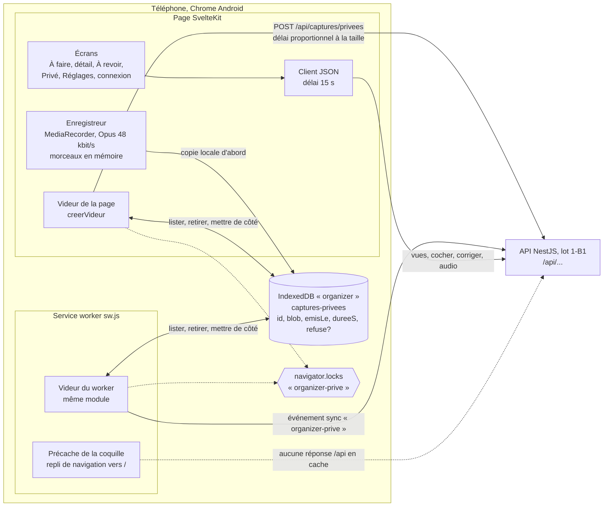

# Dossier de revue — Organizer, lot 1-B2 (la PWA)

Rédigé à partir de l'état de la branche `lot1-b2-pwa` (tête `91863b6`,
correctifs finaux F1 à F12 compris).
Auteur de la rédaction : un agent IA, à la demande de Franck, propriétaire du projet.
Ce dossier fait suite au [dossier du lot 1-A](2026-10-03-lot1-a.md) et au
[dossier du lot 1-B1](2026-10-03-lot1-b1.md). Il ne répète pas ce qu'ils disent déjà.

---

## 1. À l'attention du relecteur

Ce qu'on attend de toi est inchangé (voir [dossier 1-A, section 1](2026-10-03-lot1-a.md)) :
relire, challenger, proposer des alternatives chiffrées, séparer **défaut** et **préférence**.

**Lis d'abord** le dossier 1-A, sections 2 (le produit) et 4 (méthode), puis le dossier 1-B1,
sections 2.2 (routes de l'API) et 2.4 (contrat de la file hors ligne : `X-Capture-Id`,
`X-Emis-Le`, `X-Duree-S`, 200 ou 201 = livrée). Ce dossier-ci suppose aussi connues la règle n° 6
(le mode privé est décidé par le point d'entrée) et la décision 8 (les deux comptes voient tout).

Ce que tu ne peux pas vérifier :

- Le code est sur GitHub, dépôt public `djkix/organizer`, branche `lot1-b2-pwa`. Tous les
  commits du lot, correctifs finaux compris, y sont publiés.
- Le dossier `.superpowers/` (registre, briefs, rapports, diffs de relecture) est ignoré par Git.
  Tout ce qui en vient est résumé ici.
- **Aucun essai sur un vrai téléphone Android.** Ni installation WebAPK, ni raccourci d'écran
  d'accueil, ni micro réel, ni Background Sync déclenché par le système, ni TalkBack réel. Tous les
  essais tournent dans Chromium de bureau (profil Pixel 7 émulé, micro factice).
- **Aucun appel à la vraie API.** Les tests de bout en bout simulent l'API par `page.route`.
  La PWA n'a jamais parlé au serveur NestJS du lot 1-B1.
- Les nombres de tests et le poids du bundle viennent des rapports des implémenteurs. Ils n'ont
  pas été relancés pour ce dossier.
- **Le plan a été rédigé par un agent**, sur un cadrage du contrôleur (l'agent qui orchestre),
  **sans rien exécuter** : aucune commande lancée, aucune version de dépendance vérifiée, aucune
  option de plugin essayée. Il a été relu en surface (structure, absence d'espaces réservés) avant
  exécution. La section 5 montre ce que cela a coûté.

Même convention que les dossiers précédents : un point non vérifié est signalé ; les remarques
marquées « lecture du rédacteur » viennent de la lecture du code pour ce dossier et ne figurent
pas au registre.

---

## 2. Ce que le lot 1-B2 ajoute

**But** (extrait du plan) : L installe Organizer sur son Android, voit et coche ses actions du jour,
de la semaine et des horizons, corrige un classement en deux gestes, et enregistre une capture
privée depuis un raccourci d'écran d'accueil, même hors ligne et même sans session ouverte,
sans qu'aucune capture privée ne se perde.

**Hors de 1-B2** : déploiement, proxy, HTTPS, CSP et en-têtes (plan 1-C, voir section 6.1) ;
Reporter, alarme, vues Rapide, Fils, Pensées, Recherche, partage entrant (Web Share Target),
notifications (lots 2 et 3) ; archiver une capture `a_revoir` sans item ; basculer un item en
privé après coup ; choix du thème (il suit le système).

**Volume** : 15 commits sur `main..HEAD` (plan compris), huit tâches. Environ 3 900 lignes ajoutées
dans `apps/web/src`, `test` et `e2e`. Après la dernière ronde de la tâche 7 (rapport de
l'implémenteur) : 306 tests Vitest pour la PWA, 499 pour tout le dépôt, 25 tests Playwright,
bundle à 61,8 Ko compressés pour un budget de 150 Ko. L'application n'est pas en service.

**Pile** : SvelteKit 2 et Svelte 5 (runes) en SPA statique (`adapter-static`, repli
`index.html`, `ssr = false`) ; `@vite-pwa/sveltekit` en mode `injectManifest` (Workbox 7) ;
`idb` pour IndexedDB ; Vitest avec `fake-indexeddb` et `jsdom` ; Playwright sur Chromium.
Toute la logique vit dans des modules TypeScript de `src/lib`, testés sans SvelteKit ; les
composants Svelte restent minces.

### 2.1 Schéma



Le service worker n'a pas de code d'envoi propre : il importe `creerVideur` de
`lib/prive/file.ts`, comme la page. Un seul vidage à la fois par contexte (promesse partagée),
et un seul entre contextes (verrou nommé).

### 2.2 Écrans

| Écran | Chemin | Rôle |
| --- | --- | --- |
| À faire | `/` (`?vue=aujourdhui`, `semaine`, `horizons`) | Trois onglets ; cochage d'un geste ; détail en panneau modal |
| Détail d'un item | panneau sur `/` (entrée d'historique superficielle) | Réécoute ; correction de la nature ou de l'échéance en deux gestes |
| À revoir | `/a-revoir`, depuis Réglages | Items ambigus à trancher ; captures seules en lecture |
| Privé | `/prive` | Captures privées par mois et par jour ; lecteur ; étiquette facultative ; « En attente d'envoi » |
| Enregistreur privé | `/prive/enregistrer` | Plein écran violet, cadenas, « Ça reste à la maison. » ; exempté de la garde de session |
| Connexion | `/connexion` | Nom et mot de passe |
| Réglages | `/reglages` | Compte, « Ce qui sort de la maison », À revoir, déconnexion |

Barre du bas : À faire, Privé, Réglages, plus un bouton violet flottant vers l'enregistreur.
Elle est masquée sur la connexion et l'enregistreur. Manifeste : deux raccourcis d'appui long,
« Enregistrement privé » d'abord (CAP-07), puis « Aujourd'hui ».

### 2.3 Parcours 1 : raccourci privé, hors ligne, sans session

```mermaid
sequenceDiagram
    participant L as L
    participant SW as Service worker
    participant P as Page /prive/enregistrer
    participant Q as IndexedDB
    participant A as API

    L->>SW: appui long sur l'icône, « Enregistrement privé »
    SW-->>P: coquille précachée (aucun réseau)
    Note over P: +layout.ts : l'enregistreur n'attend jamais la session
    L->>P: appuie sur le rond
    P->>P: getUserMedia, MediaRecorder.start(1000)
    L->>P: appuie sur le carré (ou verrouille l'écran, ou un appel prend le micro)
    P->>P: stop, assemble les morceaux, refuse un blob vide
    P->>Q: put {id UUID, blob, emisLe = début, dureeS}
    P->>P: demande stockage durable et Background Sync
    P->>A: vider() : POST (échec, hors ligne)
    Note over Q: la copie reste ; Privé affiche « Il partira au retour du réseau. »
    alt la page revient au premier plan, ou événement online
        P->>A: vider() sous verrou, même X-Capture-Id
    else application fermée, réseau revenu
        SW->>A: événement sync, vider() sous verrou
    end
    A-->>P: 201 (ou 200 au rejeu)
    P->>Q: retirer(id)
    Note over P: 401 : la copie reste ; elle part après la connexion
```

Règles de la file :

- **200 ou 201** : retirée. **400, 413, 415, 422** : mise de côté (champ `refuse`), jamais
  supprimée, ignorée par les vidages automatiques, renvoyée seulement par « Réessayer » dans Privé.
- **401, 429, 5xx, autre statut, coupure, délai dépassé** : la copie reste et le passage s'arrête.
- Délai d'un envoi : 60 s plus 1 s par 20 Ko. Une heure d'audio (environ 22 Mo) donne environ
  19 minutes.
- Le client JSON (15 s) n'est pas utilisé pour l'audio.
- Si l'écriture dans IndexedDB échoue (quota, base absente), l'audio reste en mémoire. L'écran le
  dit, propose « Réessayer » et « Envoyer maintenant », et bloque la navigation et la fermeture.

### 2.4 Parcours 2 : cocher, avec annulation

- Un geste coche. La ligne est barrée tout de suite (écriture optimiste). Le bandeau « Fait. » et
  « Annuler » restent 10 s, puis la ligne quitte la liste.
- Toutes les écritures de l'écran (cochages, décochages, corrections) passent par une seule chaîne
  de promesses : elles partent dans l'ordre des gestes, jamais en parallèle.
- « Annuler » avant la réponse du `POST` : le `DELETE` attend cette réponse ; si le `POST` a échoué,
  aucun `DELETE` ne part.
- Cocher une deuxième ligne clôt l'annulation de la première.
- Un échec fait revenir la ligne avec un mot court, effacé seul. Jamais d'alerte, jamais de rouge.
- Le bandeau est une région `role=status` montée en permanence, pour que TalkBack l'annonce.

### 2.5 Parcours 3 : correction, À revoir, Privé

- **Correction** : toucher une ligne ouvre le détail (premier geste). « Ce n'est pas une chose à
  faire », « Sans date », un jour, un jour et une heure, ou « avant le » (second geste). Les heures
  murales sont converties en instant dans le fuseau `Europe/Paris`, sûres aux changements d'heure.
  « Avant une date » devient une fenêtre qui finit à minuit local du jour choisi. Les types envoyés
  sont vérifiés contre le `response-schema.json` du prompt (décision 21).
- **Focus** : au titre à l'ouverture ; retour à la ligne d'origine à la fermeture, sinon au titre de
  la page ; Échap et le geste retour d'Android ferment ; le fond est `inert`.
- **À revoir** : un item ambigu se tranche (« C'est à faire » ou « C'est une pensée ») ; une capture
  sans item reste en lecture seule, faute de route dans l'API.
- **Privé** : navigation par mois, puis par jour ; aucune recherche texte (décision 3). Chaque
  capture : heure, durée, lecteur, étiquette facultative. En tête : les copies en attente d'envoi
  et, s'il y en a, « Un enregistrement n'a pas pu partir. » avec « Réessayer ».

---

## 3. Garanties et ce qui les teste

Titres de tests abrégés. « u » = Vitest, « e2e » = Playwright.

| Garantie | Mécanisme | Tests |
| --- | --- | --- |
| **Jamais supprimée hors 200/201** | `envoyerCapture` rend `livre` seulement sur 200 ou 201 ; `retirer` n'est appelé que là | u `file` : retire les livrées et garde les refusées ; s'arrête à la première coupure sans rien retirer ; s'arrête sur un 401. e2e `prive` : refus définitif, la copie reste après rechargement ; e2e `pwa` : entrée supprimée seulement après 201 |
| **Copie locale avant le premier envoi** | `garderPuisEnvoyer` : `ajouter` puis `vider` | u : écrit dans la file avant tout envoi, avec un UUID |
| **Un seul envoi par capture** | Promesse partagée par contexte ; drapeau `relancer` pour une capture arrivée pendant un vidage | u : deux vidages simultanés n'envoient chaque capture qu'une fois ; une capture mise en file pendant un vidage part dans la même session |
| **Identifiant stable** | UUID fixé à la mise en file ; idem pour l'envoi direct depuis la mémoire | u : un rejeu après coupure garde le même `X-Capture-Id`, 200 au rejeu retire. e2e : même identifiant après retour d'Android. Trou connu : l'envoi direct et la file utilisent deux identifiants (F3) |
| **Refus mis de côté** | 400, 413, 415, 422 → `refuse` ; ignorée ensuite ; `reessayerRefusees` manuel | u : `reessayerRefusees` renvoie les mises de côté. e2e : refus dit calmement, un seul envoi |
| **Pas de blob vide en file** | `EnregistrementVide` avant toute écriture | u : refuse un enregistrement vide, rien en file, rien envoyé |
| **Délai proportionnel** | `AbortController` et course contre 60 s + taille/20 | u : un envoi muet est coupé, la copie reste ; un vidage bloqué libère le suivant |
| **Verrou entre page et service worker** | `navigator.locks.request('organizer-prive')`, repli sans verrou si l'API manque | u : utilise `navigator.locks` quand il existe (simulé). **Aucun test de deux contextes réels en concurrence** |
| **Pas de cache `/api`** | Précache de la coquille seulement ; aucune route d'exécution ; `denylist` `/api/` sur la navigation | e2e `pwa` : la coquille s'ouvre hors ligne, et `/api` ne vient jamais du cache |
| **Pas de rechargement pendant un enregistrement** | `registerType: 'prompt'`, pas de `skipWaiting` ; `clientsClaim` à la première installation seulement | **Aucun test** à la tête actuelle. F6 rend la garantie explicite et la teste |
| **Plafond d'une heure** | Minuterie de 3600 s dans l'enregistreur ; la page arrête et range ; durée bornée à 3600 | u : la limite est signalée une seule fois |
| **Micro libéré** | `liberer()` sur échec du `MediaRecorder`, à l'arrêt, à la destruction de l'écran ; garde de réentrée | u : micro rendu ; Recorder qui ne se crée pas ; deux `demarrer()` simultanés, un seul flux. e2e : double appui, un seul micro |
| **Ce qui a été dit est gardé** | Un morceau par seconde ; arrêt spontané (appel, piste terminée) et écran caché → arrêter et ranger ; repli si « stop » ne vient jamais (5 s) | u : un arrêt spontané garde ce qui a été dit ; si « stop » ne vient jamais. Verrouillage de l'écran : **non testé** |
| **Écritures sérialisées** | Une chaîne `enfiler` pour cochages, décochages, corrections | u : cocher, annuler, recocher pendant le premier envoi ; une correction passe après un cochage. e2e : ordre réseau `[POST, DELETE, POST]` ; « Annuler avant la réponse » |
| **Enregistreur jamais bloqué par la session** | `+layout.ts` saute la garde ; `redirection` exempte le chemin ; 401 sans redirection sur cet écran | u `session`. e2e : sans session, le raccourci ouvre l'enregistreur, la capture part après la connexion ; l'enregistreur s'ouvre hors ligne |
| **Aucun texte brut du serveur** | Message gardé pour 401 et 429 seulement ; sinon texte de `messages.ts` | u `api` : 400, 413, 500 jamais montrés ; un appel muet devient `HorsLigne` après 15 s |
| **Règles produit** | Balayage de toutes les sources `src` et des SVG | u `regles-produit` : aucun emoji ni pictogramme ; couleurs des tokens seulement, aucun rouge, aucune ombre, ni `rgba` ni `hsl` ; ni « retard » ni félicitation, ni `{@html}`, ni `console.log` ; messages de moins de 12 mots, sans « ! » ni « % » |
| **Contrastes AA** | Paires texte/fond réellement employées, clair et sombre | u `contrastes` : 4,5 pour le texte, 3 pour les icônes et bords |
| **Cibles 48 px, texte 17 px, tiers bas** | Tokens `--touch-min`, `--font-body` | e2e `a-faire` : mesures dans le navigateur émulé |
| **Pas de ligne ajoutée** | Les groupes ne font que regrouper ce que rend l'API | u `vues` : n'ajoute jamais de ligne |
| **Budget du bundle** | `scripts/budget.mjs` : somme gzip -9 de tout le JS et le CSS de `_app/immutable` (majorant du bundle initial) | u `budget`. Mesure : 61,8 Ko sur 150 |

Non testé ou testé à moitié :

- Tout ce qui demande un vrai Android : MediaRecorder réel et son format, coupure par un appel,
  verrouillage, Background Sync déclenché par le système (le test l'injecte par CDP), WebAPK,
  raccourcis, `navigator.storage.persist`, TalkBack.
- La plupart des e2e tournent avec le service worker **bloqué** (`serviceWorkers: 'block'`), car
  `page.route` n'intercepte pas ce qu'il sert. Seuls les trois tests de `pwa.spec` l'activent.
- `demarrage.ts` et `client.ts` (câblage des imports SvelteKit) n'ont aucun test unitaire, par
  choix du plan.
- La règle des couleurs repose sur une expression régulière ; le registre note qu'elle peut
  prendre une ancre `#abc` pour une couleur.
- L'ouverture en moins de 1,5 s (cache chaud) n'est pas mesurée.

---

## 4. Décisions R1 à R11

Registre propre au lot 1-B2. Les registres des lots 1-A et 1-B1 restent valables.

Décisions de Franck qui s'appliquent ici : la **décision 8** (listes mélangées, aucun filtre par
compte, confirmée le 3 octobre 2026, voir dossier 1-B1 section 2.3) et **R9** (pas
d'enregistrement écran verrouillé).

| # | Décision | Pourquoi | Coût si elle est fausse |
| --- | --- | --- | --- |
| R1 | Choix tranchés par le rédacteur du plan, acceptés : sous-chemins `@organizer/shared/api` et `/dates` ; fuseau `Europe/Paris` constant côté front ; « avant une date » = fenêtre finissant à minuit local ; heure sautée avancée, heure répétée = première occurrence ; couleurs ajustées pour AA ; barre À faire / Privé / Réglages, À revoir dans Réglages ; pas de rechargement automatique du worker ; 48 kbit/s | La racine du paquet partagé importe `node:fs` ; l'API n'expose pas le fuseau ; une heure tient en 22 Mo sous la limite de 30 Mo | Ajustements d'interface. Le fuseau constant est faux le jour où un compte change de fuseau |
| R2 | Relecture d'une tâche en parallèle de l'implémentation de la suivante, comme au 1-B1 | Accélérer | Corrections à reporter sur une tâche déjà avancée (arrivé aux tâches 3 à 7, voir section 5) |
| R3 | Ronde de la tâche 3 : message du serveur gardé pour 401 et 429 seulement ; délai de 15 s par appel | Le serveur peut renvoyer de l'anglais brut ; une garde de session sans délai bloque l'écran | Messages moins précis |
| R4 | Ronde de la tâche 4 : écritures sérialisées ; e2e qui vérifie l'ordre réseau ; région live permanente ; clés des Horizons ; jour recalculé au retour au premier plan | Deux écritures en vol pouvaient laisser un item dans le mauvais état | Nul |
| R5 | Ronde 1 de la tâche 5 : focus du détail (entrée, retour, Échap, geste retour, fond inert) ; bandeau d'annulation au-dessus du détail ; `aria-disabled` au lieu de `disabled` | Le brief ne disait rien du focus ; l'annulation de 10 s était cachée par le détail | Nul |
| R6 | Ronde de la tâche 6 : délai proportionnel ; relance d'un passage ; arrêt sur 429 et 5xx ; refus mis de côté et comptés ; base rejouable ; vidage après connexion ; durée arrondie ; verrou `navigator.locks` | Un envoi muet bloquait la file pour toujours ; un refus était renvoyé sans fin | Nul. Change le plan, qui prévoyait de réessayer un refus à chaque ouverture |
| R7 | Ronde 2 de la tâche 5 : `h1` focalisable ; focus après rechargement ; `aria-modal` retiré au profit d'`inert` | Le repli du focus ne marchait pas ; TalkBack ne joignait pas le bandeau | Nul. Bouton privé inerte sous le détail : accepté |
| R8 | Ronde de la tâche 7 : plafond d'une heure ; garde de réentrée ; garde de navigation tant que l'audio n'est qu'en mémoire ; identifiant stable de l'envoi direct ; message selon `DOMException.name` ; statut annoncé ; repli si « stop » manque | Fin perdue au-delà d'une heure ; deux micros ouverts ; audio perdu à la navigation | Nul |
| R9 | **Décision de Franck** : pas d'enregistrement écran verrouillé. Verrouiller arrête et range | Choix du plan, soumis à Franck | Une pensée longue est coupée au verrouillage ; L doit relancer |
| R10 | Correctifs finaux F1 à F12 ; mineur 8 (libellés hors `messages.ts`) différé | Les deux Important de la relecture finale, plus les mineurs bon marché | Un peu de code |
| R11 | Liste de contrôle PWA pour le plan 1-C, bloquante avant mise en service (section 6.1) | Ne se règle qu'au déploiement | Fuite d'audio privé par le cache HTTP, PWA cassée ou non installable |

Points incertains signalés par le rédacteur du plan avant exécution : Playwright avec un service
worker hors ligne ; options de `@vite-pwa/sveltekit` en SPA ; `Blob` dans `fake-indexeddb` ;
cookie `Secure` en dev. Le premier, le deuxième et le troisième se sont résolus (le deuxième au
prix de quatre écarts, section 5, tâche 8). Le quatrième repose sur `localhost`, non éprouvé avec
la vraie API.

---

## 5. Défauts trouvés en relecture et corrigés

C'est la partie la plus utile. Comme aux lots précédents, **presque tous les Important venaient
du plan** : les implémenteurs des tâches 4, 6 et 7 ont repris le code du brief à l'identique.
Le plan n'ayant rien exécuté, il ne pouvait pas non plus découvrir les quatre écarts de
configuration de la tâche 8.

### Tâche 1 — socle et règles produit vérifiées

Relecture propre. Mineurs différés (section 6.2).

### Tâche 2 — heure murale et libellés de dates

Relecture propre. Changements d'heure du 29 mars et du 25 octobre 2026 couverts.

### Tâche 3 — client API, connexion, garde de session (1 Important)

| Défaut | Risque | Correctif |
| --- | --- | --- |
| `ErreurApi.message` reprend le texte du serveur | De l'anglais brut (413, erreur de validation) affiché à L | Message gardé pour 401 et 429 seulement ; 413 → « Enregistrement trop long. » ; sinon « Le serveur ne répond pas. » (`30f9b6c`) |
| Aucun délai sur les appels (relevé avec la ronde) | Une garde de session qui attend un réseau muet bloque tous les écrans | 15 s, puis « hors ligne », jamais « déconnecté ». F1 reprend ce point : 15 s restent trop longues |
| 400 ou 422 à la connexion | « Le serveur ne répond pas » pour une mauvaise saisie | « Identifiants invalides. » |

Écart à l'exécution : la route de l'enregistreur n'existait pas encore ; la comparaison de chemins
typés ne compilait pas. Correctif minimal (chaîne large).

### Tâche 4 — À faire et cochage (3 Important)

| Défaut | Risque | Correctif |
| --- | --- | --- |
| Re-cocher pendant l'attente du `POST` laisse deux écritures en vol | L'item finit dans un état qui dépend de l'ordre d'arrivée | Une seule chaîne d'écritures (`3b6dff8`) |
| L'e2e n'affirme pas l'ordre réseau | Le défaut ci-dessus passait inaperçu | Ordre `[POST, DELETE, POST]` vérifié. Ces assertions passaient aussi sur l'ancien code : le défaut ne se voit qu'en unitaire |
| Bandeau `role=status` monté seulement quand il a un texte | TalkBack ne l'annonce pas | Conteneur permanent, seul le texte change |

Mineurs corrigés avec la ronde : clés d'Horizons en doublon possible ; jour recalculé au retour au
premier plan (PWA laissée ouverte une nuit).

### Tâche 5 — détail, correction, réécoute, À revoir (1 Important, puis 1 nouveau)

| Défaut | Risque | Correctif |
| --- | --- | --- |
| Le détail modal ne gère pas le focus (lacune du brief) | Au lecteur d'écran, focus perdu ; le geste retour d'Android quitte l'écran au lieu de fermer le détail | Focus au titre, retour au déclencheur, Échap, entrée d'historique, fond `inert` (`31210bb`) |
| Le bandeau d'annulation est sous le détail | L'annulation de 10 s est invisible après une correction | Bandeau au-dessus |
| Ronde 1 : repli du focus inopérant (`h1` sans `tabindex`, focus rendu à une ligne qui disparaît) | Focus sur `body` après une correction | `tabindex=-1`, focus après rechargement (`d527674`) |
| `aria-modal` empêchait TalkBack d'atteindre le bandeau | Annulation inaccessible au lecteur d'écran | `aria-modal` retiré, `inert` suffit |

### Tâche 6 — file hors ligne (3 Important, tous issus du plan)

| Défaut | Risque | Correctif |
| --- | --- | --- |
| Envoi sans délai | Un envoi muet (réseau mobile qui ne répond plus) bloque tous les vidages suivants, pour toujours | Délai proportionnel avec annulation réelle (`b2f9600`) |
| Capture ajoutée pendant un vidage non envoyée | Elle attend le déclencheur suivant, peut-être le lendemain | Drapeau `relancer` : un passage de plus |
| Refus permanents renvoyés sans fin et sans signal ; 429 et 5xx n'arrêtent pas la boucle | Charge inutile, aucun moyen pour L de savoir ; chaque capture suivante tentée sur un serveur en panne | Refus mis de côté et comptés ; arrêt sur 429 et 5xx |

Mineurs corrigés avec la ronde : ouverture de base rejouable après échec ; vidage après connexion ;
`X-Duree-S` arrondi ; verrou `navigator.locks` entre la page et le worker.

### Tâche 7 — enregistreur et vue Privé (3 Important)

| Défaut | Risque | Correctif |
| --- | --- | --- |
| Au-delà d'une heure, la fin est perdue | L'API tronque à 3600 s et refuse au-delà de 30 Mo : 413, capture entière mise de côté | Arrêt et rangement automatiques à 3600 s, phrase courte (`12e6a44`) |
| Double appui au démarrage | Deux micros ouverts, WebM corrompu | Garde de réentrée, état `demarrage`, un seul bouton |
| Audio gardé seulement en mémoire perdu à la navigation | Le geste retour jette la seule copie | `beforeNavigate` et `beforeunload` tant que l'audio n'est qu'en mémoire |

Mineurs corrigés avec la ronde : identifiant stable de l'envoi direct ; message selon la panne du
micro (bloqué, pris, absent) ; statut annoncé et focus stable ; repli si « stop » ne vient jamais ;
jours remis à zéro au changement de mois ; compteur de la connexion sans les refusés.

Écarts de l'implémenteur au brief, avant relecture : le micro était laissé ouvert si
`MediaRecorder` ne se créait pas ; une exception d'`arreter()` sortait non gérée ; aucun chemin
prévu si IndexedDB refuse l'écriture (ajout du mode « en mémoire » et de l'envoi direct).

### Tâche 8 — installation, service worker, budget

Relecture propre. Mais quatre écarts au plan, tous découverts à l'exécution, sans lesquels le
worker ne s'installait pas ou l'enregistreur ne s'ouvrait pas hors ligne :

| Écart | Cause |
| --- | --- |
| `src/sw.ts` devient `src/service-worker.ts` | Le plugin n'injecte le manifeste de précache que dans le fichier que SvelteKit compile sous ce nom |
| `spa: { fallbackMapping: '/' }` au lieu de `spa: true` | Sinon la coquille est précachée sous `index.html`, que `vite preview` ne sert pas : installation en échec silencieux |
| `base: '/'` et `scope: '/'` passés au plugin | SvelteKit construit en chemins relatifs : le worker était cherché sous `/prive/sw.js` |
| `kit.paths.relative: false` | La coquille précachée de `/` cassait `/prive/enregistrer` hors ligne (chemins `../_app`) |

Trois e2e ajoutés au-delà du brief : enregistreur hors ligne, aucune réponse `/api` en cache,
vidage par le worker sur l'événement sync (injecté par CDP).

### Relecture finale (`d2b4b39..12e6a44`)

Verdict « With fixes » : 2 Important et 11 mineurs.

| Constat | Suite |
| --- | --- |
| Écrans bloqués jusqu'à 15 s sur un réseau faible : la garde attend `/api/session/moi`, et « hors ligne » n'est pas retenu | F1 |
| Aucun accès à l'enregistrement privé depuis l'écran de connexion | F2 |
| Neuf mineurs bon marché | F3 à F11 |
| Moment d'application des mises à jour à préciser | F12 |
| Libellés écrits hors de `messages.ts` | Différé au lot suivant |

### Ce que montrent ces défauts

- Le plan donnait le code complet. Ses erreurs ont été recopiées : file sans délai, refus renvoyés
  sans fin, cochage non sérialisé, enregistreur sans plafond ni garde de réentrée.
- Le plan, écrit sans exécution, ne pouvait pas savoir comment le plugin PWA se comporte en SPA.
  L'implémenteur de la tâche 8 a dû enquêter quatre fois.
- L'accessibilité (focus, régions live) a demandé trois rondes. Aucune n'a été vérifiée avec un
  vrai TalkBack.
- Les deux Important de la relecture finale touchent l'expérience d'ensemble (attente au
  démarrage, accès au privé sans session). Aucune relecture de tâche ne pouvait les voir.
- La relecture en parallèle (R2) a mis les rondes de 3, 5 et 7 après le commit de la tâche
  suivante. Aucun conflit n'est noté au registre.

---

## 6. Liste de contrôle 1-C et dettes différées

### 6.1 Liste de contrôle PWA du plan 1-C (R11, bloquante avant mise en service)

| Point | Pourquoi |
| --- | --- |
| Coquille statique ; `/` et toute route inconnue hors `/api` servies avec `index.html` | SPA sans rendu serveur ; le raccourci ouvre `/prive/enregistrer` |
| En-têtes de cache : `sw.js`, `index.html` et manifeste en `no-cache` ; `_app/immutable` en `immutable` ; bon type MIME du manifeste | Sinon la mise à jour ne se voit pas, ou l'installation échoue |
| `Cache-Control: no-store` sur `/api` | L'audio privé et les listes ne doivent jamais finir dans le cache HTTP du téléphone |
| CSP avec empreinte du script en ligne de la coquille ; `worker-src`, `manifest-src`, `media-src`, `connect-src`, `img-src` en `self` ; `frame-ancestors 'none'` | La coquille SvelteKit contient un script en ligne |
| `Permissions-Policy: microphone=(self)` | Micro limité à l'origine |
| HTTPS, cookie `Secure`, même origine pour la PWA et l'API | Service worker et cookie de session |
| Taille de corps de 30 Mo au moins, délais du proxy au moins égaux au délai d'envoi de la PWA | Sinon une capture d'une heure échoue au proxy, en boucle |
| `TRUSTED_PROXY` | Voir dossier 1-B1, section 6.1 |
| `Referrer-Policy` et `nosniff` | En-têtes de base |
| **Essai sur un vrai Android 12 ou plus** : installation, raccourcis, hors ligne, une heure (environ 22 Mo), synchro application fermée, verrouillage, mise à jour sans rechargement | Rien de tout cela n'a été essayé |

Les portes du dossier 1-B1 (section 6.1) restent valables.

### 6.2 Dettes différées, par thème

**Session, réseau, messages**

| Point | Origine |
| --- | --- |
| Le délai de 15 s ne couvre pas la lecture du corps de la réponse | T3 |
| Un 401 sans corps affiche « Identifiants invalides. » partout | T3 |
| Exemption de l'enregistreur par égalité stricte du chemin (`/prive/enregistrer/` ou `?x` non exemptés) | T3 |
| Erreurs de chargement toutes affichées « Pas de réseau » | T4 |
| Libellés écrits hors de `messages.ts` | Relecture finale, mineur 8 |

**À faire, cochage, correction**

| Point | Origine |
| --- | --- |
| Suggestions « Bientôt » peu distinctes visuellement | T4 |
| Annulation perdue en quittant l'écran | T4 |
| Échec du premier `POST` après annuler puis recocher : l'état du second cycle est réinitialisé (séquence rare) | T4 |
| Double appui sur « C'est à faire » : deux `PATCH` idempotents | T5 |
| Libellé « Avant le » ambigu | T5 |
| Assertion e2e faible (`appels.length > 0`) ; éléments hors `main`, navigation et bouton flottant non inertes | T5 |

**File hors ligne**

| Point | Origine |
| --- | --- |
| Fenêtre entre la fin des passages et la remise à zéro d'`enCours` : une capture peut attendre le déclencheur suivant | T6 |
| `blocking()` ne ferme pas l'ancienne connexion ; pas de gestion de `blocked` (repris par F8) | T6 |
| Un statut non prévu (403, 404, 409) arrête la boucle sur la plus ancienne entrée, pour toujours | T6 |
| Aucun écran de gestion des captures mises de côté : on ne peut que réessayer, jamais abandonner | T7 |

**Enregistreur**

| Point | Origine |
| --- | --- |
| Morceaux gardés en mémoire jusqu'à l'arrêt ; pas d'écriture incrémentale dans IndexedDB | T7, lot suivant |
| Durée surévaluée de 5 s dans le repli « stop » manquant | T7 |
| Un « stop » tardif d'un ancien enregistreur peut se mêler au suivant (variables partagées) | T7 |
| « Gardé. » jamais affiché | T7 |
| Quitter pendant l'enregistrement avec IndexedDB indisponible : perte | T7 |
| Bouton Réessayer placé dans `role=status` ; étiquette sans annulation | T7 |

**Service worker et budget**

| Point | Origine |
| --- | --- |
| `budget.mjs` passe à 0 si aucun fichier n'est mesuré ; mesure limitée à `_app/immutable` | T8 |
| Pas d'e2e d'un 401 pendant la synchro d'arrière-plan | T8 |

**Socle et dates**

| Point | Origine |
| --- | --- |
| Expression régulière des couleurs : une ancre `#abc` serait prise pour une couleur ; « red » en prose | T1 |
| `libelleMois` et `moisVoisin` sans validation ; `libelleJour` non testé au passage de mois | T2 |

### 6.3 Observations du rédacteur (hors registre, à confirmer)

- **La vue Privé charge tous les blobs en attente.** `lister()` fait un `getAll` : pour afficher
  date et durée, la page lit en mémoire l'audio de chaque copie en attente. Trois enregistrements
  d'une heure, c'est environ 66 Mo lus à chaque bilan de vidage.
- **Le verrou est tenu pendant tout un envoi.** Pour une capture d'une heure sur un réseau lent,
  jusqu'à environ 19 minutes. Pendant ce temps, l'autre contexte attend. Rien n'est perdu, mais
  une capture courte faite entre-temps attend aussi.
- **Une capture en tête de file bloque les autres** sur 429, 5xx ou statut inattendu : l'ordre
  est le plus ancien d'abord, et le passage s'arrête. Voulu, mais un 409 permanent bloquerait
  la file pour toujours (dette T6).
- **Le texte de Réglages dit « ne sort jamais ».** « Ce que tu enregistres avec le bouton violet
  ne sort jamais. » Vrai pour Gemini. Faux pour Franck, qui voit tout (décision 8). Question déjà
  posée au dossier 1-B1 (question 9), toujours ouverte.
- **Durée calculée à l'horloge murale**, entre le début et l'événement « stop », pas à partir des
  morceaux reçus. Une pause du navigateur gonfle la durée.
- **Le plan disait** qu'une capture refusée serait réessayée à chaque ouverture. R6 l'a mise de
  côté. Le README suit R6 ; la section « Hors de ce plan » du plan n'a pas été mise à jour.
- **Les e2e simulent un micro de bureau.** Le WebM produit n'est pas celui d'un Android. Le
  format réel que l'API recevra (et que ffmpeg acceptera) n'a pas été vu.

---

## 7. Correctifs finaux

Les douze correctifs sont faits, relus et publiés. 519 tests verts, 32 tests de bout en bout,
typecheck et lint verts, bundle à 62,7 Ko compressés. Une relecture ciblée, sur un modèle de
premier rang, conclut : les douze constats sont traités, aucune garantie antérieure n'a régressé,
la branche est prête à fusionner. Elle n'a pas relancé les tests : ces chiffres viennent du
rapport. Hors périmètre : libellés hors `messages.ts` ; liste de contrôle 1-C.

| # | Constat | Correctif | Commit |
| --- | --- | --- | --- |
| F1 | (Important) Écrans bloqués jusqu'à 15 s sur un réseau faible | Course de la vérification de session contre 2,5 s, puis « hors ligne » et écran affiché ; dernier état connu retenu pour la durée de la page et reconfirmé en arrière-plan ; un 401 tardif redirige | `5b87fc6` |
| F2 | (Important) Aucun accès au privé depuis l'écran de connexion | Le même bouton violet sur `/connexion` | `5b87fc6` |
| F3 | Doublon après un envoi direct en échec puis « Réessayer » (deux UUID) | Un seul identifiant par enregistrement, passé à la file | `5dfa40d` |
| F4 | La synchro d'arrière-plan abandonne sur 5xx ou 429 ; elle n'est demandée qu'après une nouvelle capture | Rejeter s'il reste des captures et qu'une session existe ; redemander la synchro dès qu'il en reste | `5dfa40d` |
| F5 | Lecture marquée indisponible après un play/pause rapide (`AbortError`) ; nom accessible identique sur chaque ligne | Ignorer `AbortError` ; « Écouter, 08:12 » | `91863b6` |
| F6 | « Jamais de rechargement pendant un enregistrement » non garanti par construction | `onNeedReload` vide passé à `registerSW`, testé | `5dfa40d` |
| F7 | Écran verrouillé pendant l'ouverture du micro : l'enregistrement démarre écran éteint (contraire à R9) | Après `demarrer`, si la page est cachée, arrêter et ranger | `5dfa40d` |
| F8 | Écriture en file sans limite de temps | Borne (de l'ordre de 10 s), bascule vers le chemin « en mémoire » ; `blocking()` ferme l'ancienne connexion ; `blocked` géré | `5dfa40d` |
| F9 | Correction de date qui peut lever hors du `try` ; aucune confirmation | Conversion dans le `try` ; « C'est noté. » dans la région live | `91863b6` |
| F10 | Focus perdu quand une ligne cochée quitte la liste | Focus sur la ligne suivante, sinon le titre | `91863b6` |
| F11 | « En attente d'envoi » du plus ancien au plus récent | Plus récent d'abord, comme le reste de Privé | `91863b6` |
| F12 | README muet sur le moment d'application des mises à jour | Une mise à jour s'applique une fois toutes les fenêtres fermées | `91863b6` |

Réserves restantes (mineures) : F3, F4, F6, F7 et F8 groupés en un seul commit ; le cas
`AbortError` de F5 n'a pas été isolé en rouge ; la synchro d'arrière-plan ignore l'en-tête
`Retry-After` d'un 429 (le recul du navigateur la borne).

---

## 8. Questions pour challenger l'approche

1. **PWA plutôt qu'application native pour la capture privée.** Le cahier vise moins de 5 s entre
   l'intention et l'enregistrement, écran verrouillé compris. Il dit aussi qu'une PWA ne s'ouvre pas
   assez vite depuis un écran verrouillé (4 à 6 s) et confie la capture rapide à Telegram. Or la capture privée PWA est « Vitale » (CAP-06). Le repli Telegram privé passe par
   les serveurs de Telegram. Une petite application Android native (enregistreur seul, file locale,
   envoi) serait-elle le bon outil pour la seule fonction où la PWA est faible ?
2. **Pertes possibles avant l'écriture IndexedDB.** Les morceaux restent en mémoire jusqu'à l'arrêt.
   Si Android tue l'onglet (pression mémoire, plantage du rendu) pendant l'enregistrement, tout est
   perdu, sans trace. L'écriture incrémentale (un morceau par seconde vers IndexedDB) est différée.
   Pour une règle « rien ne se perd », le risque est-il acceptable au lot 1 ?
3. **Verrouillage = arrêt (R9).** C'est simple et sûr. Mais une pensée qu'on dicte en marchant,
   téléphone dans la poche, est coupée dès que l'écran s'éteint. L doit-elle le savoir avant ?
   L'écran pourrait-il rester allumé (Wake Lock) pendant l'enregistrement ?
4. **File IndexedDB faite main contre Background Fetch ou Workbox Background Sync.** Le lot écrit
   sa propre file, son propre délai, son propre verrou. Workbox fournit une file de rejeu ;
   Background Fetch survit à la fermeture pour les gros envois. Le contrôle fin des statuts
   (mise de côté, 401) justifie-t-il le code maison ?
5. **Verrou `navigator.locks`.** Il sérialise la page et le worker, mais il est tenu pendant tout un
   envoi (jusqu'à environ 19 minutes) et aucun test ne met deux contextes réels en concurrence.
   L'idempotence du serveur (`X-Capture-Id`) ne suffisait-elle pas, sans verrou ?
6. **Refus mis de côté sans écran de gestion.** Une capture refusée reste pour toujours sur le
   téléphone. L ne peut que réessayer. Ni écouter, ni exporter, ni abandonner. Un 413 ou un 422
   ne changera jamais. Faut-il permettre d'écouter la copie locale, au moins ?
7. **Garde de session côté client.** Elle décide d'afficher ou non les écrans, avec un état
   retenu en mémoire. F1 la raccourcit à 2,5 s. Est-ce le bon modèle, ou faut-il afficher toujours
   l'écran et ne réagir qu'au premier 401 ?
8. **Fuseau constant.** `Europe/Paris` est écrit en dur côté front, alors que l'API connaît le
   fuseau de chaque compte. En voyage, les dates corrigées seront décalées. Faut-il exposer le
   fuseau dans `/api/session/moi` ?
9. **Tests sans vrai téléphone.** 25 e2e sur Chromium de bureau, micro factice, service worker
   bloqué dans la plupart, synchro injectée par CDP. La liste 1-C prévoit l'essai réel, mais
   après la fusion. Un essai sur un Android réel aurait-il dû fermer ce lot ?
10. **Plan rédigé par un agent, sans exécution.** Comme aux lots 1-A et 1-B1, le code du plan a
    transmis ses défauts, et quatre options du plugin PWA étaient fausses. Un plan plus court
    (propriétés à prouver, points incertains à éprouver d'abord par un essai jetable) aurait-il
    coûté moins de rondes ?
11. **Budget du bundle.** 61,8 Ko sur 150, mesurés comme majorant de toute l'application. Le budget
    du cahier vise le bundle initial et l'ouverture en moins de 1,5 s, jamais mesurée. Faut-il
    mesurer le chargement de l'enregistreur seul, chemin critique du raccourci ?
12. **Durée maximale d'une heure.** La décision 4 fixe 30 s de confort et 180 s de découpage ;
    elle ne dit rien du privé, qui n'est ni transcrit ni découpé. Une capture privée d'une heure, c'est 22 Mo à envoyer
    sur réseau mobile et une file qui se bloque derrière. Faut-il un plafond plus bas, ou un envoi
    par morceaux ?
13. **Accessibilité éprouvée par les rôles ARIA seulement.** Trois rondes sur le focus et les
    régions live, aucune avec TalkBack. Faut-il un essai TalkBack dans la liste 1-C ?
14. **Mise à jour sans rechargement.** Une version corrigée n'arrive qu'à la fermeture de toutes
    les fenêtres. Android garde souvent la PWA dans les applications récentes. Un correctif
    critique de la file peut donc attendre des jours. Faut-il un moyen de forcer la mise à jour
    hors enregistrement ?
15. **Relecture en parallèle (R2).** Les rondes des tâches 3, 5 et 7 ont été passées après le commit
    de la tâche suivante. Aucun conflit noté. Mais la tâche 7 s'est bâtie sur une file dont la
    ronde venait de changer le contrat (refus mis de côté). Où placer la limite ?

---

## 9. Annexes

### 9.1 Écrans, routes et fichiers

| Chemin | Fichier | Appels API |
| --- | --- | --- |
| `/` | `apps/web/src/routes/+page.svelte` | `GET /api/vues/aujourdhui`, `semaine`, `horizons` ; `POST`/`DELETE /api/items/:id/fait` ; `PATCH /api/items/:id` ; `GET /api/captures/:id/audio` |
| `/a-revoir` | `routes/a-revoir/+page.svelte` | `GET /api/vues/a-revoir` ; `PATCH /api/items/:id` |
| `/prive` | `routes/prive/+page.svelte` | `GET /api/captures/privees?mois=` ; `PATCH /api/captures/privees/:id` ; audio |
| `/prive/enregistrer` | `routes/prive/enregistrer/+page.svelte` | `POST /api/captures/privees` (par la file, ou en direct) |
| `/connexion` | `routes/connexion/+page.svelte` | `POST /api/session` |
| `/reglages` | `routes/reglages/+page.svelte` | `DELETE /api/session` |
| (toutes) | `routes/+layout.ts`, `+layout.svelte` | `GET /api/session/moi` (garde) |

Logique : `src/lib/api.ts`, `session.ts`, `client.ts`, `cochage.ts`, `correction.ts`, `vues.ts`,
`format.ts`, `messages.ts`, `config.ts` ; `src/lib/prive/file.ts`, `relances.ts`,
`enregistreur.ts`, `demarrage.ts` ; `src/lib/pwa/manifeste.ts`, `sync.ts` ;
`src/service-worker.ts` (sortie `build/sw.js`). Tests : `apps/web/test` (Vitest),
`apps/web/e2e` (Playwright, `simul.ts` simule l'API).

### 9.2 Commandes

En plus de celles des dossiers [1-A, annexe 8.2](2026-10-03-lot1-a.md) et
[1-B1, annexe 9.2](2026-10-03-lot1-b1.md) :

```bash
pnpm exec vitest run apps/web                           # tests de la PWA, sans tunnel ni base
pnpm --filter @organizer/web build                      # SPA, index.html, sw.js, manifest.webmanifest
pnpm --filter @organizer/web budget                     # construit puis vérifie 150 Ko compressés
pnpm --filter @organizer/web icones                     # régénère les PNG depuis les SVG
pnpm --filter @organizer/web exec playwright install chromium   # une fois
pnpm --filter @organizer/web e2e                        # build + preview sur 4173, API simulée
pnpm dev                                                # PWA sur localhost:5173, /api vers le port 3000
```

### 9.3 Commits de la branche (`main..HEAD`, du plus ancien au plus récent)

```
d2b4b39 Ajoute le plan du lot 1-B2 : la PWA
ecc774b Ajoute le socle de la PWA
97bfaec Ajoute l'heure murale et les libellés de dates de la PWA
d74513d Ajoute la connexion et la garde de session de la PWA
1b6172a Ajoute l'écran À faire et le cochage avec annulation
30f9b6c N'affiche jamais un message brut du serveur et borne la durée des appels
3b6dff8 Sérialise les cochages et annonce le bandeau
70c491a Ajoute le détail d'un item, la correction et À revoir
b2afac6 Ajoute la file hors ligne des captures privées
31210bb Gère le focus du détail et garde l'annulation visible
b2f9600 Fiabilise la file hors ligne des captures privées
d527674 Rend le focus au bon endroit après une correction
489133e Ajoute l'enregistreur privé et la vue Privé
c6e3f43 Ajoute l'installation de la PWA et son service worker
12e6a44 Protège l'enregistrement privé contre les pertes
```

Base de la branche : `e73d32f` (`main`, dossier de revue du lot 1-B1). Les commits de F1 à F12
sont à ajouter (`5b87fc6`, F1 et F2, est arrivé en fin de rédaction).

### 9.4 Documents du dépôt

Liens relatifs depuis `docs/revue/` ; entre parenthèses, le chemin depuis la racine du dépôt.

- [Dossier de revue du lot 1-A](2026-10-03-lot1-a.md) (`docs/revue/2026-10-03-lot1-a.md`) : produit, méthode, pipeline.
- [Dossier de revue du lot 1-B1](2026-10-03-lot1-b1.md) (`docs/revue/2026-10-03-lot1-b1.md`) : API de la PWA, contrat de la file hors ligne.
- [Plan du lot 1-B2](../superpowers/plans/2026-10-04-lot1-b2-pwa.md)
  (`docs/superpowers/plans/2026-10-04-lot1-b2-pwa.md`) : Global Constraints, Review Focus, tâches 1 à 8, Hors de ce plan.
- [CLAUDE.md](../../CLAUDE.md) (`CLAUDE.md`) : règles produit, stack, conventions.
- [Décisions](../decisions.md) (`docs/decisions.md`) : décisions 2, 3, 4, 8 et 21.
- [Cahier des charges](../cahier-des-charges.md) (`docs/cahier-des-charges.md`) : Choix du front
  mobile, Contraintes PWA à respecter, CAP-06 à CAP-11, Vues, Interactions, Le bouton privé,
  Performance, Accessibilité et ergonomie.
- [Tokens de design](../../design/tokens.css) (`design/tokens.css`).
- [README](../../README.md) (`README.md`) : section PWA.
- [CHANGELOG](../../CHANGELOG.md) (`CHANGELOG.md`).
- [Code de la PWA](../../apps/web/src) (`apps/web/src`) et [tests e2e](../../apps/web/e2e) (`apps/web/e2e`).

Non publiés (dossier ignoré par Git, résumés ici) : `progress.md` (registre, R1 à R11),
`final-fix-brief.md` (F1 à F12), `contraintes.md`, briefs et rapports par tâche, diffs de
relecture, dans `.superpowers/sdd/2026-10-04-lot1-b2-pwa/`.
