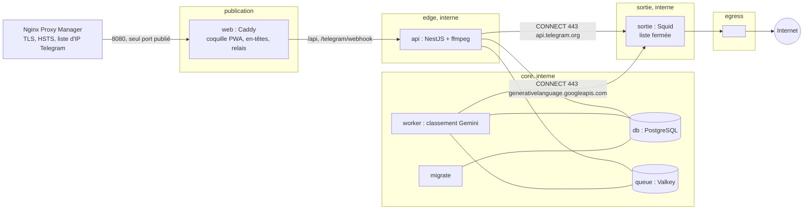
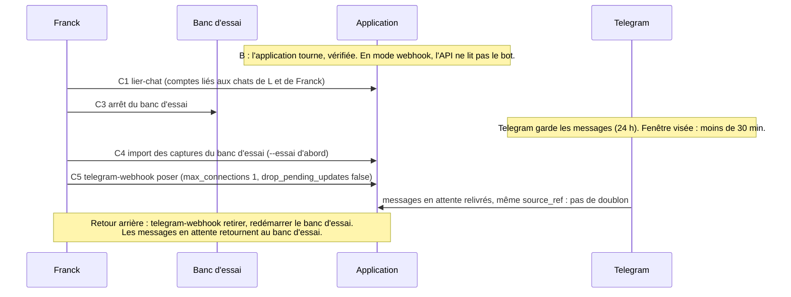

# Dossier de revue — Organizer, lot 1-C (déploiement)

Rédigé à partir de l'état de la branche `lot1-c-deploiement` (tête `1d92b06`, vague de correctifs
finaux comprise).
Auteur de la rédaction : un agent IA, à la demande de Franck, propriétaire du projet.
Ce dossier fait suite au [dossier du lot 1-A](2026-10-03-lot1-a.md), au
[dossier du lot 1-B1](2026-10-03-lot1-b1.md) et au [dossier du lot 1-B2](2026-10-04-lot1-b2.md).
Il ne répète pas ce qu'ils disent déjà (produit, règles non négociables, API, PWA).

État de la CI : <à compléter>

---

## 1. À l'attention du relecteur

Ce qu'on attend de toi est inchangé (voir [dossier 1-A, section 1](2026-10-03-lot1-a.md)) :
relire, challenger, proposer des alternatives chiffrées, séparer **défaut** et **préférence**.

**Lis d'abord** le dossier 1-A, sections 2 (le produit) et 4 (méthode), puis le dossier 1-B1,
section 6.1 (portes de mise en service) et le dossier 1-B2, section 6.1 (liste de contrôle PWA, que ce
lot ferme côté dépôt). Ce dossier suppose connues la règle n° 6 (le mode privé est décidé par le point
d'entrée, jamais par le contenu), la règle n° 8 (palier Gemini payé obligatoire) et la décision 8 (les
deux comptes voient tout).

Ce que tu ne peux pas vérifier :

- Le code est sur GitHub, dépôt public `djkix/organizer`, branche `lot1-c-deploiement`.
- Le dossier `.superpowers/` (registre, briefs, rapports, diffs de relecture) est ignoré par Git.
  Tout ce qui en vient est résumé ici, sans le détail du processus.
- **Rien n'a tourné sur la VM de production.** Aucune image n'a été construite ni lancée sur la machine
  où elle sera déployée, et **aucun Docker n'existe sur le Mac de développement** (décision R3). Les
  fichiers Docker, Compose, Squid et Caddy ont été validés par des tests de configuration (analyse du
  texte et du YAML), par la revue, et par la CI GitHub Actions (qui, elle, construit les images, les
  analyse et lance l'essai de fumée). La valeur de cette preuve dépend donc de l'état de la CI, indiqué
  plus haut.
- Squid a été essayé sous Alpine **seulement par la CI** ; l'implémenteur l'a aussi installé par
  Homebrew sur le Mac pour valider la syntaxe, ce qui ne dit rien de musl ni de la version Alpine.
- Les nombres de tests viennent des rapports des implémenteurs et n'ont pas été relancés pour ce dossier.
- Le plan (environ 4 500 lignes) a été rédigé par un agent sur un cadrage du contrôleur, **sans rien
  exécuter**. La partie 2 du plan (mise en service) n'est pas faite.
- Aucune capture réelle, aucun secret, aucun prénom réel dans le dépôt ni dans ce dossier (« L » désigne
  l'utilisatrice principale, « Franck » le propriétaire).

Convention : les remarques « lecture du rédacteur » viennent de la lecture du code pour ce dossier
et ne figurent pas au registre.

---

## 2. But et périmètre

**But** (extrait du plan) : Organizer tourne en production sur l'hôte Docker du homelab, publié en
HTTPS par le Nginx Proxy Manager (NPM) existant, reçoit les vocaux de L par le webhook du bot Telegram à
la place du banc d'essai (l'outil provisoire du lot 0 qui reçoit aujourd'hui les vocaux), sans qu'aucune
capture ne se perde pendant la bascule.

Le lot a deux parties.

| Partie | Contenu | État |
| --- | --- | --- |
| **1. Tâches de dépôt** (13 tâches) | Configuration de production, erreurs sans contenu, démarrage Telegram robuste et CLI du webhook, bornes de l'API, sortie par le proxy, Gemini en production, veille de supervision, import du banc d'essai, CSP de la PWA, empaquetage esbuild, images Docker et CI, stack Compose et essai de fumée, documentation d'exploitation | **Faite** sur la branche, relue, vague de correctifs finaux comprise. Pas encore fusionnée dans `main`. |
| **2. Mise en service** (phases 0, A, B, C) | Facturation Gemini, répétition sur la VM banc d'essai intact, bascule (liaison des comptes, arrêt du banc d'essai, import, pose du webhook), essais sur Android | **Pas faite.** Conditionnée à la sortie du lot 0 (au moins 60 énoncés annotés, typologie stable, prompt validé branché) et à l'accord de Franck **donné à chaque étape**, au moment de l'étape. Les sous-agents ne l'exécutent jamais. |

Décision de Franck (4 octobre 2026) : la fusion dans `main` est autorisée une fois la CI verte et ce
dossier publié. Fusionner n'est pas mettre en service : CLAUDE.md interdit toute mise en service avant la
sortie du lot 0.

**Hors du lot** : le scheduler (agenda, rotation de l'audio), les notifications, toute sauvegarde
automatique (décision 11), le déploiement automatique (la CI publie, Franck déploie à la main depuis Dockge).

**Volume** : 22 commits (plan compris) sur `0026b6b..HEAD` (liste en annexe 9.3). Le détail
des tests par tâche est dans le registre ; les rapports d'implémenteurs annoncent des suites vertes.
L'application n'est pas en service.

**Pile ajoutée** : esbuild (empaquetage), Docker multi-étages sur Alpine 3.22 et Node 22, Caddy 2.11,
Squid, Valkey 8.1, pgvector 0.8 (PostgreSQL 17), undici et https-proxy-agent (sortie par le proxy),
GitHub Actions, GHCR, Trivy 0.63.

---

## 3. Architecture

### 3.1 Services et réseaux

Six services applicatifs plus les migrations : `web`, `api`, `worker`, `sortie`, `db`, `queue`, et `migrate`
(tâche unique jouée avant `api` et `worker`). Quatre réseaux Docker plus un réseau de publication.



| Réseau | Interne | Membres | Rôle |
| --- | --- | --- | --- |
| `publication` | non | `web` | Nécessaire pour publier le port 8080 ; `web` n'émet rien vers Internet |
| `edge` | oui, `10.201.1.0/24` | `web`, `api` | Relais de Caddy vers l'API |
| `core` | oui | `api`, `worker`, `migrate`, `db`, `queue` | Aucune route vers Internet |
| `sortie` | oui, `10.201.2.0/24` | `api` (`.10`), `worker` (`.11`), `sortie` (`.2`) | Adresses fixes reprises dans `squid.conf` |
| `egress` | non | `sortie` seul | Seule route vers Internet de toute la stack |

Points de conception :

- **Un seul port publié** : `web`, sur `${IP_PUBLICATION}:8080`, pour NPM. Aucun autre service n'a de `ports`.
- **Seul `sortie` atteint Internet.** `api` et `worker` sont sur des réseaux `internal: true` : Docker leur
  refuse toute route. Ils sortent par `HTTPS_PROXY=http://sortie:3128`. Squid filtre par **adresse source**
  (l'API n'atteint que `api.telegram.org`, le worker que `generativelanguage.googleapis.com`), `CONNECT` sur
  le port 443 seulement, adresses IP brutes refusées avant toute autorisation, `dstdomain -n` (pas de
  résolution inverse : le nom demandé seul compte), journal sans chemin d'URL (un jeton de bot peut y figurer).
  Docker ne filtre pas par domaine : sans Squid, la « liste fermée » du cahier ne serait qu'une promesse.
- **Caddy** (image `web`) sert la coquille de la PWA **et** relaie `/api` et `/telegram/webhook` vers l'API,
  pour que les en-têtes (CSP, cache, `no-store`, `Permissions-Policy`) vivent dans le dépôt et soient testés
  en CI. NPM ne garde que TLS, HSTS, HTTP/2, plafond de corps, délais et liste d'IP Telegram.
  Le webhook n'est servi que sur le domaine du bot ; sur le domaine principal, `/telegram/*` répond 404.
- **Coquille dans l'image**, pas de volume : un volume nommé garderait l'ancienne coquille après une mise
  à jour. Caddy n'a aucun état (`auto_https off`, `admin off`).
- **CSP calculée au build** de l'image web : l'empreinte du script en ligne de SvelteKit change à chaque
  build. `apps/web/scripts/entetes.mjs` la calcule et écrit `/etc/caddy/csp.caddy` ; le même module sert
  les en-têtes de `vite preview`, donc **tous les e2e de la PWA tournent sous la vraie CSP**.
- **Proxy de confiance** : `TRUSTED_PROXY` = sous-réseau `edge` plus l'adresse du NPM (`NPM_IP`, obligatoire,
  sans valeur par défaut). En production l'API refuse de démarrer sans lui, ou avec un chemin relatif
  pour `PROMPTS_DIR` ou `AUDIO_STORAGE_PATH`.
- **Secrets** : trois fichiers (`telegram_bot_token`, `telegram_webhook_secret`, `gemini_api_key`), lus par
  variables `*_FILE`, montés seulement dans le service qui s'en sert. Pas d'`env_file`. Un test échoue si
  une variable en `TOKEN|SECRET|KEY|PASSWORD` n'est ni un fichier ni une valeur obligatoire du `.env`.
- **Limites** : mémoire par service comme au cahier (1 Go base, 512 Mo API, 768 Mo worker, 128 Mo file,
  64 Mo web et proxy), concurrence du worker plafonnée à 2, journaux JSON 10 Mo × 3, `restart: unless-stopped`.
- **Publication** : `organizer.djkix.ovh` (PWA et `/api`) et `organizer-bot.djkix.ovh` (webhook), tous deux
  vers `192.168.1.201:8080` ; seule la liste d'IP Telegram distingue le second côté NPM.

### 3.2 Bascule Telegram, sans perte (partie 2, non exécutée)



Le webhook est posé **à la main** par une commande de la CLI, jamais au démarrage de l'API : la pose
est l'instant exact de la bascule, elle ne doit pas arriver par un redémarrage. `max_connections: 1`
ferme le dernier chemin par lequel une pensée voulue privée pourrait atteindre Gemini (deux mises à jour
en parallèle, l'ordre « bouton privé » puis vocal ne tiendrait plus).

---

## 4. Invariants de confidentialité et ce qui les teste

Rappel (dossier 1-A) : rien de privé ne va vers Gemini ; aucun contenu en clair dans les journaux, même
en debug, y compris les requêtes sortantes ; rien ne se perd ; l'administrateur est alerté, jamais L.

| Invariant | Mécanisme | Test ou vérification |
| --- | --- | --- |
| **Aucune route directe vers Internet pour `api` et `worker`** | Réseaux `internal: true` ; seul `sortie` est sur `egress` | `compose.test` : table des réseaux par service, `internal` vrai pour `core`, `edge`, `sortie`. Essai de fumée (CI) : un `fetch` direct de l'API vers un domaine tiers échoue |
| **Liste fermée de domaines, par service** | ACL Squid par adresse source ; adresses de `squid.conf` égales à celles du compose | `image.test` : règles `http_access` lues une à une, CONNECT 443 seulement, refus final. `compose.test` : adresses identiques. Fumée : API joint Telegram et refuse `example.com` ; worker joint Gemini et refuse Telegram |
| **Pas d'adresse IP brute** | `acl ip_brute dstdom_regex -n ^[]0-9.:[]+$` refusée avant toute autorisation | `image.test` : le motif est un ensemble POSIX valide (le `]` en tête est littéral sous musl) et attrape les adresses sans attraper les noms (`grep -E`). **Pas essayé contre le Squid réel d'Alpine** hors CI |
| **Journal du proxy sans contenu** | `logformat sobre` sans chemin d'URL ; `forwarded_for delete`, `via off` | `image.test` : le format n'inclut pas l'URL |
| **Aucun contenu dans les erreurs et journaux de l'API** | Filtre d'exceptions : une erreur inattendue répond 500 sans rien recopier ; un JSON illisible répond 400 sans citer le corps ; seuls identifiants, noms d'erreur, statuts HTTP | Tests de la tâche 2 (relus). Même discipline pour Gemini (message d'erreur = modèle + statut), le téléchargement Telegram, l'import (numéro de ligne et identifiant, jamais le contenu) |
| **Pas de cache de l'API** | `Cache-Control: no-store` posé par Caddy sur `/api`, plus le filtre côté API | `image.test` ; essai de fumée : l'en-tête de `/api/session/moi` |
| **Session vérifiée avant de lire 30 Mio d'envoi privé** | Le middleware valide la session (même recherche que le garde) avant le parseur brut | Test discriminant : corps de plus de 30 Mio sans session valide → 401 et non 413 ; avec session → 413. (Première version : simple présence de cookie, contournable ; trouvée en relecture, section 6.) |
| **Une heure d'audio privé n'est pas coupée** | Corps 32 Mio, délais Caddy 30 min, ordre de grandeur NPM ; délai Node relevé | `image.test` et `exploitation.test` : corps au moins 30 Mio, délais au moins égaux à celui de la PWA (environ 19 min) |
| **Mode privé jamais déduit du contenu** | Inchangé (point d'entrée) ; `max_connections 1` du webhook | Dossier 1-B1. Ici : la pose du webhook (CLI). Risque résiduel en section 7 |
| **Webhook seulement sur le domaine du bot, secret vérifié** | `@bot host`, 404 ailleurs ; secret vérifié par l'API | `image.test` ; fumée : 404 sur le domaine principal, 401 avec un faux secret |
| **Pas de secret dans le dépôt, le compose ou l'image** | Fichiers de secrets, `.dockerignore` | `image.test` : le contexte de build exclut secrets, données de L, dépendances locales ; `compose.test` : secrets |
| **L n'est jamais alertée** | Veille et alertes du worker vers les seuls administrateurs liés | Tests de la veille ; sans administrateur lié, l'alerte part dans le journal |
| **Rien ne se perd à la bascule** | Comptes liés avant l'arrêt, import sans doublon, `drop_pending_updates: false` | Tests de `lier-chat` et de l'import (« réimporter ne crée rien », « une capture déjà reçue par le webhook n'est pas réimportée »). La bascule elle-même n'est pas essayée |

---

## 5. Images, CI et publication

### 5.1 Images (`infra/image/Dockerfile`, quatre cibles)

- **Non root** : `USER 1000:1000` (api, worker, web), `USER squid` (sortie). Test : « quatre cibles, aucune en root ».
- **Racine en lecture seule** : `read_only: true` et `tmpfs: /tmp` sur tous les services applicatifs, `web` et
  `sortie` compris (Caddy range son état dans `/tmp`, par `XDG_*`).
- **npm, npx et corepack retirés** des images finales `api` et `worker` : l'exécution ne passe que par `node`
  (les migrations lancent le binaire de Prisma directement). Motif : un CVE critique de `tar` vit dans npm,
  et Trivy bloquait la CI.
- **`apk upgrade`** dans les étages `base-node`, `web` et `sortie`, avant tout `USER` (test présent) : les
  correctifs Alpine du jour sont appliqués à chaque construction. `web` passe à Caddy 2.11.
- **Images de base épinglées** au mineur (`node:22.22-alpine3.22`, `caddy:2.11-alpine`, `alpine:3.22`), jamais
  `latest` ; épinglées par étiquette et non par condensat (dette connue).
- **Empaquetage esbuild** : chaque application devient `dist/*.mjs` ; le code des paquets `@organizer/*`
  (sources TypeScript avec décorateurs) est inclus, toute dépendance de `node_modules` reste externe et
  s'installe par `pnpm install --prod --filter` avec le même verrou. Un test vérifie les dépendances externes.
- **Volume audio** : `/data/audio` est créé et possédé par l'uid 1000 **dans l'image**, car un volume nommé
  hérite du propriétaire du dossier à sa création (sinon `root:root` et toute capture audio perdue :
  défaut Critique de la relecture, section 6). L'essai de fumée vérifie l'écriture par l'API et la lecture
  par le worker.
- **Trivy** : `--ignore-unfixed --severity CRITICAL --exit-code 1`, sur les **quatre** images, la boucle va au
  bout avant d'échouer.

### 5.2 CI et publication (`.github/workflows/ci.yml`)

Trois jobs : `tests` (Postgres et Valkey en services, lint, typecheck, tests, e2e Playwright, budget du
bundle), `images` (construction des quatre cibles avec cache GitHub Actions, Trivy, essai de fumée
`infra/image/essai.sh` sur la topologie réelle), `publication`.

- **Publication sur étiquette `v*` seulement**, dans un **job séparé**, le seul avec `packages: write` ;
  `contents: read` partout ailleurs. Les actions tierces sont épinglées par SHA.
- **Paquets GHCR publics** (décision de Franck, section 8). Un paquet nouvellement publié est créé en
  privé : la documentation demande de les passer en public à la première publication, avec contrôle par
  `docker pull` sans authentification depuis la VM. La VM n'a donc aucun jeton de registre.
- **Lacune déclarée : la publication reconstruit, elle ne pousse pas l'image analysée.** Le job `publication`
  relance `docker buildx build --push` depuis le cache (`--cache-from type=gha`) : mêmes couches attendues,
  mais ce n'est pas l'image exacte que Trivy et l'essai de fumée ont vue. Le correctif propre (pousser
  l'image analysée, ou publier par condensat) n'a pas été fait.
- **Essai de fumée** (`essai.sh`) : projet `organizer-essai`, secrets factices, dossier temporaire, plage
  `10.211.x` (la copie de `squid.conf` montée sur l'image `sortie` est réécrite : **le test n'exerce donc
  pas le `squid.conf` de la production tel que livré dans l'image**, déclaré). Il vérifie : démarrage,
  `/api/sante`, migrations (`migrate exited 0`), volume audio, CSP contenant l'empreinte de l'`index.html`
  servi, en-têtes de cache, type du manifeste, `Permissions-Policy`, `no-store`, webhook, sorties autorisées
  et refusées, sortie directe impossible, ffmpeg avec libopus. Il libère tout à la fin (`trap`).
- Rien n'est déployé automatiquement : Franck met à jour depuis Dockge (`up -d --wait`, retour arrière documenté).

---

## 6. Défauts trouvés en relecture et corrigés (et décisions R1 à R12)

Registre propre au lot 1-C ; les registres précédents restent valables. Les relectures tournent en
parallèle de l'implémentation de la tâche suivante (R2, comme aux lots 1-B1 et 1-B2).

| # | Décision | Pourquoi | Coût si elle est fausse |
| --- | --- | --- | --- |
| R1 | **Décisions de Franck** : GHCR public (le cahier est modifié) ; import des captures du banc d'essai ; rotation de l'audio reportée au lot 2, avec alerte à 30 Go | Voir section 8 | Voir section 8 |
| R2 | Relecture en parallèle de l'implémentation suivante | Vitesse | Corrections reportées sur du code déjà avancé |
| R3 | Pas de Docker sur le Mac : `docker build`, compose et essai de fumée sont validés par la CI et plus tard sur la VM, avec accord ; les sous-agents testent par analyse du texte et du YAML | Contrainte de poste | **Le point faible de ce lot** : beaucoup de preuves sont des tests de forme (section 7) |
| R4 | Sujet de commit « Ajouter… » de `ac8f94b` laissé tel quel | Le réécrire demandait un rebase pendant qu'un autre agent commitait | Une ligne d'historique à l'infinitif |
| R5 | Le middleware du corps de 30 Mio valide la **session**, pas la présence d'un cookie ; test discriminant | Relecture T4 : un cookie forgé suffisait à faire lire 30 Mio | Une requête en base de plus par envoi privé |
| R6 | Si l'armement du mode privé échoue : réponse « Mode privé non activé. Réessaie. » puis relivraison par Telegram ; la garantie pour L est la **confirmation**, pas l'ordre des messages | Relecture T3 : voir le risque résiduel de la section 7 | Nul |
| R7 | Un 4xx de configuration Gemini au démarrage (réflexion refusée, modèle retiré) : ligne de journal distincte et une alerte, au lieu d'une boucle indiscernable d'une panne ; statuts d'indisponibilité réglables (`GEMINI_STATUTS_INDISPONIBLES`, défaut 402, 403, 429) | Relecture T6 | Nul |
| R8 | Import : lignes écartées nommées (numéro et identifiant, jamais le contenu), code de sortie 1 s'il y en a, audios orphelins listés (non importés : décision laissée à Franck), mode `--essai` | Relecture T8 : des lignes perdues en silence | Nul |
| R9 | Cache de CI corrigé ; Squid `dstdomain -n`, refus des IP littérales, journal sans chemin ; `NPM_IP` obligatoire ; actions épinglées par SHA ; `concurrency` et délais | Relecture T11 : contournement par DNS inverse | Nul |
| R10 | npm, npx, corepack retirés des images finales ; garde Trivy maintenue (pas d'exception) | CVE critique de `tar` dans npm | Les migrations passent par `node` directement |
| R11 | Volume audio possédé par l'uid 1000 dans l'image ; job de publication séparé ; sous-réseaux de l'essai réécrits ; diagnostics sur échec de démarrage | Relecture T12 : **1 Critique, 3 Important** (section 6.1) | Nul |
| R12 | `GEMINI_THINKING_LEVEL` : **défaut vide**, valeur relevée à l'étape A2 | Vide est toujours accepté par l'API ; `minimal` peut être refusé et bloquer le worker | Réflexion par défaut du modèle (coût en jetons à mesurer) |

### 6.1 Constats notables

- **Critique (T12)** : le volume audio était créé `root:root`, l'API (uid 1000) n'y pouvait rien écrire :
  toute capture audio aurait été perdue en production. Les tests de forme n'ont rien vu ; c'est la
  relecture qui l'a trouvé. Corrigé, avec vérification dans l'essai de fumée.
- **Important (T4)** : garde du corps de 30 Mio contournable par un cookie forgé, et un test qui passait
  sans le middleware. Corrigé avec un test discriminant.
- **Important (T6)** : une configuration Gemini refusée au démarrage bouclait sans fin sans alerte. Corrigé (R7).
- **Important (T8)** : lignes écartées de l'import comptées sans être nommées, sortie 0 ; audios sans ligne ignorés. Corrigé (R8).
- **Important (T11)** : cache `type=gha` dans une étape `run:` jugé probablement défaillant (infirmé par la CI : le
  cache fonctionnait) ; `dstdomain` sans `-n` (contournement par DNS inverse, réel). Le motif des IP brutes
  était probablement inopérant sous musl ; réécrit en ensemble POSIX.
- **Important (T12)** : `packages: write` sur tout le job `images` ; essai de fumée en conflit de sous-réseaux
  avec la production ; échec de démarrage sans diagnostic. Corrigés.
- **CI réelle** : après le premier correctif, Trivy a bloqué sur `web` (libcrypto3 et quatre CVE critiques du
  binaire Caddy de l'époque : smallstep, grpc, bibliothèque standard Go) → Caddy 2.11 et `apk upgrade`. Un défaut
  que seule la CI pouvait montrer.
- **Revue finale (modèle de premier rang)** : 0 Critique ; Important : Trivy `web`, boucle Trivy, variable
  `GEMINI_STATUTS_INDISPONIBLES` non transmise au worker par le compose, import avec adresse d'API fixe,
  `max_filedescriptors` de Squid (Squid dimensionne ses tables sur la limite du conteneur) ; 8 mineurs.
  Une vague de correctifs unique les a traités ; la relecture finale confirme F1 à F7 et M1 à M7, deux
  restes de texte du plan corrigés par le contrôleur. Reste : `mkdir -m 700` sur un dossier existant.

Comme aux lots précédents, les défauts viennent surtout de **ce que le plan n'avait pas pu exécuter**, et
les tests de forme ne les attrapent pas. Ils ont été attrapés par la relecture ou la CI.

### 6.2 Dettes différées (mineurs notés au registre)

- Pas de `Retry-After` sur le 503 de ffmpeg ; pire cas de 6 × 30 Mio en mémoire.
- Corps Telegram lu entièrement avant le contrôle de taille (rejeter tôt sur `content-length`) ; `getFile` non
  JSON donne une `SyntaxError` brute ; l'agent grammY ignore `NO_PROXY` (documenté).
- Veille : mesure de l'audio par parcours complet toutes les 15 minutes (coûteux vers 30 Go) ; état des alertes
  en mémoire (un redémarrage de l'API peut renvoyer un constat encore vrai, aucun message de retour à la
  normale) ; passages non protégés contre le chevauchement ; échec de sonde avalé sans journal.
- Images de base épinglées par étiquette, pas par condensat ; délais de 30 min sur tout le serveur Caddy (pas
  seulement `/api`) ; tests `dist` dépendants de l'ordre du fichier ; `sourcesContent` dans les `.map`.
- Import : un `.DS_Store` ou un sous-dossier dans `audio/` compte comme orphelin (strict mais sûr).
- Retirer 403 ou 429 de `GEMINI_STATUTS_INDISPONIBLES` donne le libellé « configuration refusée » ; y mettre 400
  masquerait les erreurs de configuration (documenté).
- Hachage du script de la coquille par expression régulière ; le retrait du style de l'annonceur ne fait pas
  échouer la construction si le motif change.

---

## 7. Risques résiduels et ce qui n'a pas été vérifié

**Rien n'a tourné sur la VM.** Tout ce qui suit en découle ou s'y ajoute.

1. **Squid sur Alpine non vérifié hors CI.** Squid a été validé sur le Mac par Homebrew (autre version, autre
   libc) ; le motif `ip_brute` repose sur le `regcomp` de musl ; `pinger` et `netdb` ont été coupés par
   précaution et devraient être retirés si Alpine les refuse. Risque : Squid qui ne démarre pas, ou une règle
   qui ne filtre pas comme prévu.
2. **Le journal d'erreurs de Caddy peut reprendre l'en-tête `X-Telegram-Bot-Api-Secret-Token`** sur une réponse
   502 : le secret du webhook finirait dans `docker compose logs web`. Non vérifié ; documenté comme contrôle
   au premier démarrage (`grep -i secret-token` ne doit rien afficher, sinon régénérer le secret). Si c'est
   le cas, la correction du `Caddyfile` n'est pas écrite.
3. **`docker compose up -d --wait` avec `migrate`** : un service qui sort en code 0 peut faire échouer `--wait`
   sur certaines versions de Compose. Le repli est documenté (`up -d` puis `ps -a`). Non essayé.
4. **Telegram peut abandonner l'appui « Prochaine capture privée »** après une longue panne : l'appui n'est
   alors jamais reçu, le vocal suivant partirait en ordinaire (donc vers Gemini). **Non fermable côté
   serveur** (relecture T3, acceptée). Atténuation : le message de confirmation (« La prochaine capture reste
   sur le serveur. ») est la seule garantie pour L ; pas de confirmation = pas armé ; si l'armement échoue,
   « Mode privé non activé. Réessaie. ». À challenger (question 3).
5. **Publication reconstruite plutôt que poussée** (section 5.2) : l'image publiée n'est pas l'image analysée.
6. **Chemin du proxy de grammY seulement testé unitairement** : l'agent `https-proxy-agent` n'a jamais parlé
   à un vrai Telegram à travers Squid. Le `fetch` d'undici (API et worker) est exercé par l'essai de fumée,
   mais pas le chemin node-fetch de grammY.
7. **Essai de fumée sur une copie de `squid.conf` en `10.211.x`** : la production est la seule exécution du
   fichier tel que livré dans l'image.
8. **Gemini réel** : `serviceTier`, le niveau de réflexion accepté, le code d'une pause de budget (402, 403 ou
   429 ?) ne sont pas connus ; les étapes A2 à A4 de la partie 2 les mesurent. Si `serviceTier` ne distingue
   pas un projet non facturé, la règle n° 8 ne peut pas être vérifiée au démarrage et la mise en service s'arrête.
9. **Un tour de transcription réel, un vrai vocal, un vrai Android** : non essayés (dossier 1-B2).
10. **Écart aux règles** : l'implémenteur de la tâche 11 a ouvert une connexion TLS réelle à
    `api.telegram.org` (GET `/`, sans jeton ni contenu) pour tester Squid depuis le Mac : écart mineur aux
    règles du projet, sans fuite.
11. **Sauvegarde** : aucune avant le lot 2 (décision 11). La copie de la base avant mise à jour est manuelle et
    reste sur la VM ; l'archive de l'audio (`.tgz`) a dû être rendue illisible aux tiers (relecture T13 : root
    644 dans un dossier lisible).
12. **Volume audio déjà existant** : le `chown` de l'image ne s'applique qu'à un volume neuf. Sur un volume
    existant, il faut un `chown` manuel (documenté).

---

## 8. Décisions de Franck

| # | Décision | Date | Conséquence |
| --- | --- | --- | --- |
| 1 | **Images GHCR publiques**, et non privées (le cahier est modifié) | 4 oct. | La VM n'a aucun jeton de registre ; il faut passer chaque paquet en public après la première publication, et il n'y a rien de secret dans une image (le dépôt est déjà public) |
| 2 | **Importer les captures du banc d'essai** à la bascule, reclassées par le prompt de l'application | 4 oct. | CLI d'import sans doublon avec les relivraisons Telegram ; le corpus ne va jamais dans le dépôt |
| 3 | **Rotation de l'audio reportée au lot 2**, avec **alerte à 30 Go** | 4 oct. | Rien n'est supprimé d'ici là ; plafond de 40 Go atteint au mieux dans plusieurs mois (20 à 45 Go par an selon le plan) |
| 4 | **`GEMINI_THINKING_LEVEL` vide par défaut** | 5 oct. (R12) | Rien n'est demandé tant que A2 n'a pas relevé une valeur acceptée |
| 5 | **Fusion dans `main` autorisée** une fois la CI verte et ce dossier publié | 4 oct. | Fusion n'est pas mise en service |
| 6 | **Appel de contrôle A3** sur un projet jetable sans facturation, texte fixe « ok », au moment de la mise en service | 4 oct. | Vérifie que `serviceTier` distingue un projet non payé |

Aucune étape de la partie 2 n'est autorisée par ces décisions : chacune demande l'accord de Franck au moment où elle est exécutée.

---

## 9. Questions pour challenger l'approche

1. **Tests de forme contre exécution réelle.** Faute de Docker sur le poste (R3), l'essentiel des garanties
   réseau repose sur des tests qui lisent du texte et du YAML. La CI exécute l'essai de fumée, mais sur une copie
   réécrite en `10.211.x` du `squid.conf`. Quelles garanties de sortie ne sont **pas** prouvées par ce
   montage, et quel essai minimal sur la VM les prouverait avant d'y mettre un vrai secret ?
2. **Squid contre une alternative.** Est-ce le bon outil pour une liste fermée de deux domaines (musl, regex
   POSIX, `dstdomain -n`, adresses fixes) ? Un `iptables` de l'hôte, un proxy plus simple à auditer, ou un
   résolveur DNS filtrant ferait-il mieux, ou est-ce déjà trop pour un usage à deux personnes ?
3. **Mode privé et Telegram.** Si le bouton « Prochaine capture privée » peut être perdu après une longue panne
   sans que le serveur le sache, la règle n° 6 (aucun chemin de code vers Gemini) tient-elle vraiment ? La
   confirmation à L suffit-elle, ou faut-il un état serveur (par exemple un mode privé persistant jusqu'au
   désarmement, ou un vocal ordinaire différé de N secondes) ?
4. **Publication.** Reconstruire depuis le cache plutôt que pousser l'image analysée est une lacune déclarée.
   Est-elle acceptable pour un dépôt à un seul propriétaire, ou faut-il publier par condensat dans le job
   `images` dès maintenant ? Que gagne-t-on, que coûte-t-on (cache, durée, complexité) ?
5. **Caddy et la fuite du secret du webhook.** Faut-il traiter ce risque **avant** le premier démarrage (journal
   d'erreurs coupé ou filtré, en-tête retiré à Caddy avant journalisation) plutôt que par un contrôle manuel
   après coup ? Qu'est-ce qui garantit que le secret n'est pas déjà dans un journal quand le contrôle est fait ?
6. **Rotation reportée.** Reporter la rotation de l'audio au lot 2 avec une simple alerte à 30 Go, alors que
   l'unique copie des captures vit dans un volume Docker sans sauvegarde (décision 11), est-ce cohérent ?
   Le risque dominant est-il l'espace disque ou la perte du volume ? Faut-il une sauvegarde minimale avant la
   bascule ?
7. **`up --wait` et `migrate`.** Le compose dépend d'un service qui sort en code 0. Est-ce le bon patron pour
   Dockge et les versions de Compose courantes, ou vaut-il mieux faire jouer les migrations par l'API au
   démarrage (avec verrou) pour supprimer ce cas ?
8. **Ordre de la bascule.** La procédure suppose que l'arrêt du banc d'essai, l'import et la pose du webhook
   tiennent en moins de 30 minutes et que Telegram garde 24 heures. Quels cas limites manquent (mise à jour
   déjà acquittée par le banc d'essai, import interrompu au milieu, deux comptes dont un chat non lié) ? Le
   retour arrière est-il vraiment sans perte une fois le premier vocal reçu par l'application ?

---

## 10. Annexes

### 10.1 Fichiers

| Chemin | Rôle |
| --- | --- |
| `infra/docker-compose.yml` | Stack de production (Dockge) |
| `infra/image/Dockerfile` | Quatre cibles : api, worker, web, sortie |
| `infra/image/essai.sh` | Essai de fumée sur la topologie réelle |
| `infra/caddy/Caddyfile` | Coquille, en-têtes, relais, domaine du bot |
| `infra/sortie/squid.conf` | Proxy sortant à liste fermée |
| `infra/test/*.test.ts` | Tests de forme du compose, des images et de la documentation |
| `.github/workflows/ci.yml` | tests, images, publication |
| `scripts/empaquetage.mjs` | Empaquetage esbuild de l'API et du worker |
| `apps/web/scripts/entetes.mjs` | CSP calculée, en-têtes (production et `vite preview`) |
| `packages/shared/src/sortie.ts` | `fetch` d'undici et agent grammY via le proxy |
| `apps/api/src/telegram/` | Démarrage robuste, webhook, liaison de chats |
| `apps/api/src/veille/` | Veille de supervision |
| `apps/api/src/terrain/import.ts` | Import du banc d'essai |
| `apps/worker/src/demarrage.ts` | Contrôle du palier au démarrage, erreurs de configuration |
| `docs/exploitation.md` | Exploitation : commandes, mise à jour, retour arrière, secrets, supervision |

### 10.2 Commandes

```sh
pnpm lint && pnpm typecheck && pnpm test      # tests (base et file : tunnel de dev ouvert)
pnpm --filter @organizer/web e2e              # e2e de la PWA, sous la CSP de production
infra/image/essai.sh essai                    # essai de fumée (Docker requis, port 8080 de 127.0.0.1 libre)
```

### 10.3 Commits de la branche (`0026b6b..HEAD`, du plus ancien au plus récent)

- `56855ba` Ajoute le plan du lot 1-C : déploiement et mise en service
- `cfa9b9b` Publie les images sur GHCR en public
- `ac8f94b` Ajouter la configuration de production de l'API et du worker
- `87cf34d` Ajoute le filtre d'erreurs sans contenu et la sonde de santé de l'API
- `c9e3e21` Ajoute le démarrage robuste de Telegram et la CLI du webhook
- `7a0dbd8` Ajoute les bornes de l'API : ffmpeg, corps sans session, sessions expirées
- `e7969d9` Ajoute la sortie par le proxy et le téléchargement Telegram borné
- `5a3b6bf` Vérifie la session avant de lire un envoi privé
- `300f4dd` Signale un mode privé non activé et borne le démarrage Telegram
- `83ef6a3` Ajoute la gestion des refus de Gemini et la sonde du palier
- `6cf5c7f` Ajoute la veille de supervision
- `d9e3904` Signale une configuration Gemini refusée et rend les statuts réglables
- `3a29be5` Ajoute l'import des captures du banc d'essai
- `43531e7` Ajoute la CSP stricte de la PWA et ses en-têtes de production
- `d0d6568` Détaille le bilan de l'import et ajoute un mode d'essai
- `b8577b2` Ajoute l'empaquetage esbuild de l'API et du worker
- `fd32598` Ajoute les images Docker, le proxy sortant et la CI
- `9e35b07` Ajoute la stack de production, son essai de fumée et la publication des images
- `ce95c19` Retire npm des images et ferme le proxy de sortie aux adresses brutes
- `e5c6cd0` Rend le volume audio inscriptible et isole la publication des images
- `0084d91` Ajoute la documentation d'exploitation
- `1d92b06` Corrige l'analyse des images, le compose du worker et la documentation d'exploitation

### 10.4 Documents du dépôt

- [Plan du lot 1-C](../superpowers/plans/2026-10-05-lot1-c-deploiement.md) (la partie 2 décrit la mise en service)
- [Documentation d'exploitation](../exploitation.md)
- [Cahier des charges](../cahier-des-charges.md) et [décisions](../decisions.md)
